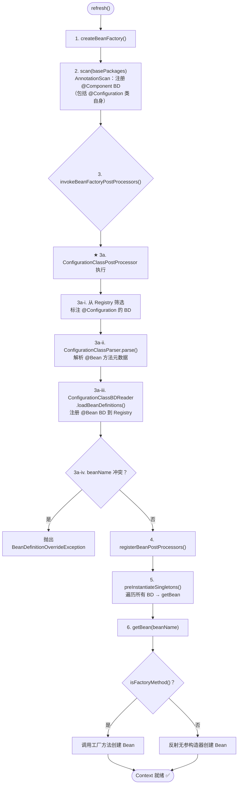
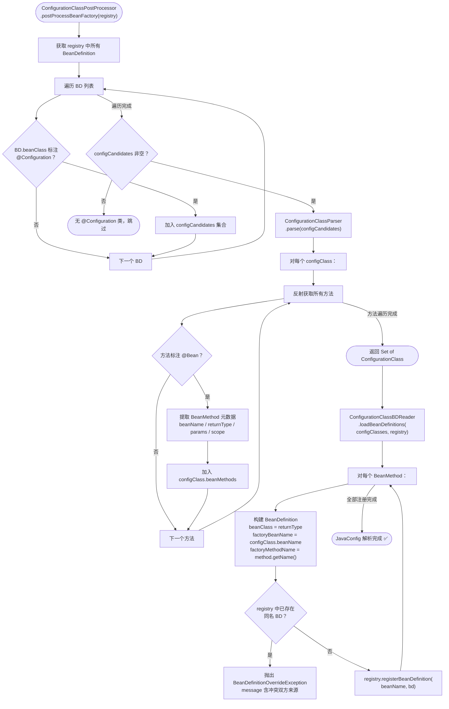
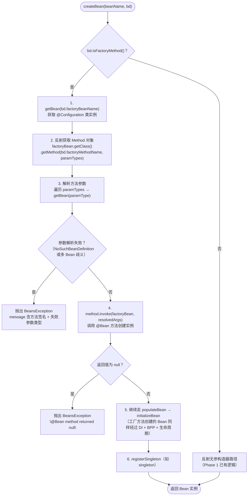

# mini-spring JavaConfig 架构设计增补文档

> **mode**: FULL  
> **sources**: AnnotationScan + JavaConfig（并存）  
> **conflict_policy**: FAIL_FAST  
> **javaconfig_features**: CONFIGURATION_CLASS=ENABLED, BEAN_METHOD=ENABLED, IMPORT=DISABLED, PROXY_ENHANCEMENT=DISABLED  
> **package group**: `com.xujn`

---

# 0. 当前实现状态（2026-03-03）

## 0.1 已实现

- JavaConfig Phase 1：`@Configuration` / `@Bean` 解析、工厂方法 Bean 注册与创建、与 AnnotationScan 并存
- JavaConfig Phase 2：`@Bean` 方法参数按类型注入、重复 beanName FAIL_FAST、`initMethod` / `destroyMethod`
- 相关验收与示例：`src/test/java/com/xujn/minispring/context/JavaConfigPhase1AcceptanceTest.java`、`src/test/java/com/xujn/minispring/context/JavaConfigPhase2AcceptanceTest.java`、`examples/src/main/java/com/xujn/minispring/examples/javaconfig/phase1`、`examples/src/main/java/com/xujn/minispring/examples/javaconfig/phase2`

## 0.2 尚未实现

- JavaConfig Phase 3：工厂方法 Bean 参与三级缓存循环依赖、工厂方法 Bean 的 AOP 提前代理一致性
- `@Scope` 标注在 `@Bean` 方法上
- `BeanDefinitionReader` / `AnnotatedBeanDefinitionReader` 抽象层

> 下面文档中的“架构目标”包含已落地内容和后续规划；凡与当前代码不一致之处，以本节状态与各 phase 文档为准。

---

# 1. 背景与目标

## 1.1 为什么需要 JavaConfig

| 维度                 | AnnotationScan（已有）                  | JavaConfig（新增）                                        |
| -------------------- | --------------------------------------- | -------------------------------------------------------- |
| 注册方式             | `@Component` 标注在类上，扫描器发现      | `@Configuration` 类中的 `@Bean` 方法显式声明               |
| 适用场景             | 业务组件自动发现                         | 第三方库集成、需要复杂初始化逻辑的 Bean、运行时条件化创建   |
| 控制粒度             | 类级别                                   | 方法级别（可精确控制构造参数、初始化逻辑）                  |
| 依赖注入方式         | `@Autowired` 字段注入                    | 方法参数自动解析 + 方法体内手动组装                        |
| 与第三方库兼容性     | 无法在第三方类上标注 `@Component`         | 通过 `@Bean` 方法包装第三方类                              |

**核心价值**：AnnotationScan 无法覆盖"不可修改源码的第三方类"和"需要复杂构造逻辑的 Bean"，JavaConfig 填补此缺口。两者并存后，框架具备完整的配置能力矩阵。

## 1.2 术语表

| 术语                    | 定义                                                                           |
| ----------------------- | ------------------------------------------------------------------------------ |
| ConfigurationClass      | 标注 `@Configuration` 的类，作为 Bean 工厂方法的载体                             |
| BeanMethod              | `@Configuration` 类中标注 `@Bean` 的方法，每个方法对应一个 BeanDefinition         |
| FactoryMethod           | 通过调用某个 Bean 的方法来创建另一个 Bean 的机制                                 |
| factoryBeanName          | 工厂 Bean 的名称（即 `@Configuration` 类实例在容器中的 beanName）                |
| factoryMethodName        | 工厂方法名称（即 `@Bean` 标注的方法名）                                          |
| BeanDefinitionReader    | 从特定配置源读取元数据并注册 BeanDefinition 的抽象接口                            |
| ConfigurationClassParser | 解析 `@Configuration` 类元数据（注解、方法列表）的组件                            |
| @Import                 | 导入额外配置类（Phase 1 不支持）                                                 |
| CGLIB 增强              | 对 `@Configuration` 类做字节码代理以保证 `@Bean` 方法单例语义（Phase 1 不支持）    |

## 1.3 包结构与命名

### 新增包结构（在现有基础上扩展）

```
com.xujn.minispring
├── beans
│   ├── factory
│   │   ├── config
│   │   │   ├── BeanDefinition.java                  # [MODIFY] 增加 factoryBeanName / factoryMethodName / 参数与生命周期元数据
│   │   │   ├── BeanDefinitionRegistry.java          # [MODIFY] 增加 allowOverride 开关
│   │   │   └── ...
│   │   └── support
│   │       ├── AutowireCapableBeanFactory.java       # [MODIFY] createBean 增加工厂方法分支
│   │       ├── DefaultListableBeanFactory.java       # [MODIFY] 重复 beanName FAIL_FAST
│   │       └── DisposableBeanAdapter.java            # [NEW] destroyMethod 适配器
│   │       └── ...
│   └── ...
├── context
│   ├── annotation
│   │   ├── Bean.java                                 # [NEW] @Bean 注解定义
│   │   ├── Configuration.java                        # [NEW] @Configuration 注解定义
│   │   ├── ConfigurationClassParser.java             # [NEW] 解析 @Configuration 类元数据
│   │   ├── ConfigurationClassBeanDefinitionReader.java # [NEW] 从解析结果注册 BeanDefinition
│   │   ├── ConfigurationClassPostProcessor.java      # [NEW] BFPP 实现：驱动解析 + 注册
│   │   └── ClassPathBeanDefinitionScanner.java       # 无变更
│   └── support
│       └── AnnotationConfigApplicationContext.java   # [MODIFY] refresh 中集成 JavaConfig 解析
├── exception
│   └── BeanDefinitionOverrideException.java          # [NEW] 重复 beanName 冲突异常
└── ...
```

### 命名规范（新增部分）

| 元素                               | 命名                                   |
| ---------------------------------- | -------------------------------------- |
| `@Configuration` 注解              | `com.xujn.minispring.context.annotation.Configuration` |
| `@Bean` 注解                       | `com.xujn.minispring.context.annotation.Bean`          |
| 解析器                              | `ConfigurationClassParser`              |
| Reader                              | `ConfigurationClassBeanDefinitionReader` |
| BFPP 驱动器                         | `ConfigurationClassPostProcessor`       |

---

# 2. Spring JavaConfig 核心能力抽取（最小闭环）

## 2.1 能力清单

### 必须实现

| # | 能力                        | 定义                                                     | 价值                               | 最小闭环                                                        | 依赖关系       | 边界                                    |
|---|-----------------------------|----------------------------------------------------------|------------------------------------|----------------------------------------------------------------|----------------|-----------------------------------------|
| 1 | `@Configuration` 类识别     | 识别标注 `@Configuration` 的类，作为配置源载体             | 区分配置类与普通 Bean               | 扫描阶段识别 → 标记为配置类                                     | AnnotationScan  | 不支持嵌套配置类                         |
| 2 | `@Bean` 方法解析            | 解析配置类中 `@Bean` 方法为 BeanDefinition                 | 支持声明式 Bean 注册               | 反射遍历方法 → 提取注解属性 → 生成 BeanDefinition               | #1              | 不支持 `@Bean` 在非配置类中使用（lite 模式） |
| 3 | factoryMethod 模型注册      | BeanDefinition 增加 factoryBeanName / factoryMethodName    | createBean 时走工厂方法分支         | 注册 BD 时填充工厂方法字段                                      | #2              | —                                        |
| 4 | 工厂方法实例化              | createBean 中根据 factoryBeanName/Method 调用方法创建实例   | 支持复杂构造逻辑                    | getBean(factoryBeanName) → 反射调用 factoryMethod               | #3, BeanFactory | @Bean 方法参数按类型从容器解析             |
| 5 | @Bean 方法参数注入          | @Bean 方法的参数自动从容器 getBean 解析                     | 声明式依赖注入                      | 反射获取参数类型 → 逐个 getBean(paramType)                      | #4              | 仅按类型解析；多 Bean 同类型时 FAIL_FAST   |
| 6 | beanName 命名               | @Bean(name="x") 显式命名；缺省使用方法名                   | 灵活命名                            | 注解属性优先 → 回退方法名                                       | #2              | —                                        |
| 7 | 多配置源统一注册            | AnnotationScan + JavaConfig 的 BeanDefinition 注册到同一 Registry | 配置源透明                    | refresh 中先 AnnotationScan 再 JavaConfig（或反之），共享 Registry | BeanDefinitionRegistry | 重复 beanName 默认 FAIL_FAST |

### 可选实现

| # | 能力                    | 说明                                                    | 可选增强                          |
|---| ----------------------- | ------------------------------------------------------- | --------------------------------- |
| 8 | `@Import`               | 导入额外配置类                                           | 支持模块化配置拆分                 |
| 9 | @Bean 的 initMethod / destroyMethod | `@Bean(initMethod="init", destroyMethod="cleanup")`  | 与生命周期回调集成               |
| 10| @Scope 在 @Bean 上      | `@Scope("prototype")` 标注 @Bean 方法                    | 工厂方法也支持 prototype           |

### 不做

| 能力                        | 原因                                                   |
| --------------------------- | ------------------------------------------------------ |
| CGLIB @Configuration 增强   | Phase 1 不支持；通过文档限制和容器级防护替代              |
| @Conditional                | Boot 层特性                                             |
| @Profile / Environment     | Boot 层特性                                             |
| @PropertySource / @Value   | 需要 BFPP 属性解析链路，非核心最小集                     |
| @ComponentScan in @Configuration | 使用独立 @ComponentScan 注解，不与 @Configuration 耦合 |
| Lite @Bean mode             | 非 @Configuration 类中的 @Bean 方法（Spring 4.0+），复杂度高 |

## 2.2 Spring 概念映射

| mini-spring 组件                              | 对应 Spring 类                                                     |
| --------------------------------------------- | ------------------------------------------------------------------ |
| `Configuration`                               | `org.springframework.context.annotation.Configuration`              |
| `Bean`                                        | `org.springframework.context.annotation.Bean`                       |
| `ConfigurationClassParser`                    | `o.s.context.annotation.ConfigurationClassParser`                   |
| `ConfigurationClassBeanDefinitionReader`      | `o.s.context.annotation.ConfigurationClassBeanDefinitionReader`     |
| `ConfigurationClassPostProcessor`             | `o.s.context.annotation.ConfigurationClassPostProcessor`            |
| BeanDefinition.factoryBeanName                | `o.s.beans.factory.support.AbstractBeanDefinition.factoryBeanName`  |
| BeanDefinition.factoryMethodName              | `o.s.beans.factory.support.AbstractBeanDefinition.factoryMethodName`|

---

# 3. 设计总览（多配置源 → 统一 BeanDefinition）

## 3.1 新增抽象

### BeanDefinitionReader 接口

```text
interface BeanDefinitionReader
    int loadBeanDefinitions(BeanDefinitionRegistry registry)
```

**实现类**：
- 当前未实现；保留为未来抽象方向
- 当前代码直接使用 `ClassPathBeanDefinitionScanner` 和 `ConfigurationClassBeanDefinitionReader`

### ConfigurationClassParser

```text
class ConfigurationClassParser
    Set<ConfigurationClass> parse(Set<BeanDefinition> configCandidates)
```

**职责**：接收被标注 `@Configuration` 的 BeanDefinition 集合 → 反射解析每个类的 `@Bean` 方法 → 返回结构化的 `ConfigurationClass` 元数据集合。

### ConfigurationClassPostProcessor（BFPP）

```text
class ConfigurationClassPostProcessor implements BeanFactoryPostProcessor
    void postProcessBeanFactory(BeanDefinitionRegistry registry)
```

**职责**：作为 BFPP，在 `refresh()` 的 `invokeBeanFactoryPostProcessors()` 阶段执行。从 Registry 中筛选 `@Configuration` 类 → 委托 Parser 解析 → 委托 Reader 注册 @Bean 对应的 BeanDefinition。

> [注释] 为何用 BFPP 驱动而非直接在 refresh 中硬编码
> - 背景：JavaConfig 解析本质是"修改 BeanDefinitionRegistry"（增加新 BD），这正是 BFPP 的语义
> - 影响：如果硬编码在 refresh 中，后续增加新配置源（XML 等）需要反复修改 refresh 逻辑
> - 取舍：`ConfigurationClassPostProcessor` 实现 `BeanFactoryPostProcessor`，在 `invokeBeanFactoryPostProcessors` 阶段自动执行；refresh 流程无需感知具体配置源类型
> - 可选增强：后续增加 `XmlBeanDefinitionReader` 时，同样通过 BFPP 驱动，refresh 逻辑不变

## 3.2 与现有 refresh 的集成

Phase 1 的 refresh 流程：

```
1. createBeanFactory
2. scan(basePackages)      → AnnotationScan 注册 @Component BD（包括 @Configuration 类本身）
3. invokeBFPP              → ★ ConfigurationClassPostProcessor 在此执行
                              → 从 registry 筛选 @Configuration BD
                              → parse → 得到 @Bean 方法元数据
                              → reader → 注册 @Bean 对应 BD（factoryBeanName + factoryMethodName）
4. registerBPP
5. preInstantiateSingletons → getBean 时，工厂方法 BD 走 factoryMethod 创建分支
```

**关键点**：`@Configuration` 类本身也是 `@Component`（`@Configuration` 注解元标注 `@Component`），因此在步骤 2 的 AnnotationScan 阶段就被注册为 BeanDefinition。步骤 3 的 BFPP 阶段再从中提取 @Bean 方法。

## 3.3 多配置源冲突策略

> [注释] 重复 beanName 冲突策略
> - 背景：AnnotationScan 和 JavaConfig 存在注册相同 beanName 的 BeanDefinition 的风险（不同配置源声明同名 Bean，或同一 @Configuration 类内不同方法指定相同 beanName）
> - 影响：静默覆盖将导致使用者无法察觉配置冲突，运行时行为不可预期
> - 取舍：默认策略为 **FAIL_FAST** — `registerBeanDefinition` 检查 beanName 是否已存在，若存在且来源不同则抛出 `BeanDefinitionOverrideException`，message 包含两个来源的详细信息（原 BD 的来源 vs 新 BD 的来源）
> - 可选增强：后续支持 `allowBeanDefinitionOverriding` 开关（默认 false），设为 true 时后注册的覆盖先注册的（与 Spring Boot 2.1+ 默认行为一致）

| 场景                                  | 策略                                                    |
|---------------------------------------|--------------------------------------------------------|
| AnnotationScan 注册 A，JavaConfig 注册 A | 抛出 `BeanDefinitionOverrideException`                 |
| 同一 @Configuration 类内两个 @Bean 同名  | 抛出 `BeanDefinitionOverrideException`                 |
| 不同 @Configuration 类的 @Bean 同名     | 抛出 `BeanDefinitionOverrideException`                 |
| AnnotationScan 注册 A，JavaConfig 注册 B（不同名） | 正常共存                                       |

---

# 4. 核心数据结构与接口草图

## 4.1 ConfigurationClass 元数据

| 字段             | 类型                  | 说明                                           |
|------------------|-----------------------|------------------------------------------------|
| `configClass`    | `Class<?>`            | 配置类 Class 对象                               |
| `beanName`       | `String`              | 配置类在容器中的 beanName                        |
| `beanMethods`    | `Set<BeanMethod>`     | 该配置类中所有 `@Bean` 方法的元数据集合           |

## 4.2 BeanMethod 元数据

| 字段               | 类型          | 说明                                              |
|--------------------|---------------|---------------------------------------------------|
| `method`           | `Method`      | @Bean 标注的方法反射对象                            |
| `beanName`         | `String`      | Bean 名称：@Bean(name=...) 优先，缺省为方法名       |
| `returnType`       | `Class<?>`    | 方法返回类型（即 Bean 类型）                        |
| `parameterTypes`   | `Class<?>[]`  | 方法参数类型列表（用于参数注入）                     |
| `initMethodName`   | `String`      | @Bean(initMethod=...)（可选，Phase 2+）             |
| `destroyMethodName`| `String`      | @Bean(destroyMethod=...)（可选，Phase 2+）          |

## 4.3 BeanDefinition 扩展字段

在现有 BeanDefinition 基础上增加：

| 新增字段             | 类型     | 说明                                              | 与现有字段关系          |
|----------------------|----------|---------------------------------------------------|------------------------|
| `factoryBeanName`    | `String` | 工厂 Bean 名称（@Configuration 类的 beanName）      | 非空时走工厂方法创建     |
| `factoryMethodName`  | `String` | 工厂方法名称（@Bean 方法名）                        | 与 factoryBeanName 成对  |
| `factoryMethodParameterTypes` | `Class<?>[]` | @Bean 方法参数类型列表                         | 用于工厂方法参数解析      |
| `initMethodName`     | `String` | 自定义初始化方法名                                   | Phase 2 已实现            |
| `destroyMethodName`  | `String` | 自定义销毁方法名                                     | Phase 2 已实现            |
| `isFactoryMethod()`  | `boolean`| `factoryBeanName != null && factoryMethodName != null` | 判断走哪个创建分支      |

> [注释] factoryBeanName 与 configurationClass 的关系
> - 背景：`@Configuration` 类本身是一个 Bean（通过 AnnotationScan 注册），其 beanName 作为 `factoryBeanName` 填入 @Bean 方法生成的 BeanDefinition
> - 影响：createBean 时需要先 `getBean(factoryBeanName)` 获取配置类实例，再反射调用 factoryMethod
> - 取舍：配置类实例与普通 singleton 共享同一生命周期和缓存机制，无需特殊处理
> - 可选增强：Phase N 对配置类做 CGLIB 增强时，factoryBeanName 指向的是增强后的代理类实例

## 4.4 Reader / Parser 接口草图

### BeanDefinitionReader 接口

```text
interface BeanDefinitionReader
    int loadBeanDefinitions(BeanDefinitionRegistry registry)
    void setBeanFactory(BeanFactory beanFactory)
```

### ConfigurationClassParser

```text
class ConfigurationClassParser
    // 入参：候选配置类的 BeanDefinition 集合
    // 出参：解析后的 ConfigurationClass 集合
    Set<ConfigurationClass> parse(Set<BeanDefinition> configCandidates)

    // 判断一个 BeanDefinition 是否为 @Configuration 类
    boolean isConfigurationClass(BeanDefinition bd)
```

### ConfigurationClassBeanDefinitionReader

```text
class ConfigurationClassBeanDefinitionReader
    // 从 ConfigurationClass 集合中提取所有 @Bean 方法 → 注册为 BeanDefinition
    void loadBeanDefinitions(Set<ConfigurationClass> configClasses, BeanDefinitionRegistry registry)
```

### ConfigurationClassPostProcessor

```text
class ConfigurationClassPostProcessor implements BeanFactoryPostProcessor
    void postProcessBeanFactory(BeanDefinitionRegistry registry)
    // 内部流程：
    //   1. 从 registry 中筛选 @Configuration 类
    //   2. 委托 ConfigurationClassParser.parse()
    //   3. 委托 ConfigurationClassBeanDefinitionReader.loadBeanDefinitions()
```

## 4.5 解析产物注册规则

| 规则                               | 描述                                                          |
|------------------------------------|---------------------------------------------------------------|
| beanName 唯一性                    | 注册前检查是否重复，默认 FAIL_FAST，可通过 `setAllowOverride(true)` 放开 |
| beanClass                          | 设为 @Bean 方法的返回类型                                      |
| factoryBeanName                    | 设为 @Configuration 类的 beanName                              |
| factoryMethodName                  | 设为 @Bean 方法名                                              |
| factoryMethodParameterTypes        | 设为 @Bean 方法参数类型列表                                     |
| initMethodName / destroyMethodName | 从 @Bean 注解读取                                               |
| 来源标记                           | BeanDefinition 增加 `source` 字段（String 类型），记录来源为 `"JavaConfig:<configClassName>"` |

---

# 5. 核心流程

## 5.1 refresh 扩展流程（多 Reader）

> **标题**：refresh 流程 — AnnotationScan + JavaConfig 双配置源集成  
> **覆盖范围**：从 refresh 入口到所有 Bean 就绪，标注 JavaConfig 解析的插入位置



## 5.2 JavaConfig 解析流程

> **标题**：ConfigurationClassPostProcessor 完整解析流程  
> **覆盖范围**：从筛选 @Configuration BD 到所有 @Bean 方法注册为 BeanDefinition 的详细步骤



## 5.3 工厂方法创建 Bean 的 createBean 分支

> **标题**：createBean 工厂方法分支流程  
> **覆盖范围**：当 BeanDefinition 包含 factoryBeanName/factoryMethodName 时，createBean 的完整执行路径



> [注释] 工厂方法创建的 Bean 同样走完整生命周期
> - 背景：通过 @Bean 方法创建的实例与通过反射创建的实例，在后续生命周期上应完全一致
> - 影响：如果跳过 BPP / InitializingBean / AOP，工厂方法创建的 Bean 将无法被代理或执行初始化回调
> - 取舍：工厂方法创建实例后，与反射路径合流到 `populateBean → initializeBean` 统一流程
> - 可选增强：工厂方法创建的实例的 `populateBean` 阶段是否执行 @Autowired 字段注入，取决于使用场景。Phase 1 默认执行（方法体内已手动组装的依赖不受影响，因为 @Autowired 仅处理标注字段）

> [注释] @Bean 方法参数解析策略
> - 背景：@Bean 方法的参数自动从容器中按类型解析
> - 影响：如果同类型存在多个 Bean，按类型解析将产生歧义
> - 取舍：Phase 2 按类型解析，同类型多 Bean 时抛出 `BeansException("expected single bean of type X but found N")` 快速失败
> - 可选增强：后续支持 `@Qualifier` 参数注解消歧；支持参数名匹配 beanName

---

# 6. 关键设计取舍与边界

## 6.1 @Bean 方法单例语义

> [注释] 不做 CGLIB 增强时 @Bean 方法单例语义的风险与限制
> - 背景：Spring 中 `@Configuration` 类会被 CGLIB 增强，确保 @Bean 方法内部互相调用时返回的是容器中的 singleton 实例而非新创建的对象。例如：
>   ```
>   @Configuration
>   class AppConfig {
>       @Bean A a() { return new A(b()); }
>       @Bean B b() { return new B(); }
>   }
>   ```
>   无 CGLIB 增强时，`a()` 中调用 `b()` 将创建一个新的 B 实例（而非容器中的 singleton B）。
> - 影响：不做 CGLIB 增强时，@Bean 方法间的直接调用将破坏 singleton 语义，导致容器中存在两个 B 实例
> - 取舍：Phase 1 不做 CGLIB 增强，转而通过以下策略规避：
>   1. **文档约束**：明确要求使用者不在 @Bean 方法间直接调用，改用方法参数注入（`@Bean A a(B b) { return new A(b); }`）
>   2. **容器级防护**：在 `ConfigurationClassPostProcessor` 中对每个 @Configuration 类输出 WARN 日志：`"@Configuration class X is not CGLIB-enhanced; avoid inter-@Bean method calls, use parameter injection instead"`
> - 可选增强：Phase N 实现 CGLIB 增强 — 对 @Configuration 类生成子类代理，拦截 @Bean 方法调用并重定向到容器 `getBean`

## 6.2 覆盖 / 冲突策略

| 维度                   | 策略                                                         |
|------------------------|-------------------------------------------------------------|
| 默认策略               | **FAIL_FAST** — 重复 beanName 立即抛出异常                    |
| 异常类型               | `BeanDefinitionOverrideException extends BeansException`     |
| 异常信息               | 包含：冲突 beanName、原 BD 来源、 新 BD 来源 |
| AnnotationScan vs JavaConfig | 两者在不同阶段注册，BFPP 阶段（JavaConfig）发现冲突时报错   |
| 优先级（OVERRIDE 模式下）| JavaConfig 覆盖 AnnotationScan（与 Spring 行为一致，后注册优先） |

> [注释] FAIL_FAST 与 OVERRIDE 策略的取舍
> - 背景：Spring Boot 2.1 起默认禁止 Bean 覆盖（FAIL_FAST），之前默认允许（OVERRIDE）
> - 影响：OVERRIDE 模式下使用者无法察觉意外的 Bean 被替换，FAIL_FAST 则强制使用者显式解决冲突
> - 取舍：mini-spring 默认 FAIL_FAST，通过 `BeanDefinitionRegistry.setAllowOverride(boolean)` 开关控制
> - 可选增强：OVERRIDE 模式下记录 INFO 日志，说明哪个 BD 被覆盖

## 6.3 与循环依赖（三级缓存）的交互

> [注释] 工厂方法创建的 Bean 与三级缓存的交互
> - 背景：三级缓存在 `createBeanInstance` 之后注册 `singletonFactory`；工厂方法创建的 Bean 同样在此时机注册
> - 影响：如果工厂方法创建的 Bean 参与循环依赖，三级缓存机制需要正常运作
> - 取舍：工厂方法创建的实例与反射创建的实例在 `createBean` 中的后续流程完全一致（包括 singletonFactory 注册），三级缓存无需感知创建方式的差异
> - 可选增强：无需额外处理，但需要在 Phase 3 的循环依赖验收用例中增加"@Bean 方法创建的 Bean 参与循环依赖"场景

## 6.4 与 AOP / BPP 的交互

| 问题                                 | 结论                                                          |
|--------------------------------------|---------------------------------------------------------------|
| 工厂方法创建的 Bean 是否走 BPP？      | 是。createBean 工厂方法分支在实例化后与反射分支合流到 initializeBean |
| 工厂方法创建的 Bean 是否走 AOP 代理？ | 是。AOP 代理在 BPP AfterInitialization 阶段创建，与创建方式无关    |
| @Configuration 类本身是否走 BPP？     | 是。配置类本身是 singleton Bean，走完整生命周期                    |

---

# 7. 开发迭代计划（Git 驱动）

## 7.1 Phase 列表总览

| Phase | 标题                                   | 核心交付                                                               | 前置依赖          |
|-------|----------------------------------------|------------------------------------------------------------------------|-------------------|
| 1     | JavaConfig 最小闭环                     | @Configuration/@Bean 解析 → BD 注册 → 工厂方法创建 Bean                  | IOC Phase 1       |
| 2     | 参数注入完善 + 冲突策略                  | @Bean 参数按类型注入、FAIL_FAST 冲突检测、initMethod/destroyMethod       | JavaConfig Phase 1 |
| 3     | 三级缓存 + AOP 协同                    | 工厂方法 Bean 参与循环依赖解决、AOP 代理一致性验证                        | IOC Phase 3 + JavaConfig Phase 2 |

## 7.2 Phase 1：JavaConfig 最小闭环

### 目标

- `@Configuration` 类可被识别；其 `@Bean` 方法被解析为 BeanDefinition 并注册
- createBean 支持工厂方法分支：通过 factoryBeanName/factoryMethodName 创建实例
- @Bean 方法无参数时可正常创建 Bean

### 范围

| 包含                                    | 不包含                           |
|-----------------------------------------|----------------------------------|
| `@Configuration` / `@Bean` 注解定义      | @Import                          |
| `ConfigurationClassParser`               | @Bean 参数注入                    |
| `ConfigurationClassBeanDefinitionReader`  | CGLIB 增强                        |
| `ConfigurationClassPostProcessor`（BFPP）| initMethod / destroyMethod        |
| BeanDefinition 增加 factoryBeanName 字段 | @Scope 在 @Bean 上                |
| createBean 工厂方法分支                  | FAIL_FAST 冲突检测（Phase 2）     |

### 交付物

- `@Configuration`、`@Bean` 注解
- `ConfigurationClassParser`、`ConfigurationClassBeanDefinitionReader`、`ConfigurationClassPostProcessor`
- BeanDefinition 扩展字段
- `AutowireCapableBeanFactory` 工厂方法分支
- 单元测试

### 验收标准

1. `@Configuration` 类中的无参 `@Bean` 方法 → `getBean` 返回非 null 实例
2. 工厂方法创建的 Bean 通过 factoryBeanName/factoryMethodName 正确关联
3. @Bean 方法创建的 Bean 与 @Component 创建的 Bean 可共存
4. @Bean 方法返回值为 Bean 实例，类型正确
5. 工厂方法创建的 singleton Bean 多次 `getBean` 返回同一实例

## 7.3 Phase 2：参数注入 + 冲突策略

### 目标

- @Bean 方法参数自动从容器解析
- 重复 beanName FAIL_FAST
- @Bean 的 initMethod/destroyMethod 集成

### 范围

| 包含                                   | 不包含           |
|----------------------------------------|-----------------|
| 方法参数按类型 getBean 解析             | @Qualifier      |
| 参数解析失败 → 明确异常                 | CGLIB 增强      |
| FAIL_FAST 冲突检测                     | @Import         |
| @Bean(initMethod/destroyMethod)         | @Primary        |
| `BeanDefinitionRegistry.setAllowOverride()` 开关 | `@Scope("prototype")` 在 `@Bean` 上 |

### 交付物

- @Bean 参数解析逻辑（`AutowireCapableBeanFactory` 工厂方法分支中）
- `BeanDefinitionOverrideException` 异常
- `BeanDefinitionRegistry.setAllowOverride()` 开关
- 验收测试与可运行示例

### 验收标准

1. `@Bean A a(B b)` → 参数 b 从容器自动解析并传入
2. 参数类型在容器中不存在 → 抛出 `NoSuchBeanDefinitionException`
3. 参数类型存在多个 Bean → 抛出 `BeansException`
4. AnnotationScan 和 JavaConfig 注册同名 Bean → 抛出 `BeanDefinitionOverrideException`
5. `@Bean(initMethod="init")` → Bean 创建后 `init()` 被调用
6. `@Bean(destroyMethod="cleanup")` → `context.close()` 时 `cleanup()` 被调用

## 7.4 Phase 3：三级缓存 + AOP 协同

### 目标

- 工厂方法创建的 Bean 参与循环依赖时三级缓存正常工作
- AOP 代理对工厂方法创建的 Bean 生效

### 范围

| 包含                                          | 不包含                 |
|-----------------------------------------------|------------------------|
| 工厂方法 Bean + 循环依赖验证                   | CGLIB 增强              |
| 工厂方法 Bean + AOP 代理验证                   | @Import                 |
| getEarlyBeanReference 对工厂方法 Bean 生效     | 构造器注入循环依赖       |

### 交付物

- 验证用例（工厂方法 Bean 参与循环依赖）
- 验证用例（工厂方法 Bean 被 AOP 代理）
- 回归全部 IOC Phase 1-3 + JavaConfig Phase 1-2 用例

### 验收标准

1. @Bean 创建的 A ↔ @Component 创建的 B 循环依赖 → 启动成功
2. @Bean 创建的 Bean 被 AOP 代理 → 代理方法调用经过 MethodInterceptor
3. 全部历史验收用例通过

## 7.5 风险清单与缓解策略

| 风险                                         | 概率 | 影响 | 缓解策略                                                   |
|----------------------------------------------|------|------|-------------------------------------------------------------|
| @Bean 方法间直接调用破坏 singleton 语义        | 高   | 高   | Phase 1 通过文档约束 + WARN 日志规避；Phase N 引入 CGLIB    |
| BFPP 执行顺序影响 JavaConfig 解析             | 中   | 中   | ConfigurationClassPostProcessor 固定为第一个执行的 BFPP      |
| 工厂方法参数解析与循环依赖交叉                 | 中   | 高   | 参数解析通过 getBean 触发，三级缓存机制自动处理               |
| 多 @Configuration 类的解析顺序影响 beanName 冲突检测 | 低 | 中 | 按类名字典序排序保证确定性                                   |

> [注释] BFPP 执行顺序
> - 背景：`ConfigurationClassPostProcessor` 必须在其他 BFPP 之前执行，否则其他 BFPP 无法处理 @Bean 注册的 BeanDefinition
> - 影响：如果 `PropertyPlaceholderConfigurer`（BFPP）先于 `ConfigurationClassPostProcessor` 执行，@Bean 注册的 BD 将错过属性占位符替换
> - 取舍：Phase 1 中容器仅有一个 BFPP（`ConfigurationClassPostProcessor`），不存在顺序问题；Phase 2+ 如果引入多个 BFPP，需要在 `invokeBeanFactoryPostProcessors` 中将 `ConfigurationClassPostProcessor` 排在最前
> - 可选增强：实现 `PriorityOrdered` 接口，保证 `ConfigurationClassPostProcessor` 始终最先执行

---

# 8. Git 规范（Angular Conventional Commits）

## 8.1 Commit Message 格式

```
type(scope): subject

[可选 body]

[可选 footer]
```

## 8.2 Type 列表与适用场景

| Type       | 适用场景                                    | 示例 scope                          |
| ---------- | ------------------------------------------ | ----------------------------------- |
| `feat`     | 新增功能                                    | `javaconfig`, `beans`, `context`    |
| `fix`      | 修复 Bug                                   | `factory-method`, `parser`          |
| `refactor` | 重构                                        | `bean-definition`, `refresh`        |
| `test`     | 新增或修改测试                              | `javaconfig-test`                   |
| `docs`     | 文档变更                                    | `architecture-javaconfig`           |
| `chore`    | 构建 / CI / 依赖                            | `build`, `deps`                     |

## 8.3 示例提交（每个 Phase）

### Phase 1 示例提交

```
feat(javaconfig): define @Configuration and @Bean annotation types
  -> src/main/java/com/xujn/minispring/context/annotation/Configuration.java
  -> src/main/java/com/xujn/minispring/context/annotation/Bean.java

feat(javaconfig): implement ConfigurationClassParser to extract @Bean methods
  -> src/main/java/com/xujn/minispring/context/annotation/ConfigurationClassParser.java

feat(javaconfig): implement ConfigurationClassBeanDefinitionReader
  -> src/main/java/com/xujn/minispring/context/annotation/ConfigurationClassBeanDefinitionReader.java

feat(javaconfig): implement ConfigurationClassPostProcessor as BFPP
  -> src/main/java/com/xujn/minispring/context/annotation/ConfigurationClassPostProcessor.java

feat(beans): extend BeanDefinition with factoryBeanName and factoryMethodName
  -> src/main/java/com/xujn/minispring/beans/factory/config/BeanDefinition.java

feat(beans): add factory-method branch in createBean
  -> src/main/java/com/xujn/minispring/beans/factory/support/AutowireCapableBeanFactory.java

test(javaconfig): add tests for @Configuration/@Bean parsing and factory-method bean creation
  -> src/test/java/com/xujn/minispring/context/JavaConfigTest.java
```

### Phase 2 示例提交

```
feat(javaconfig): implement @Bean method parameter resolution via getBean
  -> src/main/java/com/xujn/minispring/beans/factory/support/AutowireCapableBeanFactory.java

feat(exception): define BeanDefinitionOverrideException
  -> src/main/java/com/xujn/minispring/exception/BeanDefinitionOverrideException.java

feat(beans): implement FAIL_FAST duplicate beanName detection in registerBeanDefinition
  -> src/main/java/com/xujn/minispring/beans/factory/support/DefaultListableBeanFactory.java

test(javaconfig): add tests for @Bean parameter injection and conflict detection
  -> src/test/java/com/xujn/minispring/context/JavaConfigParameterTest.java
  -> src/test/java/com/xujn/minispring/context/JavaConfigConflictTest.java
```

### Phase 3 示例提交

```
test(javaconfig): add tests for factory-method bean circular dependency with three-level cache
  -> src/test/java/com/xujn/minispring/context/JavaConfigCircularDependencyTest.java

test(javaconfig): add tests for factory-method bean AOP proxy consistency
  -> src/test/java/com/xujn/minispring/aop/JavaConfigAopTest.java

test(javaconfig): add regression tests for all IOC + JavaConfig phases
  -> src/test/java/com/xujn/minispring/context/JavaConfigRegressionTest.java
```

## 8.4 分支策略

采用 **trunk-based development**（与 IOC 分支策略一致）：

| 分支                                     | 用途                               | 生命周期       |
|------------------------------------------|------------------------------------|----------------|
| `main`                                   | 主干，保持可编译可测试              | 永久           |
| `feature/javaconfig-phase-{n}-<topic>`   | 每个 Phase 的特性分支              | PR 合并后删除   |

## 8.5 PR 模板要点

```markdown
## What
<!-- 本 PR 做了什么 -->

## Why
<!-- 为什么要做这个变更 -->

## Risk
<!-- 潜在风险和影响范围 -->
- [ ] @Bean 方法间互相调用是否涉及 singleton 语义风险
- [ ] 与现有 AnnotationScan 是否存在 beanName 冲突

## Verify
- [ ] 单元测试通过
- [ ] 手动验证场景：...

## Phase
JavaConfig Phase {n}: <阶段标题>
```
