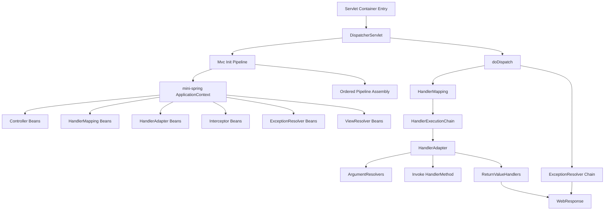
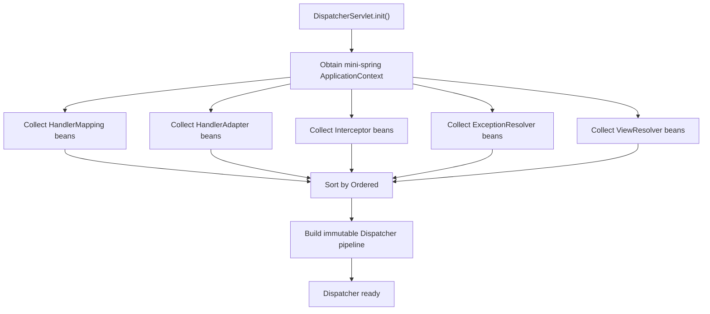
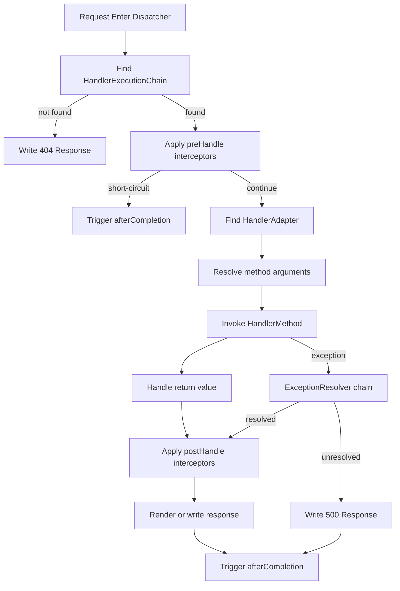
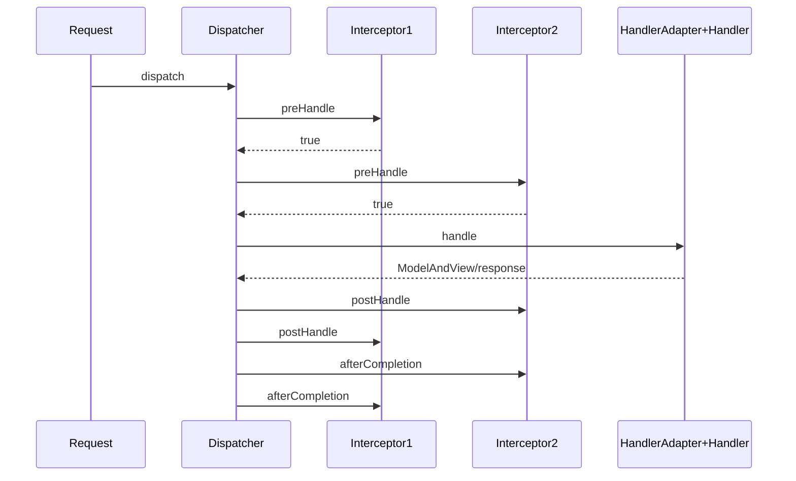
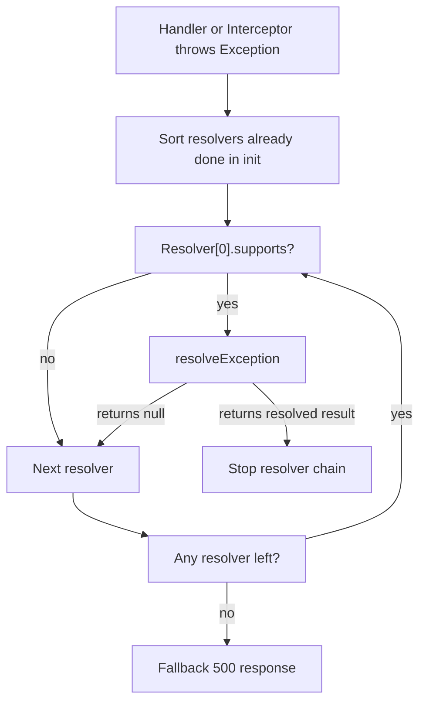

# 1. 背景与目标

## 1.1 目标

`mini-springmvc` 是构建在 `mini-spring` 之上的 MVC 框架内核，目标是提供“请求进入后”的稳定分发链路，并保持与 `mini-spring` 一致的设计风格：

- 核心流程稳定：`init` 编排负责收集组件、排序组件、构建 Dispatcher 流水线
- 扩展点可插拔：`HandlerMapping`、`HandlerAdapter`、`HandlerInterceptor`、`HandlerMethodArgumentResolver`、`HandlerMethodReturnValueHandler`、`ExceptionResolver`、`ViewResolver`
- 生命周期可控：MVC 组件由 `mini-spring` 容器托管，在 MVC 初始化阶段装配为运行时流水线
- 依赖方向单向：`mini-springmvc -> mini-spring`，MVC 不反向侵入 IOC/AOP 内核

## 1.2 非目标（Non-goals）

- 不设计 Servlet 容器、网络 IO、线程模型
- 不设计 Tomcat、Jetty、Undertow 运行机制
- 不设计 SpringBoot 自动装配
- 不设计 MyBatis、JPA、数据库访问层
- 不设计分布式、微服务、网关、Cloud 能力
- 不设计模板引擎细节；视图仅保留 MVC 组件抽象

## 1.3 术语表

- `Dispatcher`：MVC 请求分发总控组件，负责调度整条处理链
- `Handler`：请求处理目标；本设计固定采用 `HandlerMethod`
- `HandlerMapping`：根据请求选择处理器
- `HandlerAdapter`：屏蔽不同 Handler 类型的调用差异
- `Interceptor`：围绕 Handler 调用的拦截链组件
- `ArgumentResolver`：将请求数据解析为方法参数
- `ReturnValueHandler`：将方法返回值写入响应或转换为模型结果
- `ExceptionResolver`：将异常解析为统一响应结果
- `ViewResolver`：将逻辑视图名解析为视图对象

## 1.4 命名与包结构约定

### mini-springmvc 推荐包结构

```text
src/main/java/com/xujn/minispringmvc
├── servlet
│   ├── DispatcherServlet.java
│   ├── ModelAndView.java
│   ├── HandlerExecutionChain.java
│   └── support
│       └── MvcApplicationContextAwareInitializer.java
├── context
│   ├── MvcApplicationContext.java
│   └── support
│       └── DefaultMvcInfrastructureInitializer.java
├── annotation
│   ├── Controller.java
│   ├── RequestMapping.java
│   ├── RequestParam.java
│   ├── ResponseBody.java
│   └── ExceptionHandler.java
├── mapping
│   ├── HandlerMapping.java
│   ├── RequestMappingInfo.java
│   ├── HandlerMethod.java
│   ├── RequestMappingHandlerMapping.java
│   └── support
│       └── PathMatcher.java
├── adapter
│   ├── HandlerAdapter.java
│   ├── RequestMappingHandlerAdapter.java
│   ├── HandlerMethodArgumentResolver.java
│   ├── HandlerMethodReturnValueHandler.java
│   └── support
│       ├── InvocableHandlerMethod.java
│       ├── HandlerMethodArgumentResolverComposite.java
│       └── HandlerMethodReturnValueHandlerComposite.java
├── interceptor
│   ├── HandlerInterceptor.java
│   ├── MappedInterceptor.java
│   └── support
│       └── InterceptorRegistry.java
├── exception
│   ├── ExceptionResolver.java
│   ├── HandlerExceptionResolverComposite.java
│   └── support
│       ├── DefaultExceptionResolver.java
│       └── ExceptionHandlerMethodResolver.java
├── view
│   ├── View.java
│   ├── ViewResolver.java
│   └── support
│       └── InternalResourceViewResolver.java
├── bind
│   ├── WebDataBinder.java
│   ├── TypeConverter.java
│   └── support
│       └── SimpleTypeConverter.java
└── support
    ├── Ordered.java
    ├── PriorityOrdered.java
    └── AnnotationUtils.java
```

### mini-spring 提供的基础能力

```text
src/main/java/com/xujn/minispring
├── beans/...
├── context/...
├── aop/...
├── tx/...（可选，不是 MVC 核心依赖）
└── exception/...
```

### 依赖方向

- `com.xujn.minispringmvc.* -> com.xujn.minispring.*`
- `mini-springmvc` 的所有组件都作为 Bean 交给 `mini-spring` 管理
- `mini-spring` 不依赖 `mini-springmvc`

# 2. SpringMVC 核心能力抽取（只限 SpringMVC 核心链路）

## 2.1 能力分级清单

### 必须

- `Dispatcher` 请求分发总流程
- `HandlerMapping`
- `HandlerAdapter`
- 注解路由：`@Controller` + `@RequestMapping`
- `HandlerMethod`
- 基础参数解析
- 基础返回值处理
- 拦截器链
- 异常处理链
- MVC 初始化装配流程

### 可选

- `ViewResolver`
- `ModelAndView`
- 类型转换器
- `@ExceptionHandler`
- 路径模式增强
- 内容协商

### 不做

- 异步请求处理
- 文件上传
- SSE / WebSocket
- Multipart 解析
- Session / FlashMap
- 内容协商全套媒体类型系统
- Servlet 容器细节

## 2.2 能力项定义

### Dispatcher

- 定义：接收请求后驱动整条 MVC 流水线
- 价值：把“找谁处理、怎么调、结果怎么出、异常怎么兜底”集中编排
- 最小闭环：`mapping -> adapter -> invoke -> return handling -> exception resolving`
- 依赖关系：依赖所有 MVC SPI；依赖 `mini-spring` 提供 Bean 容器
- 边界：不处理容器线程、不处理网络读写
- 可选增强：异步分发、多阶段上下文缓存

### HandlerMapping

- 定义：根据请求定位 `HandlerExecutionChain`
- 价值：隔离路由匹配策略
- 最小闭环：注解扫描产生映射表，按路径和请求方法匹配
- 依赖关系：依赖 `mini-spring` 提供 Controller Bean；依赖注解元数据
- 边界：Phase 1 只做精确匹配与简单优先级判断
- 可选增强：模式匹配、条件匹配、媒体类型匹配

> [注释] HandlerMapping 必须先把“选择规则”固定下来
> - 背景：同一路径可能出现多 Controller 方法、多 Mapping 组件并存
> - 影响：如果选择规则不稳定，运行结果会随注册顺序漂移
> - 取舍：mini 版统一按 `order` 排序后依次尝试，第一个唯一命中的 `HandlerMapping` 返回结果；单个 `HandlerMapping` 内部若命中多个处理器直接报冲突
> - 可选增强：后续增加更细粒度的路径 specificity 比较器

### HandlerAdapter

- 定义：负责真正调用 Handler
- 价值：把“如何执行 Handler”与“如何找到 Handler”解耦
- 最小闭环：识别 `HandlerMethod`，完成参数解析、方法调用、返回值处理
- 依赖关系：依赖参数解析器、返回值处理器
- 边界：Phase 1 只支持 `HandlerMethod`
- 可选增强：支持函数式 Handler、异步返回值

### HandlerInterceptor

- 定义：围绕 Handler 调用的前后置拦截器
- 价值：在不侵入业务方法的前提下挂载通用处理
- 最小闭环：`preHandle / postHandle / afterCompletion`
- 依赖关系：依赖 `HandlerExecutionChain`
- 边界：不做异步回调扩展
- 可选增强：MappedInterceptor、条件拦截

> [注释] 拦截器链必须定义短路规则
> - 背景：多个拦截器串行执行时，任意一个都可能拒绝继续处理
> - 影响：如果短路后不回调已执行拦截器，资源清理会缺失
> - 取舍：mini 版规定 `preHandle` 返回 `false` 立即短路，并只回调已经成功通过的拦截器 `afterCompletion`
> - 可选增强：后续增加异步场景的并发回调分支

### HandlerMethodArgumentResolver

- 定义：把请求数据解析为控制器方法参数
- 价值：参数绑定逻辑不落到 Adapter 巨型类里
- 最小闭环：支持按参数类型和注解判断是否可解析
- 依赖关系：依赖请求抽象、类型转换器
- 边界：Phase 1 只支持简单类型和原始请求对象
- 可选增强：JSON Body、复杂对象绑定、校验

> [注释] 参数绑定的边界必须小且清晰
> - 背景：参数解析天然容易无限扩展，最容易把 mini 版做成半成品
> - 影响：过早支持复杂对象和 body 绑定，会把 MVC 与序列化、校验耦死
> - 取舍：Phase 1 只支持 `String/int/long/boolean` 及 `WebRequest/WebResponse`，参数缺失直接失败
> - 可选增强：Phase 2 再引入可插拔 `TypeConverter` 和 body 解析

### HandlerMethodReturnValueHandler

- 定义：处理控制器返回值并写入响应或生成 `ModelAndView`
- 价值：返回值类型扩展不侵入 Dispatcher
- 最小闭环：支持 `String` 文本响应、`void`、`ModelAndView`
- 依赖关系：依赖 `WebResponse`，可选依赖 `ViewResolver`
- 边界：Phase 1 禁用视图时，`String` 解释为直接响应体
- 可选增强：`@ResponseBody`、JSON、视图名区分

> [注释] 返回值处理必须先固定语义
> - 背景：`String` 既可能是视图名，也可能是响应体
> - 影响：语义不固定会让 Controller 行为不可预测
> - 取舍：当 `view=DISABLED` 时，`String` 固定作为响应体；启用视图解析后，再通过 `@ResponseBody` 与 `ModelAndView` 区分
> - 可选增强：后续增加基于注解或媒体类型的返回值协商

### ExceptionResolver

- 定义：把处理链上的异常转换为可写回的响应结果
- 价值：形成统一异常出口，避免异常泄漏到容器层
- 最小闭环：链式解析，首个能处理的 Resolver 短路
- 依赖关系：依赖异常类型判断、响应写出能力
- 边界：Phase 1 至少有默认 Resolver
- 可选增强：`@ExceptionHandler`、分层异常映射

> [注释] 异常处理链必须是短路型责任链
> - 背景：多个 Resolver 可能都声称能处理异常
> - 影响：如果不短路，后续 Resolver 会覆盖前一个结果，行为不稳定
> - 取舍：mini 版规定按 `order` 排序，首个返回“已处理结果”的 Resolver 立即终止
> - 可选增强：后续支持异常层级匹配评分

### ViewResolver

- 定义：把逻辑视图名解析为 View
- 价值：解耦控制器返回值与具体渲染实现
- 最小闭环：视图名 -> View
- 依赖关系：依赖 `ModelAndView`
- 边界：Phase 1 可禁用
- 可选增强：JSP、模板引擎、多 Resolver 链

> [注释] 视图解析不进入 Phase 1 主闭环
> - 背景：当前目标是先把 Dispatcher 主链路跑通
> - 影响：若同时引入视图系统，初始化流程和返回值语义都会膨胀
> - 取舍：Phase 1 固定 `view=DISABLED`，Phase 3 再引入 `ViewResolver`
> - 可选增强：后续支持简单模板视图和默认视图名策略

## 2.3 概念映射

| SpringMVC 概念 | mini-springmvc 建议模块 |
|---|---|
| `DispatcherServlet` | `com.xujn.minispringmvc.servlet.DispatcherServlet` |
| `HandlerMethod` | `com.xujn.minispringmvc.mapping.HandlerMethod` |
| `RequestMappingHandlerMapping` | `com.xujn.minispringmvc.mapping.RequestMappingHandlerMapping` |
| `RequestMappingHandlerAdapter` | `com.xujn.minispringmvc.adapter.RequestMappingHandlerAdapter` |
| `HandlerExecutionChain` | `com.xujn.minispringmvc.servlet.HandlerExecutionChain` |
| `HandlerInterceptor` | `com.xujn.minispringmvc.interceptor.HandlerInterceptor` |
| `HandlerMethodArgumentResolver` | `com.xujn.minispringmvc.adapter.HandlerMethodArgumentResolver` |
| `HandlerMethodReturnValueHandler` | `com.xujn.minispringmvc.adapter.HandlerMethodReturnValueHandler` |
| `HandlerExceptionResolver` | `com.xujn.minispringmvc.exception.ExceptionResolver` |
| `ViewResolver` | `com.xujn.minispringmvc.view.ViewResolver` |

# 3. mini-springmvc 设计总览（对齐 mini-spring 的执行逻辑）

## 3.1 设计原则

- 流水线稳定：Dispatcher 主流程固定
- 组件可替换：通过 SPI 和排序机制接入扩展点
- 生命周期编排：先 `mini-spring.refresh()`，后 `mvc.init()`
- 责任单一：路由、调用、绑定、异常、渲染分层
- 失败可定位：冲突、找不到 Handler、参数缺失、返回值不支持都返回带上下文的错误

## 3.2 总体架构图

**标题：mini-springmvc 总体架构图**  
**覆盖范围说明：展示 MVC 组件如何复用 mini-spring 容器并在 init 后形成 Dispatcher 流水线。**



## 3.3 模块拆分与职责边界

### `servlet`

- 对外总入口
- 负责 `init` 和 `doDispatch`
- 不实现容器细节

### `mapping`

- 负责路由注册与选择
- 产出 `HandlerExecutionChain`

### `adapter`

- 负责调用 `HandlerMethod`
- 负责参数解析和返回值处理

### `interceptor`

- 负责请求前后拦截
- 提供链式顺序与短路规则

### `exception`

- 负责异常兜底与链式解析

### `view`

- 负责逻辑视图解析；Phase 1 禁用

### `bind`

- 负责最小类型转换和参数绑定支撑

### `context`

- 负责从 `mini-spring` 容器收集 MVC 组件并完成装配

## 3.4 与 mini-spring 的集成方式

- Controller 作为普通 Bean 由 `mini-spring` 托管
- `HandlerMapping`、`HandlerAdapter`、`HandlerInterceptor`、`ExceptionResolver`、`ViewResolver` 都是容器 Bean
- MVC `init` 阶段按类型从容器中收集组件，再按 `Ordered` 规则排序
- Dispatcher 运行时只读取已装配好的不可变组件列表，不在请求中重新扫描容器

> [注释] MVC 与 mini-spring 的集成点必须收敛在 init 阶段
> - 背景：如果每个请求都从容器动态拉取组件，请求路径会依赖容器内部状态
> - 影响：性能不稳定，组件顺序也可能漂移
> - 取舍：mini 版固定为“容器 refresh 完成后，MVC 一次性收集并排序组件，构建 Dispatcher 运行态”
> - 可选增强：后续支持显式 refresh 或热重载时再重建流水线

> [注释] 依赖方向必须单向保持 mvc -> spring
> - 背景：`mini-spring` 是基座，`mini-springmvc` 是上层框架
> - 影响：如果 IOC 感知 MVC 组件语义，核心容器会被 Web 语义污染
> - 取舍：MVC 只通过 Bean 查询和生命周期托管复用 `mini-spring`；IOC 不感知 Handler、View、Resolver
> - 可选增强：后续增加独立 `MvcNamespace` 或配置模块，但仍保持单向依赖

# 4. 核心数据结构与接口草图

## 4.1 请求上下文模型

### `WebRequest`

字段边界：

- `String method`
- `String requestUri`
- `String contextPath`
- `Map<String, String[]> parameters`
- `Map<String, String> headers`
- `InputStream bodyStream`
- `Map<String, Object> attributes`

### `WebResponse`

字段边界：

- `int status`
- `Map<String, String> headers`
- `Writer writer`
- `boolean committed`

## 4.2 Handler 表示模型

本设计固定选择 `HandlerMethod`，原因：

- 可直接复用 `mini-spring` 容器中的 Controller Bean
- 注解映射天然落到“Bean + Method”
- 与参数解析器、返回值处理器的接口最契合

### `HandlerMethod`

字段建议：

- `String beanName`
- `Object bean`
- `Class<?> beanType`
- `Method method`
- `MethodParameter[] parameters`

### `HandlerExecutionChain`

字段建议：

- `Object handler`
- `List<HandlerInterceptor> interceptors`

## 4.3 核心 SPI

### `HandlerMapping`

```java
public interface HandlerMapping {
    HandlerExecutionChain getHandler(WebRequest request);
    int getOrder();
}
```

### `HandlerAdapter`

```java
public interface HandlerAdapter {
    boolean supports(Object handler);
    ModelAndView handle(WebRequest request, WebResponse response, Object handler) throws Exception;
    int getOrder();
}
```

### `HandlerInterceptor`

```java
public interface HandlerInterceptor {
    boolean preHandle(WebRequest request, WebResponse response, Object handler) throws Exception;
    void postHandle(WebRequest request, WebResponse response, Object handler, ModelAndView modelAndView) throws Exception;
    void afterCompletion(WebRequest request, WebResponse response, Object handler, Exception ex) throws Exception;
    int getOrder();
}
```

### `HandlerMethodArgumentResolver`

```java
public interface HandlerMethodArgumentResolver {
    boolean supportsParameter(MethodParameter parameter);
    Object resolveArgument(MethodParameter parameter, WebRequest request, WebResponse response) throws Exception;
    int getOrder();
}
```

### `HandlerMethodReturnValueHandler`

```java
public interface HandlerMethodReturnValueHandler {
    boolean supportsReturnType(MethodParameter returnType);
    ModelAndView handleReturnValue(
            Object returnValue,
            MethodParameter returnType,
            WebRequest request,
            WebResponse response) throws Exception;
    int getOrder();
}
```

### `ExceptionResolver`

```java
public interface ExceptionResolver {
    boolean supports(Exception ex, Object handler);
    ModelAndView resolveException(
            WebRequest request,
            WebResponse response,
            Object handler,
            Exception ex) throws Exception;
    int getOrder();
}
```

### `ViewResolver`

```java
public interface ViewResolver {
    boolean supports(String viewName);
    View resolveViewName(String viewName);
    int getOrder();
}
```

## 4.4 扩展点排序与优先级模型

排序模型建议：

- 复用 `mini-spring` 风格，定义 `Ordered` / `PriorityOrdered`
- 初始化时统一排序
- 运行时不再重新排序

规则：

- `PriorityOrdered` 优先于 `Ordered`
- 同级按 `order` 数值升序
- 未实现排序接口的组件按默认最低优先级

> [注释] 扩展点顺序必须在 init 时冻结
> - 背景：MVC 的 Mapping、Resolver、Interceptor 都依赖链式顺序
> - 影响：请求中动态决定顺序会造成结果不可预测
> - 取舍：mini 版在 `init` 阶段排序一次，Dispatcher 使用不可变列表
> - 可选增强：后续支持显式刷新流水线

> [注释] 链式扩展点必须定义短路语义
> - 背景：类似 `BeanPostProcessor`，MVC 扩展点也是链式调用
> - 影响：没有短路规则就无法处理“第一个可用组件即结束”的场景
> - 取舍：`HandlerMapping`、`ExceptionResolver`、`ReturnValueHandler` 都采用“按顺序找到首个可用组件即停止”
> - 可选增强：后续为不同扩展点定义更细粒度的聚合策略

# 5. 核心流程

## 5.1 MVC 初始化 init 流程

**标题：MVC init 装配流程**  
**覆盖范围说明：展示 MVC 如何在容器 refresh 完成后收集 Bean 并组装运行时流水线。**



## 5.2 Dispatcher 主流程

**标题：Dispatcher doDispatch 主流程**  
**覆盖范围说明：展示请求进入后从 Mapping 到返回值处理的主干调用链。**



> [注释] 多个 HandlerAdapter 同时支持同一个 Handler 必须直接失败
> - 背景：Adapter 负责真正调用 Handler，重复支持意味着运行语义不唯一
> - 影响：若取第一个，会让结果依赖注册顺序
> - 取舍：mini 版在 init 或首次匹配时检查，若支持者数量不为 1 直接抛出配置错误
> - 可选增强：后续为 Handler 类型引入更明确的 adapter 分类

## 5.3 拦截器链时序图

**标题：拦截器链执行时序**  
**覆盖范围说明：展示 `preHandle`、`postHandle`、`afterCompletion` 的调用顺序与短路行为。**



> [注释] postHandle 与 afterCompletion 的回调顺序必须反向
> - 背景：前置链通常表现为栈结构
> - 影响：若正向回调，资源释放顺序会与获取顺序相反
> - 取舍：mini 版固定 `preHandle` 正向、`postHandle/afterCompletion` 反向
> - 可选增强：后续对异步场景补充独立回调约束

## 5.4 异常处理链流程图

**标题：ExceptionResolver 责任链**  
**覆盖范围说明：展示异常如何被链式解析以及已提交响应时的处理边界。**



> [注释] 响应已提交后不能再二次写错误结果
> - 背景：异常可能发生在返回值处理或视图渲染后段
> - 影响：若继续写入，容器层会出现重复提交或内容污染
> - 取舍：mini 版规定 `response.committed=true` 时仅执行 `afterCompletion` 和日志记录，不再进入异常写回
> - 可选增强：后续增加统一错误事件上报

> [注释] 异常吞噬必须被禁止
> - 背景：Resolver 链若把“无法处理”误当“已处理”，真实错误会消失
> - 影响：排查成本极高，且响应状态不可信
> - 取舍：mini 版要求 Resolver 明确返回“已处理结果”或 `null`；`null` 表示继续下一个 Resolver
> - 可选增强：后续增加异常解析调试日志和 trace 视图

# 6. 关键设计取舍与边界

## 6.1 路由与匹配

- 选择：`AnnotationMapping`
- 最小实现：`@Controller` + `@RequestMapping(path, method)` 最小子集
- 支持：
  - 类级前缀 + 方法级路径拼接
  - 精确路径匹配
  - HTTP 方法精确匹配
- 不支持：
  - Ant 风格路径
  - 路径变量
  - 媒体类型条件
  - 参数条件
- 可选增强：
  - 路径模式匹配
  - specificity 评分
  - 组合条件

> [注释] 多匹配冲突必须在初始化期暴露
> - 背景：注解路由是静态元数据，冲突应视为配置错误
> - 影响：若延迟到运行时才发现，错误只在特定请求路径上暴露
> - 取舍：mini 版在 `RequestMappingHandlerMapping` 初始化映射表时检测重复 key，直接 fail-fast
> - 可选增强：后续支持更复杂的条件比较器

## 6.2 参数绑定

- 选择：Phase 1 仅支持简单类型，不支持 JSON body
- 最小实现：
  - `@RequestParam`
  - `String/int/long/boolean`
  - `WebRequest`
  - `WebResponse`
- 支持：
  - 字符串到简单类型转换
  - 必填参数缺失直接报错
- 不支持：
  - 嵌套对象绑定
  - JSON body 反序列化
  - 集合绑定
- 可选增强：
  - `TypeConverter`
  - 请求体消息转换器
  - 校验框架接入

## 6.3 返回值

- 选择：Phase 1 支持 `String` 与 `void`
- 语义：
  - `String` 在 `view=DISABLED` 下作为直接响应体
  - `void` 表示方法自行完成响应或无需响应体
- 不支持：
  - JSON 自动序列化
  - `ResponseEntity`
  - 流式返回
- 可选增强：
  - `@ResponseBody`
  - `ModelAndView`
  - 统一消息转换器

## 6.4 视图渲染

- Phase 1：禁用
- Phase 2+：引入 `ViewResolver`
- 影响：Phase 1 控制器返回 `String` 不解释为视图名
- 可选增强：
  - `InternalResourceViewResolver`
  - 默认视图名策略

## 6.5 异常处理

- 必须有最小闭环
- Phase 1 最小实现：
  - 默认 `ExceptionResolver`
  - 未处理异常转 500
  - 参数缺失、找不到 Handler、映射冲突给出明确错误
- 可选增强：
  - `@ExceptionHandler`
  - 异常类型分层匹配
  - 统一错误响应模型

## 6.6 与 AOP 的关系

- Controller 允许被 `mini-spring` AOP 代理
- 影响：
  - `HandlerMethod` 建议保存 Bean 实例与原始可调用 Method 元数据
  - Mapping 初始化时应以目标类为基础解析注解，而不是仅看代理类
- 取舍：
  - mini 版约定从容器拿到 Bean 时，若是代理对象，则同时解析其目标类元数据
- 可选增强：
  - 暴露统一 `AopUtils` 辅助工具
  - 支持代理类与原始方法映射缓存

> [注释] Controller 代理会影响注解扫描和方法调用
> - 背景：AOP 代理类通常不保留原始类上的 MVC 注解结构
> - 影响：若直接扫描代理类，Controller 可能“消失”或映射为空
> - 取舍：mini 版固定“注解解析看目标类，实际调用用容器里的 Bean”
> - 可选增强：后续抽出统一代理解包工具供 MVC 与事务复用

# 7. 开发迭代计划（Git 驱动）

## 7.1 Phase 列表

### Phase 1：Dispatcher + Mapping + Adapter 最小闭环（无 ViewResolver）

- 目标：
  - 完成 Dispatcher 主流程
  - 完成注解路由映射
  - 完成 `HandlerMethod` 调用
  - 完成最小参数解析和返回值处理
- 范围：
  - `@Controller`
  - `@RequestMapping`
  - `RequestMappingHandlerMapping`
  - `RequestMappingHandlerAdapter`
  - 简单类型参数绑定
  - `String/void` 返回值
  - 默认异常处理
- 交付物：
  - MVC 核心包骨架
  - Phase 1 示例
  - Phase 1 验收文档
- 验收标准：
  - 找得到唯一 Handler
  - 找不到 Handler 返回 404
  - 参数缺失返回明确错误
  - `String` 返回值可写出响应
  - 未处理异常可转 500

### Phase 2：参数解析 + 返回值处理扩展点

- 目标：
  - 把参数解析和返回值处理抽成可插拔 SPI
  - 引入排序模型和组合器
- 范围：
  - `HandlerMethodArgumentResolverComposite`
  - `HandlerMethodReturnValueHandlerComposite`
  - `@RequestParam`
  - `WebRequest/WebResponse` 参数解析器
- 交付物：
  - SPI 组合器
  - Phase 2 示例
  - Phase 2 验收文档
- 验收标准：
  - 多 Resolver 可按顺序选择
  - 不支持参数类型会 fail-fast
  - 不支持返回值类型会 fail-fast
  - 自定义 Resolver 可插入默认链

### Phase 3：拦截器链 + 异常处理链完善 + 视图（可选）

- 目标：
  - 完成拦截器链
  - 完成可扩展异常处理链
  - 在 `view=ENABLED` 的条件下引入 `ViewResolver`
- 范围：
  - `HandlerInterceptor`
  - `ExceptionResolver` 责任链
  - `ModelAndView`
  - `ViewResolver`
- 交付物：
  - 拦截器示例
  - 异常处理示例
  - 可选视图示例
- 验收标准：
  - `preHandle` 可短路
  - `postHandle/afterCompletion` 顺序正确
  - 异常解析链首个命中即终止
  - 逻辑视图名可解析为 View

## 7.2 风险清单与缓解策略

- 路由冲突风险：初始化期构建映射表时 fail-fast
- 代理类注解丢失风险：扫描目标类而非代理类
- 扩展点顺序不稳定风险：统一 `Ordered` 排序并冻结
- 参数绑定膨胀风险：Phase 1 只支持简单类型
- 返回值语义歧义风险：`view=DISABLED` 时固定 `String` 为响应体

> [注释] 风险缓解必须优先选择“收缩边界”
> - 背景：MVC 核心链路扩展面很广
> - 影响：若 Phase 1 同时追求全功能，会快速失控
> - 取舍：mini 版优先稳定主流程，再逐步开放参数、返回值、视图和异常扩展
> - 可选增强：后续引入阶段性特性开关和更细的验收矩阵

# 8. Git 规范（Angular Conventional Commits）

## 8.1 commit message 格式

```text
type(scope): subject
```

## 8.2 type 列表与适用场景

- `feat`：新增框架能力
- `fix`：修复框架行为缺陷
- `refactor`：重构，不改变外部行为
- `test`：新增或调整验收测试、夹具、示例断言
- `docs`：设计文档、README、验收策略文档
- `chore`：构建配置、目录初始化、无业务语义调整

## 8.3 scope 建议

- `mvc`
- `dispatcher`
- `mapping`
- `adapter`
- `interceptor`
- `exception`
- `view`
- `bind`
- `examples`
- `docs`
- `tests`

## 8.4 每个 phase 的示例提交

### Phase 1

- `docs(docs): add mvc phase-1 design and acceptance documents -> docs/mvc-phase-1.md, tests/acceptance-mvc-phase-1.md`
- `feat(dispatcher): add dispatcher servlet and handler execution chain core -> src/main/java/com/xujn/minispringmvc/servlet/DispatcherServlet.java, src/main/java/com/xujn/minispringmvc/servlet/HandlerExecutionChain.java`
- `feat(mapping): add request mapping handler mapping and handler method registry -> src/main/java/com/xujn/minispringmvc/mapping/RequestMappingHandlerMapping.java, src/main/java/com/xujn/minispringmvc/mapping/HandlerMethod.java, src/main/java/com/xujn/minispringmvc/annotation/RequestMapping.java`
- `feat(adapter): add request mapping handler adapter minimal invoke pipeline -> src/main/java/com/xujn/minispringmvc/adapter/RequestMappingHandlerAdapter.java, src/main/java/com/xujn/minispringmvc/adapter/support/InvocableHandlerMethod.java`
- `test(tests): add mvc phase-1 acceptance coverage for dispatch and mapping failures -> src/test/java/com/xujn/minispringmvc/Phase1AcceptanceTest.java`

### Phase 2

- `docs(docs): add mvc phase-2 design and acceptance documents -> docs/mvc-phase-2.md, tests/acceptance-mvc-phase-2.md`
- `feat(bind): add argument resolver and return value handler composites -> src/main/java/com/xujn/minispringmvc/adapter/support/HandlerMethodArgumentResolverComposite.java, src/main/java/com/xujn/minispringmvc/adapter/support/HandlerMethodReturnValueHandlerComposite.java`
- `feat(adapter): add request param and native request resolvers -> src/main/java/com/xujn/minispringmvc/adapter/support/RequestParamMethodArgumentResolver.java, src/main/java/com/xujn/minispringmvc/adapter/support/WebRequestArgumentResolver.java`
- `feat(adapter): add string and void return value handlers -> src/main/java/com/xujn/minispringmvc/adapter/support/StringReturnValueHandler.java, src/main/java/com/xujn/minispringmvc/adapter/support/VoidReturnValueHandler.java`
- `test(tests): add mvc phase-2 acceptance coverage for resolver ordering and unsupported types -> src/test/java/com/xujn/minispringmvc/Phase2AcceptanceTest.java`

### Phase 3

- `docs(docs): add mvc phase-3 design and acceptance documents -> docs/mvc-phase-3.md, tests/acceptance-mvc-phase-3.md`
- `feat(interceptor): add handler interceptor chain and mapped interceptor support -> src/main/java/com/xujn/minispringmvc/interceptor/HandlerInterceptor.java, src/main/java/com/xujn/minispringmvc/interceptor/MappedInterceptor.java`
- `feat(exception): add exception resolver composite and default resolver -> src/main/java/com/xujn/minispringmvc/exception/HandlerExceptionResolverComposite.java, src/main/java/com/xujn/minispringmvc/exception/support/DefaultExceptionResolver.java`
- `feat(view): add model and view plus simple view resolver contracts -> src/main/java/com/xujn/minispringmvc/servlet/ModelAndView.java, src/main/java/com/xujn/minispringmvc/view/ViewResolver.java`
- `test(tests): add mvc phase-3 acceptance coverage for interceptor short-circuit and exception chain -> src/test/java/com/xujn/minispringmvc/Phase3AcceptanceTest.java`

## 8.5 分支策略

选择：`trunk-based`

规则：

- 以 `main` 为主分支
- 每个 Phase 或专项能力从 `main` 拉短分支
- 分支命名：
  - `feature/mvc-phase-1-dispatcher`
  - `feature/mvc-phase-2-binding`
  - `feature/mvc-phase-3-interceptor-exception-view`
- 小步提交，Phase 完成后合并回 `main`

原因：

- 当前项目是框架内核演进，阶段边界明确
- `trunk-based` 更适合按验收文档驱动的小步交付

## 8.6 PR 模板要点

- `What`：本次增加了哪些 MVC 内核能力
- `Why`：对应哪个 Phase 文档和验收目标
- `Risk`：可能影响的链路、顺序、兼容性风险
- `Verify`：如何编译、运行示例、执行验收
- `Phase`：明确属于 `Phase 1/2/3` 哪一阶段
