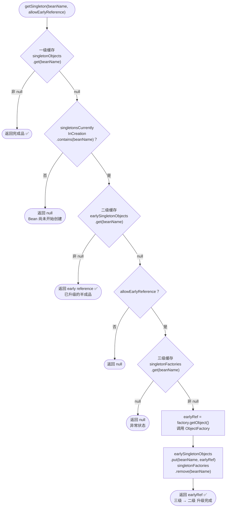
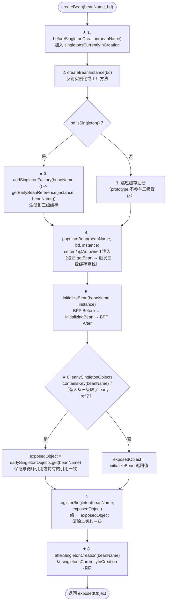
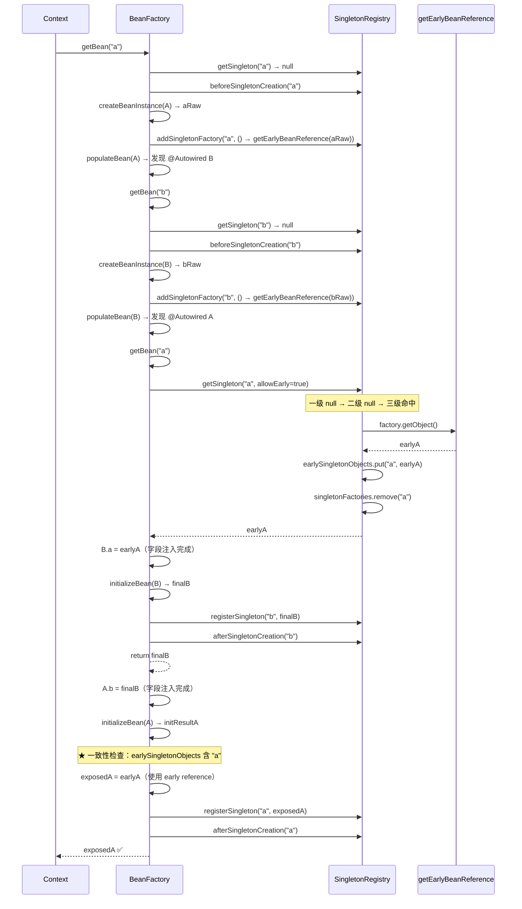

# mini-spring 三级缓存循环依赖架构设计文档

> **mode**: FULL  
> **injection_style**: SETTER_REQUIRED  
> **circular_dependency**: THREE_LEVEL_CACHE  
> **aop_early_reference**: DISABLED（Phase 1）→ ENABLED（Phase 2+）  
> **scope_support**: SINGLETON_ONLY  
> **package group**: `com.xujn`

---

# 1. 背景与目标

## 1.1 循环依赖问题定义

| 注入方式         | 循环依赖示例                | 是否可解决       | 原因                                                      |
| ---------------- | --------------------------- | ---------------- | --------------------------------------------------------- |
| Setter / 字段注入 | A.setB(B)、B.setA(A)        | ✅ 可解决         | 实例化与属性注入分离，实例化后即可暴露半成品引用             |
| 构造器注入        | new A(B)、new B(A)          | ❌ 不可解决       | 实例化阶段即需要完整依赖，无法先创建半成品                   |
| Prototype         | A(prototype) ↔ B(prototype) | ❌ 不可解决       | prototype 不缓存，无法复用同一半成品引用                     |

## 1.2 为什么需要三级缓存

> [注释] 三级缓存 vs 二级缓存 — 为什么不能只用两级
> - 背景：直觉上，只用 `singletonObjects`（完成品）+ `earlySingletonObjects`（半成品）两级缓存即可解决 setter 循环依赖：实例化后直接将半成品放入二级缓存，属性注入时从二级取用
> - 影响：在无 AOP 的场景下，两级缓存确实足够。但引入 AOP 后，最终放入一级缓存的是代理对象而非原始对象。若实例化后立即放入二级缓存的是原始对象，则循环引用方持有的是原始对象，而一级缓存存储的是代理对象，两者不一致，破坏 singleton 语义
> - 取舍：引入第三级 `singletonFactories`（类型 `Map<String, ObjectFactory<?>>`），存储的不是对象本身而是"创建 early reference 的工厂"。工厂的 `getObject()` 方法延迟决定返回原始对象还是代理对象：
>   - 无 AOP 场景 → 返回原始对象
>   - 有 AOP 场景 → 返回代理对象（通过 `getEarlyBeanReference` 提前创建代理）
>   - 该工厂仅在实际发生循环依赖时被调用（某个 Bean 在属性注入阶段递归 getBean 触发），避免无循环依赖时的额外代理创建开销
> - 可选增强：无（三级缓存是 Spring 的最终方案）

## 1.3 mini-spring 当前能力与改造边界

| 维度                    | 当前状态                              | 本次改造                                     |
| ----------------------- | ------------------------------------- | -------------------------------------------- |
| SingletonBeanRegistry   | 仅 `singletonObjects` 一级缓存        | 增加 `earlySingletonObjects` + `singletonFactories` |
| 循环依赖检测            | `singletonsCurrentlyInCreation` + FAIL_FAST | 改为标记状态，不直接抛异常；仅构造器循环抛异常 |
| createBean 流程         | 实例化 → populateBean → initializeBean | 实例化后插入 singletonFactory 注册步骤         |
| AOP 代理创建            | BPP AfterInitialization 阶段           | Phase 2 增加 `getEarlyBeanReference` 提前代理  |
| 错误信息                | 基础异常                              | Phase 3 增强依赖链追踪                         |

## 1.4 术语表

| 术语                                  | 定义                                                                         |
| ------------------------------------- | ---------------------------------------------------------------------------- |
| singletonObjects                      | 一级缓存：存储完全初始化、可直接使用的 singleton Bean                          |
| earlySingletonObjects                 | 二级缓存：存储已实例化但未完成属性注入的 early reference（原始对象或代理对象）    |
| singletonFactories                    | 三级缓存：存储 `ObjectFactory<?>`，延迟生成 early reference                    |
| ObjectFactory                         | 函数式接口，`T getObject()` 方法返回 early reference                           |
| singletonsCurrentlyInCreation         | 正在创建中的 Bean 名称集合，用于检测循环依赖                                   |
| early reference                       | 半成品引用 — 已实例化但属性注入和初始化回调尚未完成的 Bean 引用                   |
| getEarlyBeanReference                 | `SmartInstantiationAwareBeanPostProcessor` 的方法，用于在循环依赖场景下提前创建代理 |
| SmartInstantiationAwareBeanPostProcessor | BPP 扩展接口，提供 `getEarlyBeanReference` 方法                            |
| earlyProxyReferences                  | 记录已通过 `getEarlyBeanReference` 提前创建代理的 beanName 集合                |
| 缓存升级                              | 从三级获取后放入二级、最终放入一级的过程                                        |

## 1.5 包结构与改造位置

```
com.xujn.minispring
├── beans
│   ├── factory
│   │   ├── ObjectFactory.java                              # [NEW] 函数式接口
│   │   ├── config
│   │   │   ├── SmartInstantiationAwareBeanPostProcessor.java # [NEW] Phase 2
│   │   │   └── ...
│   │   └── support
│   │       ├── DefaultSingletonBeanRegistry.java            # [MODIFY] 三级缓存核心
│   │       ├── AbstractBeanFactory.java                     # [MODIFY] getSingleton 三级查找
│   │       └── AutowireCapableBeanFactory.java              # [MODIFY] createBean 暴露 singletonFactory
│   └── ...
├── aop
│   └── framework
│       └── autoproxy
│           └── AutoProxyCreator.java                        # [MODIFY] Phase 2 实现 getEarlyBeanReference
├── exception
│   └── BeanCurrentlyInCreationException.java                # [MODIFY] Phase 3 增强依赖链信息
└── ...
```

---

# 2. Spring 三级缓存核心能力抽取

## 2.1 能力清单

### 必须实现

| #  | 能力                             | 定义                                                                  | 价值                                       | 最小闭环                                                        | 依赖关系       | 边界                           |
|----|----------------------------------|-----------------------------------------------------------------------|--------------------------------------------|-----------------------------------------------------------------|----------------|-------------------------------|
| 1  | 三级缓存数据结构                  | `DefaultSingletonBeanRegistry` 增加二级和三级缓存 Map                  | 存储半成品引用和引用工厂                    | 两个 `Map<String, Object>` 和 `Map<String, ObjectFactory<?>>`   | —              | —                             |
| 2  | getSingleton 三级查找             | 按一级 → 二级 → 三级优先顺序查找                                       | 循环依赖场景取到 early reference            | 查找逻辑 + 三级升级二级 + 清理三级                               | #1             | 仅 singleton                  |
| 3  | singletonsCurrentlyInCreation 标记 | createBean 前标记、完成后移除                                          | 识别正在创建中的 Bean                       | `Set<String>` add/remove                                        | —              | —                             |
| 4  | singletonFactory 注册            | createBeanInstance 之后、populateBean 之前注册 ObjectFactory 到三级缓存 | 延迟生成 early reference                    | `singletonFactories.put(beanName, factory)`                     | #1, #3         | 仅 singleton                  |
| 5  | 缓存升级与清理                    | 三级 → 二级升级；最终放入一级时清理二级和三级                            | 保证缓存一致性                              | registerSingleton 清理 early + factory                           | #1, #2         | —                             |
| 6  | setter 循环依赖闭环               | A ↔ B setter 互注入场景下容器正常启动                                  | 核心功能                                    | #2 + #4 + populateBean 递归 getBean                             | #1-5           | 仅 singleton + setter         |
| 7  | 构造器循环依赖 FAIL_FAST          | 构造器注入场景快速失败并输出依赖链                                      | 明确不可解决的场景                          | 创建中标记 + 实例化前检测                                        | #3             | 异常 message 含依赖链          |
| 8  | early reference 一致性检查        | createBean 末尾检查 earlySingletonObjects 确保最终对象一致              | 保证 singleton 语义                         | 若 early reference 已暴露，最终对象必须使用 early reference       | #2, #4         | —                             |

### 可选实现

| #  | 能力                                        | 说明                                                      | 可选增强                                    |
|----|---------------------------------------------|-----------------------------------------------------------|---------------------------------------------|
| 9  | SmartInstantiationAwareBeanPostProcessor    | 定义 `getEarlyBeanReference` 接口供 AOP 使用                | Phase 2 实现                                |
| 10 | earlyProxyReferences 防重复代理              | AutoProxyCreator 跳过已 early 代理的 Bean                   | Phase 2 实现                                |
| 11 | 依赖链追踪与增强错误信息                     | 异常 message 中输出完整依赖链                                | Phase 3 实现                                |
| 12 | prototype 循环依赖检测                       | prototype 场景快速失败                                      | Phase 3 实现                                |

### 不做

| 能力                               | 原因                                                  |
|------------------------------------|-------------------------------------------------------|
| 构造器注入循环依赖解决              | 实例化阶段即需完整依赖，三级缓存无法解决                |
| CGLIB 提前代理                     | mini-spring 仅支持 JDK 代理                            |
| 完整 SmartInstantiationAwareBPP 体系 | 仅实现 `getEarlyBeanReference` 单方法                |
| 并发安全（synchronized）            | mini-spring 为单线程启动模型                           |
| `@Lazy` 代理打破循环                | 属于替代方案，非三级缓存核心                            |

## 2.2 Spring 概念映射

| mini-spring 组件                                  | 对应 Spring 类                                                        |
| ------------------------------------------------- | --------------------------------------------------------------------- |
| `DefaultSingletonBeanRegistry`                    | `o.s.beans.factory.support.DefaultSingletonBeanRegistry`               |
| `ObjectFactory<T>`                                | `o.s.beans.factory.ObjectFactory`                                      |
| `SmartInstantiationAwareBeanPostProcessor`        | `o.s.beans.factory.config.SmartInstantiationAwareBeanPostProcessor`    |
| `AutoProxyCreator.getEarlyBeanReference()`        | `AbstractAutoProxyCreator.getEarlyBeanReference()`                     |
| `BeanCurrentlyInCreationException`                | `o.s.beans.factory.BeanCurrentlyInCreationException`                   |
| `singletonsCurrentlyInCreation`                   | `DefaultSingletonBeanRegistry.singletonsCurrentlyInCreation`           |
| `earlyProxyReferences`                            | `AbstractAutoProxyCreator.earlyProxyReferences`                        |

---

# 3. 设计总览（对齐 mini-spring 主流程）

## 3.1 SingletonRegistry 增量设计

### DefaultSingletonBeanRegistry 字段模型

| 字段                              | 类型                                  | 访问语义                                              | 写入时机                                    | 清理时机                           |
| --------------------------------- | ------------------------------------- | ----------------------------------------------------- | ------------------------------------------- | ---------------------------------- |
| `singletonObjects`                | `Map<String, Object>`                 | 一级：完全初始化的 Bean                                 | `registerSingleton()` 完成时                | 容器关闭                           |
| `earlySingletonObjects`           | `Map<String, Object>`                 | 二级：从三级工厂生产后升级存储的 early reference         | `getSingleton()` 命中三级时升级              | `registerSingleton()` 时清除       |
| `singletonFactories`              | `Map<String, ObjectFactory<?>>`       | 三级：延迟生成 early reference 的工厂                   | `addSingletonFactory()` 在实例化后调用       | `getSingleton()` 命中时清除 或 `registerSingleton()` 时清除 |
| `singletonsCurrentlyInCreation`   | `Set<String>`                         | 标记正在创建中的 Bean                                   | `beforeSingletonCreation()` 加入            | `afterSingletonCreation()` 移除    |

### 核心方法签名

```text
class DefaultSingletonBeanRegistry
    // 三级查找
    Object getSingleton(String beanName, boolean allowEarlyReference)

    // 注册三级工厂
    void addSingletonFactory(String beanName, ObjectFactory<?> singletonFactory)

    // 注册到一级（清理二三级）
    void registerSingleton(String beanName, Object singletonObject)

    // 创建中标记
    void beforeSingletonCreation(String beanName)
    void afterSingletonCreation(String beanName)

    // 判断是否正在创建中
    boolean isSingletonCurrentlyInCreation(String beanName)
```

## 3.2 createBean 主流程改造点

Phase 1-3 改造后的 `createBean` 完整节点序列：

```
createBean(beanName, bd):
  1. beforeSingletonCreation(beanName)          ← 标记创建中
  2. instance = createBeanInstance(bd)            ← 反射或工厂方法实例化
  3. ★ addSingletonFactory(beanName, () -> getEarlyBeanReference(instance, beanName))  ← 暴露三级工厂
  4. populateBean(beanName, bd, instance)         ← setter/字段注入（递归 getBean 触发三级缓存查找）
  5. exposedObject = initializeBean(instance)     ← BPP Before → InitializingBean → BPP After
  6. ★ early reference 一致性检查
     if earlySingletonObjects.containsKey(beanName):
       exposedObject = earlySingletonObjects.get(beanName)
  7. registerSingleton(beanName, exposedObject)   ← 放入一级、清除二三级
  8. afterSingletonCreation(beanName)             ← 移除创建中标记
  return exposedObject
```

> [注释] 步骤 3 暴露时机：为什么在 populateBean 之前
> - 背景：三级工厂必须在属性注入之前注册，因为属性注入阶段的递归 getBean 是触发循环依赖的唯一路径
> - 影响：如果在 populateBean 之后注册，循环引用方将无法从三级缓存获取 early reference，导致死循环或 null pointer
> - 取舍：在 `createBeanInstance` 之后立即注册到三级缓存；此时 Bean 已实例化但属性为空，是一个合法的半成品引用
> - 可选增强：无（这是唯一正确的注册时机）

## 3.3 与 BPP / AOP 的交互

> [注释] AOP 参与循环依赖时的引用一致性问题
> - 背景：正常流程中 AOP 代理在 `initializeBean` 的 BPP AfterInitialization 阶段创建。但循环依赖场景下，B 在属性注入阶段通过三级缓存获取 A 的 early reference，此时 A 尚未走到 BPP After
> - 影响：如果三级工厂返回原始对象而非代理，B 持有的是原始 A；A 走完 BPP After 后变成代理 A。此时 B.a ≠ getBean(A)，singleton 语义被破坏
> - 取舍：三级工厂的 `ObjectFactory.getObject()` 调用 `getEarlyBeanReference(bean, beanName)`，在需要代理时提前创建代理对象。`AutoProxyCreator` 实现 `SmartInstantiationAwareBeanPostProcessor`：
>   - `getEarlyBeanReference()` 中检查切点匹配 → 匹配则创建代理并记录到 `earlyProxyReferences`
>   - `postProcessAfterInitialization()` 中检查 `earlyProxyReferences` → 已提前代理则跳过重复创建
>   - createBean 步骤 6 检查 earlySingletonObjects → 若已暴露 early reference 则最终对象使用 early reference
> - 可选增强：无（该机制与 Spring 实现一致）

## 3.4 默认支持范围与 FAIL_FAST

| 场景                           | 策略                                                                    |
| ------------------------------ | ----------------------------------------------------------------------- |
| singleton + setter 循环依赖     | ✅ 三级缓存解决                                                          |
| singleton + 字段注入循环依赖    | ✅ 三级缓存解决（@Autowired 字段注入在 populateBean 阶段，与 setter 等价） |
| 构造器注入循环依赖              | ❌ FAIL_FAST：`BeanCurrentlyInCreationException`                         |
| prototype 参与循环依赖          | ❌ FAIL_FAST：`BeanCurrentlyInCreationException`                         |
| singleton ↔ prototype 混合循环 | ❌ FAIL_FAST                                                             |

---

# 4. 核心数据结构与接口草图

## 4.1 三级缓存字段模型

| 缓存   | 字段名                  | Key 类型   | Value 类型          | 说明                                          |
| ------ | ----------------------- | ---------- | ------------------- | --------------------------------------------- |
| 一级   | `singletonObjects`      | `String`   | `Object`            | beanName → 完全初始化的 Bean                    |
| 二级   | `earlySingletonObjects` | `String`   | `Object`            | beanName → early reference（原始或代理）        |
| 三级   | `singletonFactories`    | `String`   | `ObjectFactory<?>` | beanName → 延迟生成 early reference 的工厂       |

## 4.2 ObjectFactory 接口

```text
@FunctionalInterface
interface ObjectFactory<T>
    T getObject()
```

**用途**：封装 `getEarlyBeanReference(bean, beanName)` 的延迟调用。仅在循环依赖实际发生时（即有其他 Bean 从三级缓存取值时）才执行。

## 4.3 SmartInstantiationAwareBeanPostProcessor（Phase 2）

```text
interface SmartInstantiationAwareBeanPostProcessor extends BeanPostProcessor
    // 在循环依赖场景下，为 early reference 提供代理包装的机会
    Object getEarlyBeanReference(Object bean, String beanName)
```

**默认实现**（Phase 1 无 AOP 参与时）：

```text
// Phase 1：直接返回原始对象
getEarlyBeanReference(bean, beanName) → return bean

// Phase 2：AutoProxyCreator 实现
getEarlyBeanReference(bean, beanName):
    earlyProxyReferences.add(beanName)
    if 切点匹配 bean.getClass():
        return createProxy(bean)
    return bean
```

## 4.4 依赖链追踪结构（Phase 3）

| 字段               | 类型            | 说明                                                  |
| ------------------ | --------------- | ----------------------------------------------------- |
| `creationPath`     | `List<String>`  | 当前创建链路的 beanName 栈（线程局部或方法参数传递）    |

**错误信息格式要求**：

```
BeanCurrentlyInCreationException:
  Circular dependency detected:
    serviceA → serviceB → serviceC → serviceA
  Injection type: [setter|constructor]
  Note: Constructor injection circular dependencies cannot be resolved.
```

---

# 5. 核心流程

## 5.1 getSingleton 三级缓存读取优先级

> **标题**：getSingleton 三级缓存查找流程  
> **覆盖范围**：从 getSingleton 入口到返回 Bean 实例（或 null）的三级查找、升级逻辑



> [注释] 二级缓存的存在价值
> - 背景：三级缓存通过 `ObjectFactory` 生成 early reference 后升级到二级缓存
> - 影响：如果多个 Bean 都循环依赖同一个尚未完成的 Bean X（如 A → X、B → X、C → X 且 X → A/B/C），第一次从三级获取 X 的 early reference 后升级到二级，后续 B、C 对 X 的 getSingleton 直接命中二级，不重复调用 `ObjectFactory`
> - 取舍：二级缓存保证同一 Bean 的 early reference 只生成一次，多个循环引用方持有的是同一个 early reference 对象
> - 可选增强：无

## 5.2 createBean 改造后生命周期流程

> **标题**：createBean 三级缓存改造后完整生命周期  
> **覆盖范围**：从 createBean 入口到 registerSingleton 的全流程，标注三级缓存关键步骤（★ 标记）



## 5.3 Setter 循环依赖成功闭环时序图（A ↔ B）

> **标题**：三级缓存解决 A ↔ B setter 循环依赖完整时序  
> **覆盖范围**：从 getBean("a") 到 A、B 均注册到一级缓存的全过程



## 5.4 AOP 参与循环依赖的一致性方案（Phase 2）

> **标题**：AOP + 循环依赖引用一致性方案  
> **覆盖范围**：AutoProxyCreator 在 getEarlyBeanReference 与 postProcessAfterInitialization 中的协作策略

```mermaid
flowchart TD
    subgraph "三级工厂被调用（循环依赖触发）"
        SF_CALL(["singletonFactory.getObject()"])
        SF_CALL --> INVOKE_GER["AutoProxyCreator\n.getEarlyBeanReference(bean, beanName)"]
        INVOKE_GER --> RECORD["earlyProxyReferences\n.add(beanName)"]
        RECORD --> MATCH_PC{"切点匹配\nbean.getClass()？"}
        MATCH_PC -->|是| CREATE_PROXY["创建 JDK 代理\n→ 返回 proxyBean"]
        MATCH_PC -->|否| RETURN_RAW["返回原始 bean"]
        CREATE_PROXY --> TO_L2["earlyRef 升级到二级缓存"]
        RETURN_RAW --> TO_L2
    end

    subgraph "initializeBean BPP After 阶段"
        BPP_AFTER(["AutoProxyCreator\n.postProcessAfterInitialization(bean, beanName)"])
        BPP_AFTER --> CHECK_EARLY{"earlyProxyReferences\n.contains(beanName)？"}
        CHECK_EARLY -->|是| SKIP["跳过代理创建\nearlyProxyReferences.remove(beanName)\nreturn bean"]
        CHECK_EARLY -->|否| NORMAL_PROXY["正常走切点匹配\n→ 创建代理或返回原 bean\n（无循环依赖场景）"]
    end

    subgraph "createBean 一致性检查"
        CONSIST(["createBean 步骤 6"])
        CONSIST --> HAS_EARLY{"earlySingletonObjects\n含 beanName？"}
        HAS_EARLY -->|是| USE_EARLY_OBJ["exposedObject = earlySingletonObjects.get(beanName)\n→ 保证与循环引用方持有的代理一致"]
        HAS_EARLY -->|否| USE_INIT_OBJ["exposedObject = initializeBean 返回值"]
    end
```



> [注释] earlyProxyReferences 防止重复代理的必要性
> - 背景：同一 Bean 在循环依赖场景下通过 `getEarlyBeanReference` 创建了一次代理，后续 `postProcessAfterInitialization` 不应再创建第二个代理
> - 影响：两次代理创建将产生两个不同的代理实例 — early reference 持有代理 A₁，一级缓存存储代理 A₂，B.a = A₁ ≠ getBean(A) = A₂，singleton 语义被破坏
> - 取舍：`AutoProxyCreator` 维护 `Set<String> earlyProxyReferences`，`getEarlyBeanReference` 中记录已提前代理的 beanName，`postProcessAfterInitialization` 中检测到已记录则跳过
> - 可选增强：无（该机制与 Spring 实现一致）

## 5.5 构造器循环依赖 FAIL_FAST 流程

> **标题**：构造器循环依赖 FAIL_FAST 检测流程  
> **覆盖范围**：构造器注入场景下，Bean 在实例化阶段即检测到循环依赖并抛出异常

```mermaid
flowchart TD
    GB(["getBean(\"ctorA\")"])
    GB --> GS1["getSingleton(\"ctorA\") → null"]
    GS1 --> MARK_A["beforeSingletonCreation(\"ctorA\")\nsingletonsCurrentlyInCreation.add(\"ctorA\")"]
    MARK_A --> CBI_A["createBeanInstance(CtorA)\n→ 构造器需要 CtorB"]
    CBI_A --> GB_B["getBean(\"ctorB\")"]
    GB_B --> GS2["getSingleton(\"ctorB\") → null"]
    GS2 --> MARK_B["beforeSingletonCreation(\"ctorB\")\nsingletonsCurrentlyInCreation.add(\"ctorB\")"]
    MARK_B --> CBI_B["createBeanInstance(CtorB)\n→ 构造器需要 CtorA"]
    CBI_B --> GB_A2["getBean(\"ctorA\")"]
    GB_A2 --> GS3["getSingleton(\"ctorA\") → null\n（三级缓存也为空：尚未实例化完成，\nsingletonFactory 未注册）"]
    GS3 --> CHECK_CIC{"singletonsCurrentlyInCreation\n.contains(\"ctorA\")？"}
    CHECK_CIC -->|是| THROW["❌ 抛出 BeanCurrentlyInCreationException\nmessage: \"ctorA → ctorB → ctorA\"\n\"Constructor injection circular dependency\ncannot be resolved\""]
```

> [注释] 构造器循环依赖无法解决的根本原因
> - 背景：三级缓存的 singletonFactory 注册发生在 `createBeanInstance` 之后。构造器注入在 `createBeanInstance` 内部执行。因此构造器注入触发的递归 getBean 发生在三级工厂注册之前
> - 影响：循环引用方无法从任何缓存获取 early reference，getSingleton 返回 null，但 singletonsCurrentlyInCreation 已标记该 Bean 正在创建
> - 取舍：检测到 `singletonsCurrentlyInCreation.contains(beanName) && getSingleton(beanName) == null` 时，判定为构造器循环依赖，抛出 `BeanCurrentlyInCreationException` 并附带依赖链信息
> - 可选增强：异常 message 中建议使用者改用 setter 注入或 `@Lazy` 代理

---

# 6. 关键设计取舍与边界

## 6.1 只支持 setter / 字段注入循环依赖

> [注释] 仅 setter / 字段注入循环依赖可解决
> - 背景：setter 和字段注入发生在 `populateBean` 阶段，此时 Bean 已完成实例化且三级工厂已注册
> - 影响：限制了"所有注入必须通过 setter 或 @Autowired 字段"才能参与循环依赖解决
> - 取舍：mini-spring 默认仅支持此场景；文档和异常信息明确提示"构造器注入循环依赖不可解决"
> - 可选增强：后续通过 `@Lazy` 注解生成延迟代理，打破构造器循环（需要额外 LazyProxy 实现）

## 6.2 构造器循环依赖 FAIL_FAST

| 维度             | 设计                                                               |
| ---------------- | ------------------------------------------------------------------ |
| 检测时机         | `getBean → getSingleton` 返回 null 且 `singletonsCurrentlyInCreation` 包含该 beanName |
| 异常类型         | `BeanCurrentlyInCreationException`                                  |
| 异常 message 格式 | `"Circular dependency detected: beanA → beanB → beanA\nConstructor injection circular dependency cannot be resolved"` |
| Phase 3 增强     | 完整依赖链 + 注入类型标注                                           |

## 6.3 prototype 循环依赖

| 维度             | 设计                                                               |
| ---------------- | ------------------------------------------------------------------ |
| 策略             | FAIL_FAST — prototype 不参与三级缓存，不注册 singletonFactory       |
| 检测方式         | prototype 流程中使用独立的 `prototypesCurrentlyInCreation` 标记      |
| 异常类型         | `BeanCurrentlyInCreationException`                                  |
| 异常 message     | `"Prototype bean 'X' is currently in creation: circular dependency"` |

## 6.4 BPP 参与 early reference 的策略

| Phase   | 策略                                                                    |
| ------- | ----------------------------------------------------------------------- |
| Phase 1 | `getEarlyBeanReference` 直接返回原始 bean（无 AOP 参与）                 |
| Phase 2 | `AutoProxyCreator` 实现 `SmartInstantiationAwareBeanPostProcessor`，在 `getEarlyBeanReference` 中按切点匹配决定是否创建代理 |
| Phase 2+ | 其他 BPP 不参与 early reference（仅 `SmartInstantiationAwareBeanPostProcessor` 子类参与） |

## 6.5 缓存清理与内存泄漏风险

> [注释] 缓存清理规则与内存安全
> - 背景：三级缓存的写入和清理必须严格配对，否则导致内存泄漏或幽灵引用
> - 影响：
>   - 三级未清理 → `ObjectFactory` 持有原始 Bean 引用，GC 无法回收
>   - 二级未清理 → early reference 与一级缓存的最终对象并存，占用额外内存
>   - 创建中标记未清理 → 后续 getBean 误判为循环依赖
> - 取舍：严格遵循以下清理规则：
>   | 事件                         | 清理动作                                                |
>   |------------------------------|---------------------------------------------------------|
>   | 三级 → 二级升级               | `singletonFactories.remove(beanName)`                   |
>   | `registerSingleton` 完成      | `earlySingletonObjects.remove(beanName)` + `singletonFactories.remove(beanName)` |
>   | `afterSingletonCreation`     | `singletonsCurrentlyInCreation.remove(beanName)`         |
>   | createBean 抛出异常           | `afterSingletonCreation` + `singletonFactories.remove` + `earlySingletonObjects.remove` |
>   | `context.close()`            | 清空所有三级缓存                                          |
> - 可选增强：在 `afterSingletonCreation` 中增加断言检查，确保该 beanName 不再存在于二三级缓存

---

# 7. 开发迭代计划（Git 驱动）

## 7.1 Phase 列表总览

| Phase | 标题                              | 核心交付                                                           | 前置依赖          |
|-------|-----------------------------------|--------------------------------------------------------------------|-------------------|
| 1     | 三级缓存最小闭环                   | 三级缓存结构 + setter 循环依赖闭环（无 AOP）+ 构造器 FAIL_FAST       | IOC Phase 1       |
| 2     | AOP 一致性                        | SmartInstantiationAwareBPP + getEarlyBeanReference + earlyProxyReferences | Phase 1 + AOP     |
| 3     | 错误模型增强 + 边界完善            | 依赖链追踪 + prototype 检测 + 多层依赖图 + 异常清理验证              | Phase 2           |

## 7.2 Phase 1：三级缓存最小闭环

### 目标
- `DefaultSingletonBeanRegistry` 增加二级和三级缓存
- `getSingleton` 实现三级查找逻辑
- `createBean` 改造：实例化后注册三级工厂
- A ↔ B setter 循环依赖容器正常启动
- 构造器循环依赖 FAIL_FAST

### 范围

| 包含                                  | 不包含                              |
|---------------------------------------|-------------------------------------|
| 三级缓存数据结构                       | AOP 参与 early reference            |
| getSingleton 三级查找                  | SmartInstantiationAwareBPP           |
| singletonFactory 注册                 | 依赖链追踪增强                       |
| setter 循环依赖闭环                    | prototype 循环检测                   |
| 构造器循环 FAIL_FAST                   | 并发安全                             |
| early reference 一致性检查             | —                                    |
| 缓存升级与清理                         | —                                    |

### 验收标准

1. A ↔ B setter 互注入 → 启动成功 → A.b == getBean(B) && B.a == getBean(A)
2. A → B → C → A 三层 setter 循环 → 启动成功 → 引用一致
3. 构造器循环 → `BeanCurrentlyInCreationException`
4. 自依赖 → 启动成功
5. 启动完成后 `earlySingletonObjects` 和 `singletonFactories` 为空
6. 无循环依赖 Bean 不受影响

### 风险

| 风险                          | 概率 | 缓解                                                    |
|-------------------------------|------|----------------------------------------------------------|
| 缓存清理遗漏                  | 中   | registerSingleton 中断言检查二三级为空                    |
| 构造器检测误判                | 低   | 构造器路径中 getSingleton 必然返回 null 作为判定条件       |

## 7.3 Phase 2：AOP 一致性

### 目标
- 定义 `SmartInstantiationAwareBeanPostProcessor` 接口
- `AutoProxyCreator` 实现 `getEarlyBeanReference`
- 循环依赖场景下代理对象的引用一致性保证
- `earlyProxyReferences` 防止重复代理

### 范围

| 包含                                             | 不包含                   |
|--------------------------------------------------|--------------------------|
| SmartInstantiationAwareBPP 接口                   | CGLIB 代理               |
| AutoProxyCreator 实现 getEarlyBeanReference       | 依赖链追踪增强            |
| earlyProxyReferences 防重复                       | prototype 循环检测        |
| AOP + 循环依赖验证                                | —                        |

### 验收标准

1. A ↔ B 循环，B 需 AOP 代理 → B 的 early reference 是代理 → A.b instanceof Proxy
2. A.b == getBean(B) — 代理对象一致
3. `getEarlyBeanReference` 仅被调用 1 次
4. 无循环依赖的 Bean 不经过 `getEarlyBeanReference`
5. 双侧 AOP + 循环 → 两者均为代理 → 引用一致

### 风险

| 风险                                      | 概率 | 缓解                                            |
|-------------------------------------------|------|--------------------------------------------------|
| early 代理与 BPP After 代理不一致          | 高   | earlyProxyReferences 机制 + 步骤 6 一致性检查      |
| 无接口 Bean 无法 JDK 代理                  | 中   | 跳过代理创建，输出 WARN 日志                       |

## 7.4 Phase 3：错误模型增强 + 边界完善

### 目标
- 依赖链追踪：异常 message 包含完整依赖链和注入类型
- prototype 循环依赖 FAIL_FAST
- 多层依赖图（A → B → C → D → A）验证
- 异常场景缓存清理验证

### 范围

| 包含                                    | 不包含       |
|-----------------------------------------|-------------|
| `creationPath` 依赖链追踪              | 并发安全     |
| prototype 循环检测                      | CGLIB       |
| 混合注入循环（构造器 + setter）检测     | @Lazy       |
| 异常后缓存清理验证                      | —           |
| 多层嵌套循环验证                        | —           |

### 验收标准

1. 异常 message 包含完整依赖链：`"a → b → c → a"`
2. 异常 message 标注注入类型
3. prototype A ↔ singleton B 循环 → FAIL_FAST
4. A → B → C → D → A（4 层）→ 启动成功
5. createBean 抛异常后缓存和标记被清理
6. Phase 1 + Phase 2 全部验收用例回归通过

### 风险

| 风险                                    | 概率 | 缓解                                       |
|-----------------------------------------|------|---------------------------------------------|
| creationPath 线程局部变量未清理          | 中   | finally 块确保清理                            |
| 混合注入检测逻辑复杂                    | 中   | 仅在构造器阶段做快速检测，不重复检测          |

> [注释] 异常场景的缓存清理必要性
> - 背景：createBean 过程中如果抛出异常（如依赖注入失败），三级缓存中已注册的 singletonFactory 和创建中标记必须被清理
> - 影响：未清理将导致后续 getBean 误判该 Bean 正在创建中，或三级缓存中残留无效工厂引用
> - 取舍：createBean 使用 try-finally 结构：finally 块中执行 `afterSingletonCreation` + 清除二三级缓存条目
> - 可选增强：增加全局健康检查方法 `assertCachesClean()`，在容器启动完成后验证二三级缓存为空

---

# 8. Git 规范（Angular Conventional Commits）

## 8.1 Commit Message 格式

```
type(scope): subject

[可选 body]

[可选 footer]
```

## 8.2 Type 列表

| Type       | 适用场景                                    | 示例 scope                             |
| ---------- | ------------------------------------------ | -------------------------------------- |
| `feat`     | 新增功能                                    | `cache`, `registry`, `aop`             |
| `fix`      | 修复 Bug                                   | `cache-cleanup`, `circular-detection`  |
| `refactor` | 重构                                        | `singleton-registry`, `create-bean`    |
| `test`     | 新增或修改测试                              | `circular-test`, `aop-circular-test`   |
| `docs`     | 文档变更                                    | `architecture-cache`                   |
| `chore`    | 构建 / CI / 依赖                            | `build`, `deps`                        |

## 8.3 示例提交

### Phase 1 示例

```
feat(beans): define ObjectFactory functional interface
  -> src/main/java/com/xujn/minispring/beans/factory/ObjectFactory.java

feat(registry): add earlySingletonObjects and singletonFactories to DefaultSingletonBeanRegistry
  -> src/main/java/com/xujn/minispring/beans/factory/support/DefaultSingletonBeanRegistry.java

feat(registry): implement three-level cache lookup in getSingleton
  -> src/main/java/com/xujn/minispring/beans/factory/support/DefaultSingletonBeanRegistry.java

test(circular): add tests for A-B setter circular dependency resolution
  -> src/test/java/com/xujn/minispring/beans/factory/SetterCircularDependencyTest.java
```

### Phase 2 示例

```
feat(extension): define SmartInstantiationAwareBeanPostProcessor with getEarlyBeanReference
  -> src/main/java/com/xujn/minispring/beans/factory/config/SmartInstantiationAwareBeanPostProcessor.java

feat(aop): implement getEarlyBeanReference in AutoProxyCreator with earlyProxyReferences tracking
  -> src/main/java/com/xujn/minispring/aop/framework/autoproxy/AutoProxyCreator.java

test(aop-circular): add tests for AOP + circular dependency proxy consistency
  -> src/test/java/com/xujn/minispring/aop/AopCircularDependencyTest.java
```

### Phase 3 示例

```
feat(exception): add creation path tracking for dependency chain error messages
  -> src/main/java/com/xujn/minispring/exception/BeanCurrentlyInCreationException.java
  -> src/main/java/com/xujn/minispring/beans/factory/support/AbstractBeanFactory.java

feat(beans): add prototype circular dependency detection with prototypesCurrentlyInCreation
  -> src/main/java/com/xujn/minispring/beans/factory/support/AbstractBeanFactory.java

test(circular): add tests for prototype circular fail-fast and multi-layer dependency resolution
  -> src/test/java/com/xujn/minispring/beans/factory/PrototypeCircularTest.java
  -> src/test/java/com/xujn/minispring/beans/factory/MultiLayerCircularTest.java
```

## 8.4 分支策略

| 分支                                           | 用途                               | 生命周期       |
|------------------------------------------------|------------------------------------|----------------|
| `main`                                         | 主干                               | 永久           |
| `feature/three-level-cache-phase-{n}-<topic>`  | Phase 特性分支                     | PR 合并后删除   |

## 8.5 PR 模板要点

```markdown
## What
<!-- 本 PR 做了什么 -->

## Why
<!-- 为什么要做这个变更 -->

## Risk
<!-- 潜在风险和影响范围 -->
- [ ] 缓存写入与清理是否配对
- [ ] 构造器循环依赖是否正确 FAIL_FAST
- [ ] early reference 一致性是否验证

## Verify
- [ ] 单元测试通过
- [ ] 循环依赖场景手动验证
- [ ] 启动完成后二三级缓存为空

## Phase
Three-Level Cache Phase {n}: <阶段标题>
```
