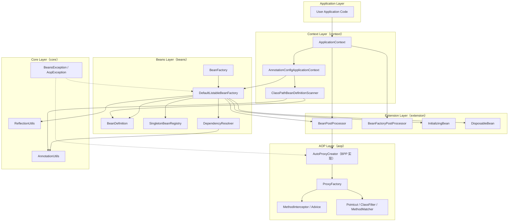
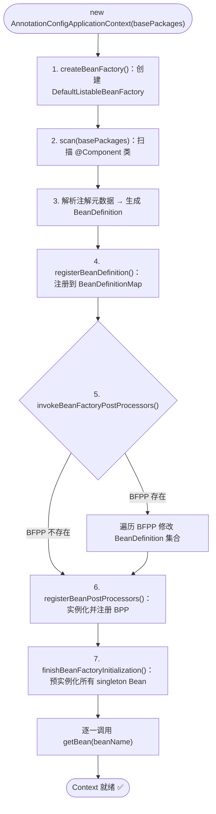
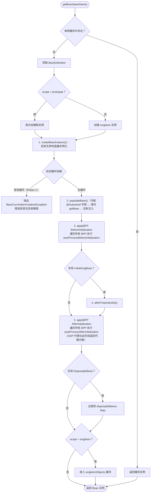
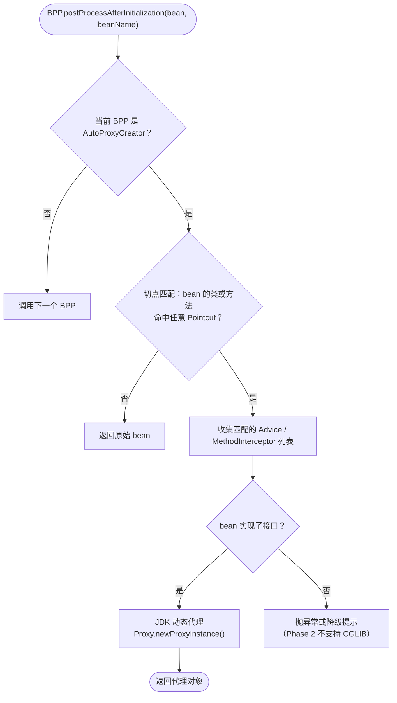
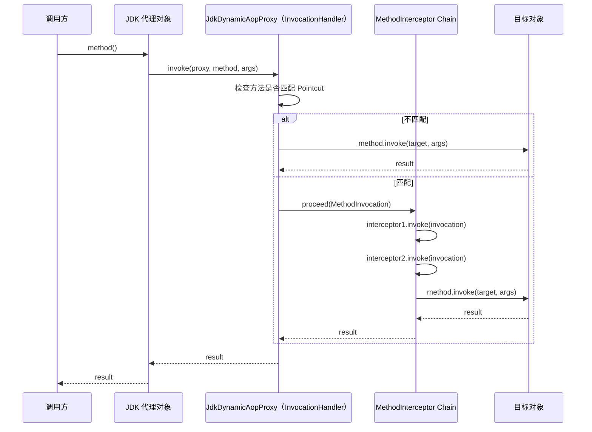

# mini-spring 架构设计文档

> **mode**: FULL  
> **config_source**: AnnotationScan  
> **circular_dependency**: Phase 1 = DISALLOW; Phase 3 = THREE_LEVEL_CACHE_REQUIRED  
> **package group**: `com.xujn`

---

# 1. 背景与目标

## 1.1 目标

| 维度     | 描述                                                                               |
| -------- | ---------------------------------------------------------------------------------- |
| 核心目标 | 从零实现 Spring Framework IOC/DI、Bean 生命周期、扩展点（BPP）、AOP 最小闭环       |
| 工程目标 | 产出可编译、可测试、Git 管理的 Java 工程，每个 Phase 独立可验收                     |
| 学习目标 | 通过手写框架理解 Spring 核心机制的设计动机、演进路径与关键取舍                       |

## 1.2 非目标（Non-goals）

| 排除项            | 原因                                         |
| ----------------- | -------------------------------------------- |
| Spring Boot       | 自动装配属于上层便利，不属于框架核心          |
| Spring Cloud      | 分布式能力，超出内核范围                      |
| Spring MVC        | Web 层，不属于 IOC/AOP 核心                   |
| MyBatis / ORM     | 持久层框架，与 IOC 容器解耦                   |
| Tomcat / Servlet  | 运行时容器，不属于框架内核                    |
| XML 配置          | Phase 1 仅支持注解扫描；预留扩展接口即可       |
| 条件注解 / Profile | 属于 Boot 层特性                              |

## 1.3 术语表

| 术语                | 定义                                                                                     |
| ------------------- | ---------------------------------------------------------------------------------------- |
| IOC                 | Inversion of Control — 将对象的创建与依赖管理交由容器控制                                 |
| DI                  | Dependency Injection — IOC 的实现方式，容器通过构造器/字段注入依赖                         |
| BeanDefinition      | Bean 元数据描述对象，记录类型、作用域、依赖、初始化方法等信息                               |
| BeanFactory         | 容器最底层接口，负责根据 BeanDefinition 创建和获取 Bean                                    |
| ApplicationContext  | 高级容器接口，在 BeanFactory 基础上增加刷新、事件、BPP 注册等能力                           |
| BPP                 | BeanPostProcessor — Bean 实例化后、初始化前后的扩展钩子                                    |
| BFPP                | BeanFactoryPostProcessor — 容器刷新阶段对 BeanDefinition 集合的修改钩子                    |
| AOP                 | Aspect-Oriented Programming — 面向切面编程，通过代理实现横切关注点                         |
| Proxy               | 代理对象，JDK 动态代理或 CGLIB 字节码代理                                                  |
| Singleton           | 单例作用域，容器内同一 BeanDefinition 只产生一个实例                                       |
| Prototype           | 原型作用域，每次 getBean 产生新实例                                                       |
| 三级缓存            | Spring 解决循环依赖的机制：singletonObjects / earlySingletonObjects / singletonFactories  |

## 1.4 命名与包结构约定

### 1.4.1 推荐包结构

```
com.xujn.minispring
├── beans                          # Bean 核心模型与工厂
│   ├── factory                    # BeanFactory 接口与实现
│   │   ├── config                 # BeanDefinition、BPP 接口、单例注册表
│   │   └── support                # BeanFactory 实现类（Abstract / Default）
│   └── PropertyValue.java         # 属性注入值封装
├── context                        # 高级容器（ApplicationContext）
│   ├── annotation                 # 注解扫描（ComponentScan、Autowired 解析）
│   └── support                    # Context 实现类
├── aop                            # AOP 核心
│   ├── aspectj                    # 切点表达式解析（AspectJ 子集）
│   └── framework                  # 代理工厂、Advice、MethodInterceptor
├── core                           # 基础工具
│   └── io                         # 资源加载（预留）
└── exception                      # 统一异常定义
```

### 1.4.2 命名规范

| 元素       | 规范                                                       | 示例                                  |
| ---------- | ---------------------------------------------------------- | ------------------------------------- |
| 类名       | 大驼峰（PascalCase）                                       | `DefaultBeanFactory`                  |
| 接口       | 大驼峰，不加 `I` 前缀                                      | `BeanFactory`                         |
| 方法       | 小驼峰（camelCase）                                         | `getBean(String name)`                |
| 常量       | 全大写 + 下划线                                             | `SCOPE_SINGLETON`                     |
| 包名       | 全小写，单词间无分隔                                         | `com.xujn.minispring.beans.factory`   |
| 测试类     | `<被测类>Test`                                              | `DefaultBeanFactoryTest`              |

> [注释] 包结构预留扩展能力
> - 背景：Phase 1 仅支持注解扫描，但后续需要支持 XML、Java Config 等配置源
> - 影响：如果 Phase 1 将扫描逻辑与 BeanDefinition 注册耦合，后续扩展成本高
> - 取舍：mini 版在 `context.annotation` 中实现注解扫描，通过 `BeanDefinitionRegistry` 接口解耦注册行为
> - 可选增强：后续增加 `context.xml` 包支持 XML 解析，增加 `context.config` 包支持 Java Config

---

# 2. Spring 核心能力抽取（仅 Spring Framework）

## 2.1 能力清单

### 必须实现

| # | 能力               | 定义                                                   | 价值                                       | 最小闭环                                                         | 依赖关系      | 边界                                       |
|---| ------------------- | ------------------------------------------------------ | ------------------------------------------ | ---------------------------------------------------------------- | ------------- | ------------------------------------------ |
| 1 | BeanDefinition 注册 | 将类元数据解析为 BeanDefinition 并注册到容器             | 容器运行基础                                | 注解扫描 → 解析 → 注册到 BeanDefinitionMap                       | 无            | 仅支持注解扫描；不支持 XML / Java Config    |
| 2 | Bean 实例化         | 根据 BeanDefinition 通过反射创建 Bean 实例              | IOC 核心                                    | 无参构造器反射实例化                                              | #1            | 不支持工厂方法、@Bean 方法实例化             |
| 3 | 依赖注入（DI）      | 容器自动注入 Bean 之间的依赖                             | 解耦业务组件                                | 字段注入（`@Autowired`）                                         | #1, #2        | Phase 1 仅字段注入；不支持构造器注入          |
| 4 | 单例管理            | 同一 BeanDefinition 在容器中只有一个实例                 | 资源复用、状态共享                           | `SingletonBeanRegistry` + `singletonObjects` Map                  | #2            | Phase 1 仅 singleton                        |
| 5 | Bean 生命周期       | 初始化 / 销毁钩子                                       | 资源管理（连接池打开/关闭等）                 | `InitializingBean.afterPropertiesSet()` + `DisposableBean.destroy()` | #2, #3       | 不支持 `@PostConstruct` / `@PreDestroy`     |
| 6 | BeanPostProcessor   | 初始化前后扩展点                                        | 框架扩展能力核心（AOP 基于此实现）            | `postProcessBeforeInitialization` / `postProcessAfterInitialization` | #2, #5       | 所有 BPP 按注册顺序执行                      |
| 7 | AOP 代理            | 通过 BPP 在初始化后返回代理对象替换原实例                 | 横切关注点分离（日志、事务等）                | JDK 动态代理 + MethodInterceptor + 切点匹配                       | #6            | 仅 JDK 代理；切点按注解或包名匹配            |

### 可选实现

| # | 能力                     | 说明                                       | 可选增强                            |
|---| ------------------------ | ------------------------------------------ | ----------------------------------- |
| 8 | BeanFactoryPostProcessor | 在 Bean 实例化前修改 BeanDefinition 集合     | 支持属性占位符替换等场景             |
| 9 | Prototype 作用域         | 每次 getBean 创建新实例                     | 扩展 scope 策略                     |
| 10| Aware 接口               | Bean 获取容器自身引用（BeanFactoryAware 等） | 少数框架级 Bean 需要感知容器         |

### 不做

| 能力                          | 原因                                   |
| ----------------------------- | -------------------------------------- |
| @Bean / Java Config           | 属于 Spring 3.0+ 特性，非核心最小集     |
| @Conditional / Profile        | 属于 Spring Boot 特性                   |
| 事件机制（ApplicationEvent）  | 非 IOC/AOP 核心闭环，可后续扩展         |
| SpEL 表达式                   | 复杂度高，价值低于核心路径              |
| 国际化 / MessageSource        | 非核心能力                              |

## 2.2 Spring 概念映射

| mini-spring 组件                  | 对应 Spring 类/接口                                   |
| --------------------------------- | ----------------------------------------------------- |
| `BeanDefinition`                  | `org.springframework.beans.factory.config.BeanDefinition` |
| `BeanFactory`                     | `org.springframework.beans.factory.BeanFactory`        |
| `DefaultListableBeanFactory`      | `o.s.beans.factory.support.DefaultListableBeanFactory`  |
| `ApplicationContext`              | `o.s.context.ApplicationContext`                       |
| `AnnotationConfigApplicationContext` | `o.s.context.annotation.AnnotationConfigApplicationContext` |
| `BeanPostProcessor`               | `o.s.beans.factory.config.BeanPostProcessor`           |
| `BeanFactoryPostProcessor`        | `o.s.beans.factory.config.BeanFactoryPostProcessor`    |
| `SingletonBeanRegistry`           | `o.s.beans.factory.config.SingletonBeanRegistry`       |
| `InitializingBean`                | `o.s.beans.factory.InitializingBean`                   |
| `DisposableBean`                  | `o.s.beans.factory.DisposableBean`                     |

---

# 3. mini-spring 设计总览

## 3.1 设计原则

| 原则                 | 描述                                                                 |
| -------------------- | -------------------------------------------------------------------- |
| 最小闭环优先         | 每个 Phase 交付完整可验收的最小能力集，拒绝半成品                      |
| 接口驱动             | 所有核心能力先定义接口再实现，保证可扩展 / 可替换                      |
| 单一职责             | 每个类 / 接口只承担一个维度的职责                                     |
| 组合优于继承         | 通过接口组合扩展能力，减少继承层次                                    |
| 预留扩展、延迟实现   | 数据结构预留字段、接口预留方法，但只实现当前 Phase 需要的部分          |
| 失败快速             | 循环依赖、Bean 不存在等异常场景立即抛出明确异常，包含诊断信息          |

## 3.2 总体架构图

> **标题**：mini-spring 模块依赖与层次架构  
> **覆盖范围**：core / beans / context / aop / extension 五个模块的依赖关系与职责划分



## 3.3 模块拆分与职责边界

| 模块           | 包路径                                  | 职责                                                       | 不负责                           |
| -------------- | --------------------------------------- | ---------------------------------------------------------- | -------------------------------- |
| **core**       | `com.xujn.minispring.core`              | 反射工具、注解工具、基础异常定义                             | 任何 Bean 管理逻辑               |
| **beans**      | `com.xujn.minispring.beans`             | BeanDefinition 模型、BeanFactory 接口与实现、单例注册表、DI  | 扫描逻辑、上下文生命周期管理      |
| **context**    | `com.xujn.minispring.context`           | ApplicationContext、注解扫描、容器刷新（refresh）流程        | Bean 创建细节（委托给 BeanFactory）|
| **aop**        | `com.xujn.minispring.aop`              | 切点定义、代理创建、Advice 链调用                           | Bean 生命周期管理                 |
| **extension**  | `com.xujn.minispring.beans.factory.config` | BPP / BFPP / InitializingBean / DisposableBean 接口定义     | 接口实现（由具体模块实现）        |

## 3.4 配置与元数据模型

Phase 1 仅支持注解扫描作为配置源。

**支持的注解**（Phase 1）：

| 注解            | 作用                                          |
| --------------- | --------------------------------------------- |
| `@Component`    | 标记类为 Bean，触发扫描注册                    |
| `@Autowired`    | 字段级依赖注入                                |
| `@ComponentScan`| 指定扫描包路径                                |
| `@Scope`        | 指定作用域（singleton / prototype）            |

> [注释] 配置源扩展策略
> - 背景：Spring 支持 XML / 注解 / Java Config 三种配置源，mini-spring Phase 1 仅实现注解扫描
> - 影响：如果将注解解析与 BeanDefinition 注册强耦合，后续添加新配置源需要大量重构
> - 取舍：通过 `BeanDefinitionReader` 接口抽象「读取配置 → 生成 BeanDefinition」过程；Phase 1 只实现 `AnnotatedBeanDefinitionReader`
> - 可选增强：Phase N 增加 `XmlBeanDefinitionReader`；增加 `@Configuration` + `@Bean` 支持 Java Config

---

# 4. 核心数据结构与接口草图

## 4.1 BeanDefinition 字段列表

| 字段                | 类型                      | 说明                                           | Phase 1 使用 | 预留用途                    |
| ------------------- | ------------------------- | ---------------------------------------------- | ------------ | --------------------------- |
| `beanClass`         | `Class<?>`                | Bean 的 Class 对象                              | ✅            | —                           |
| `beanName`          | `String`                  | Bean 名称（默认类名首字母小写）                  | ✅            | —                           |
| `scope`             | `String`                  | 作用域：`singleton` / `prototype`               | ✅            | 自定义 scope                 |
| `lazyInit`          | `boolean`                 | 是否延迟初始化                                  | ❌            | Phase 2+ 懒加载              |
| `dependsOn`         | `String[]`                | 显式依赖的 Bean 名称列表                        | ❌            | 显式依赖排序                 |
| `propertyValues`    | `List<PropertyValue>`     | setter 注入的属性值列表                         | ❌            | setter 注入、三级缓存        |
| `initMethodName`    | `String`                  | 自定义初始化方法名                               | ❌            | `@Bean(initMethod=...)`     |
| `destroyMethodName` | `String`                  | 自定义销毁方法名                                 | ❌            | `@Bean(destroyMethod=...)`  |
| `isSingleton()`     | `boolean`（方法）          | `scope.equals("singleton")`                     | ✅            | —                           |
| `isPrototype()`     | `boolean`（方法）          | `scope.equals("prototype")`                     | ✅            | —                           |

> [注释] propertyValues 预留设计
> - 背景：Phase 1 使用 `@Autowired` 字段注入，不需要 `propertyValues`
> - 影响：Phase 3 三级缓存需要在实例化后、属性注入前暴露 early reference；如果没有 `propertyValues`，setter 注入场景无法走三级缓存流程
> - 取舍：Phase 1 在 BeanDefinition 中声明 `propertyValues` 字段但不填充，字段注入通过反射直接设值
> - 可选增强：Phase 3 实现 `populateBean()` 方法统一处理字段注入和 setter 注入

## 4.2 PropertyValue

| 字段    | 类型     | 说明                                      |
| ------- | -------- | ----------------------------------------- |
| `name`  | `String` | 属性名                                    |
| `value` | `Object` | 属性值（可以是直接值或 BeanReference 引用） |

## 4.3 BeanFactory 核心接口

```text
interface BeanFactory
    Object getBean(String name)
    <T> T getBean(String name, Class<T> requiredType)
    <T> T getBean(Class<T> requiredType)
    boolean containsBean(String name)
```

## 4.4 BeanDefinitionRegistry 接口

```text
interface BeanDefinitionRegistry
    void registerBeanDefinition(String beanName, BeanDefinition beanDefinition)
    BeanDefinition getBeanDefinition(String beanName)
    boolean containsBeanDefinition(String beanName)
    String[] getBeanDefinitionNames()
    int getBeanDefinitionCount()
```

## 4.5 SingletonBeanRegistry 接口

```text
interface SingletonBeanRegistry
    Object getSingleton(String beanName)
    void registerSingleton(String beanName, Object singletonObject)
    boolean containsSingleton(String beanName)
```

> [注释] SingletonBeanRegistry 与三级缓存演进
> - 背景：Phase 1 `SingletonBeanRegistry` 仅维护一级缓存 `singletonObjects`
> - 影响：Phase 3 需要三级缓存，接口和实现必须扩展
> - 取舍：Phase 1 实现 `DefaultSingletonBeanRegistry`，内部仅一个 `Map<String, Object> singletonObjects`；Phase 3 在此类中增加 `earlySingletonObjects` 和 `singletonFactories` 两个 Map
> - 可选增强：`getSingleton()` 方法在 Phase 3 改为按三级缓存顺序查找

## 4.6 ApplicationContext 接口

```text
interface ApplicationContext extends BeanFactory
    void refresh()
    void close()
```

## 4.7 AbstractBeanFactory（模板方法模式）

```text
abstract class AbstractBeanFactory extends DefaultSingletonBeanRegistry implements BeanFactory
    // 模板方法
    Object getBean(String name)          // 先查单例缓存，未命中则 createBean
    abstract Object createBean(String beanName, BeanDefinition bd)
    abstract BeanDefinition getBeanDefinition(String beanName)
```

## 4.8 AutowireCapableBeanFactory

```text
abstract class AutowireCapableBeanFactory extends AbstractBeanFactory
    Object createBean(String beanName, BeanDefinition bd)   // 实例化 → 注入 → 初始化
    Object createBeanInstance(BeanDefinition bd)             // 反射实例化
    void populateBean(String beanName, Object bean, BeanDefinition bd)  // DI
    Object initializeBean(String beanName, Object bean, BeanDefinition bd) // 生命周期
    void applyBeanPostProcessorsBeforeInitialization(Object bean, String beanName)
    void applyBeanPostProcessorsAfterInitialization(Object bean, String beanName)
```

## 4.9 BeanPostProcessor 接口

```text
interface BeanPostProcessor
    Object postProcessBeforeInitialization(Object bean, String beanName)
    Object postProcessAfterInitialization(Object bean, String beanName)
```

## 4.10 BeanFactoryPostProcessor 接口

```text
interface BeanFactoryPostProcessor
    void postProcessBeanFactory(BeanDefinitionRegistry registry)
```

## 4.11 生命周期回调接口

```text
interface InitializingBean
    void afterPropertiesSet()

interface DisposableBean
    void destroy()
```

---

# 5. 核心流程

## 5.1 refresh 启动流程图

> **标题**：ApplicationContext.refresh() 启动流程  
> **覆盖范围**：从创建 Context 到所有 singleton Bean 可用的完整启动过程



> [注释] BPP 必须在业务 Bean 之前实例化
> - 背景：BPP 本身也是 Bean，但需要在所有业务 Bean 创建前完成注册
> - 影响：如果 BPP 与业务 Bean 同阶段创建，先创建的业务 Bean 将错过 BPP 处理
> - 取舍：refresh 流程中 step 6 先识别所有 BPP 类型的 BeanDefinition，提前实例化并注册到 BPP 列表
> - 可选增强：支持 `@Order` / `Ordered` 接口控制 BPP 执行顺序

## 5.2 getBean → createBean 流程图

> **标题**：getBean 完整流程（含生命周期钩子）  
> **覆盖范围**：从 getBean 调用到返回完整可用 Bean 的全流程，包括单例缓存、实例化、依赖注入、BPP、初始化回调



> [注释] BPP AfterInitialization 是 AOP 代理返回的关键时机
> - 背景：AOP 的 `AutoProxyCreator` 实现了 `BeanPostProcessor` 接口
> - 影响：`postProcessAfterInitialization` 返回的是代理对象（非原对象）；此后容器缓存的是代理对象
> - 取舍：Phase 2 中 AOP 代理仅在 `afterInitialization` 阶段创建；Phase 3 三级缓存需要在更早阶段（singletonFactory）暴露代理能力
> - 可选增强：Phase 3 在 `getEarlyBeanReference()` 中调用 `AutoProxyCreator` 提前生成代理

> [注释] 循环依赖检测机制（Phase 1）
> - 背景：Phase 1 不支持循环依赖，必须在发现时快速失败
> - 影响：如果不检测，将导致无限递归 StackOverflow
> - 取舍：使用 `Set<String> singletonsCurrentlyInCreation` 记录正在创建的 Bean；createBean 入口 add，出口 remove；getBean 时若发现 beanName 已在集合中，抛出 `BeanCurrentlyInCreationException`（错误信息包含完整依赖链路）
> - 可选增强：Phase 3 引入三级缓存后，将 early reference 放入二级缓存，移除循环检测直接报错逻辑

## 5.3 AOP 织入流程

> **标题**：AOP 代理创建与方法调用时序  
> **覆盖范围**：AutoProxyCreator 在 BPP 阶段创建代理 → 调用方通过代理触发 MethodInterceptor 链

### 5.3.1 代理创建流程



### 5.3.2 方法调用时序图

> **标题**：代理方法调用时序  
> **覆盖范围**：调用方通过代理对象调用目标方法时，MethodInterceptor 链的执行过程



> [注释] AOP 代理链执行顺序
> - 背景：多个 Advice 应用于同一方法时，执行顺序由 MethodInterceptor 链的排列决定
> - 影响：错误的顺序将导致前置逻辑（如日志、权限校验）执行位置偏移，拦截效果与预期不符
> - 取舍：Phase 2 按 Advice 注册顺序（即 BPP 收集顺序）排列 MethodInterceptor，不支持 `@Order`
> - 可选增强：后续支持 `@Order` 或 `Ordered` 接口排序 Advice

> [注释] 代理对象与原对象引用差异
> - 背景：AOP 代理后，容器中缓存的是代理对象而非原对象
> - 影响：如果其他 Bean 通过 DI 持有的是原对象引用（在代理创建之前注入的），则 AOP 不生效
> - 取舍：Phase 2 通过确保 AOP 代理在 BPP AfterInitialization 阶段完成、且所有 Bean 的 DI 在此之前完成来规避此问题
> - 可选增强：Phase 3 三级缓存中 `getEarlyBeanReference()` 确保即使在循环依赖场景下也返回代理对象

---

# 6. 关键设计取舍与边界

## 6.1 循环依赖

> [注释] 循环依赖与三级缓存
> - 背景：A 依赖 B，B 依赖 A，此时创建 A 时需要 B，创建 B 时又需要 A，形成死循环
> - 影响：Phase 1 不处理循环依赖则无法创建存在循环引用的 Bean 图 — 这是预期行为；Phase 3 如不引入三级缓存，则在 AOP 场景下循环依赖将返回错误的引用（原对象而非代理）
> - 取舍：
>   - **Phase 1**：使用 `singletonsCurrentlyInCreation` 集合检测循环，发现即抛出 `BeanCurrentlyInCreationException`，错误信息包含完整依赖链（如 `A → B → A`）
>   - **Phase 3**：引入三级缓存解决 singleton 字段注入场景的循环依赖
> - 可选增强：构造器注入场景的循环依赖无法通过三级缓存解决，Spring 本身也不支持

### 为何需要三级而非二级缓存

| 缓存层级               | 存储内容                        | 作用                                                       |
| ---------------------- | ------------------------------- | ---------------------------------------------------------- |
| `singletonObjects`     | 完全初始化的 Bean                | 正常获取 Bean 的入口                                        |
| `earlySingletonObjects`| 提前暴露的 Bean（原对象或代理对象） | 解决循环依赖时，其他 Bean 可以先拿到一个已确定的引用           |
| `singletonFactories`   | `ObjectFactory<?>` lambda       | 延迟决定返回原对象还是代理对象（关键：AOP 一致性）           |

**为何不能只用二级？** 如果只有 `singletonObjects` + `earlySingletonObjects`，在 AOP 场景下无法确保循环依赖中拿到的 early reference 是代理对象。`singletonFactories` 的 `ObjectFactory.getObject()` 会调用 `getEarlyBeanReference()`，此方法内 `AutoProxyCreator` 可以决定是否返回代理。

## 6.2 Scope 策略

| Scope       | Phase | 行为                                                   |
| ----------- | ----- | ------------------------------------------------------ |
| `singleton` | 1+    | 容器内唯一实例，缓存在 `singletonObjects`               |
| `prototype` | 2+    | 每次 `getBean` 创建新实例，不缓存，不调用 `destroy()`    |

> [注释] Prototype Bean 不注册销毁回调
> - 背景：Prototype 每次创建新实例，容器不持有引用
> - 影响：如果注册销毁回调，容器关闭时无法定位所有 prototype 实例
> - 取舍：与 Spring 行为一致，prototype Bean 的 `DisposableBean.destroy()` 不由容器调用
> - 可选增强：如有需要，可在文档中提醒使用者自行管理 prototype 生命周期

## 6.3 AOP 策略

| 维度           | 决策                                                           |
| -------------- | -------------------------------------------------------------- |
| 代理方式       | 默认 JDK 动态代理；Phase 2 不实现 CGLIB                         |
| 切点匹配       | 基于包名前缀 + 注解匹配（如 `@Aspect` 标识切面类，方法级通过注解匹配） |
| 切点表达式     | 实现 AspectJ `execution()` 表达式的子集（包名 + 方法名通配符）    |
| Advice 类型    | `MethodInterceptor`（Around 语义，Before/After 可在 interceptor 内模拟） |
| 代理创建时机   | BPP `postProcessAfterInitialization` 阶段                       |
| 自调用问题     | 不解决（与 Spring 一致，this 调用不经过代理）                     |

## 6.4 扩展点策略

| 扩展点   | Phase | 说明                                                         |
| -------- | ----- | ------------------------------------------------------------ |
| **BPP**  | 2（必做） | AOP、Aware 注入等核心机制依赖 BPP，属于框架扩展点基石         |
| **BFPP** | 2（可选） | 用于修改 BeanDefinition 集合（如属性占位符替换），非核心路径   |

> [注释] 为何 BFPP 可选而非必做
> - 背景：BFPP 在 `refresh()` 中 Bean 实例化前执行，主要用于修改 BeanDefinition 元数据
> - 影响：不实现 BFPP 则无法支持 `PropertyPlaceholderConfigurer` 等高级特性
> - 取舍：mini-spring 核心闭环不依赖 BFPP；BPP 已足够支撑 AOP 和 Aware；BFPP 作为可选增强，实现成本低（仅需在 refresh 中增加一个遍历阶段）
> - 可选增强：实现 BFPP 后可支持 `@Value` 属性注入、环境变量替换等

---

# 7. 开发迭代计划（Git 驱动）

## 7.1 Phase 列表总览

| Phase | 标题                           | 核心交付                                                  | 前置依赖 |
| ----- | ------------------------------ | --------------------------------------------------------- | -------- |
| 1     | IOC 容器 + DI 注入              | 注解扫描、BeanDefinition、BeanFactory、@Autowired 字段注入  | 无       |
| 2     | 生命周期 + BPP + AOP            | InitializingBean / DisposableBean、BPP、JDK 代理 AOP      | Phase 1  |
| 3     | 三级缓存循环依赖                | 三级缓存、循环依赖解决、AOP + 循环依赖一致性                | Phase 2  |

## 7.2 Phase 1：IOC 容器 + DI 注入

### 目标

- 实现注解扫描 → BeanDefinition 注册 → 反射实例化 → 字段注入的完整链路
- singleton Bean 可通过 `ApplicationContext.getBean()` 获取
- 循环依赖直接报错并输出依赖链

### 范围

| 包含                               | 不包含                                 |
| ---------------------------------- | -------------------------------------- |
| `@Component` 扫描注册              | XML / Java Config                      |
| `@Autowired` 字段注入              | 构造器注入 / setter 注入                |
| `@Scope("singleton")` 默认单例     | prototype 支持                          |
| `@ComponentScan` 指定扫描包        | 生命周期回调                           |
| 循环依赖检测 + 报错                | 循环依赖解决                           |
| `BeanDefinitionRegistry` 接口      | BPP / BFPP                             |

### 交付物

- `com.xujn.minispring.beans` 包：BeanDefinition、BeanFactory、SingletonBeanRegistry
- `com.xujn.minispring.context` 包：ApplicationContext、注解扫描
- `com.xujn.minispring.core` 包：反射工具、异常
- 单元测试：覆盖正常路径 + 循环依赖失败路径

### 验收标准

1. `@Component` 标注的类可被扫描注册，通过 `getBean(Class)` 获取实例
2. `@Autowired` 字段自动注入依赖 Bean，验证注入结果非 null 且类型正确
3. singleton Bean 多次 `getBean()` 返回同一实例（`assertSame`）
4. A → B → A 循环依赖抛出 `BeanCurrentlyInCreationException`，message 包含 `"A -> B -> A"`
5. 未注册 Bean 调用 `getBean()` 抛出 `NoSuchBeanDefinitionException`

## 7.3 Phase 2：生命周期 + BPP + AOP

### 目标

- Bean 支持初始化 / 销毁回调
- BPP 扩展点可用
- AOP 最小闭环：JDK 代理 + MethodInterceptor + 切点匹配

### 范围

| 包含                                | 不包含                          |
| ----------------------------------- | ------------------------------- |
| `InitializingBean` / `DisposableBean` | `@PostConstruct` / `@PreDestroy` |
| `BeanPostProcessor` 接口与注册       | `@Order` 排序                    |
| `AutoProxyCreator`（BPP 实现）       | CGLIB 代理                       |
| JDK 动态代理                        | 构造器注入                       |
| `execution()` 切点表达式子集         | 三级缓存                         |
| BFPP（可选）                        | —                                |

### 交付物

- `com.xujn.minispring.beans.factory.config` 扩展点接口
- `com.xujn.minispring.aop` 包：Pointcut、Advice、ProxyFactory、AutoProxyCreator
- 单元测试：覆盖生命周期回调顺序、BPP 执行、AOP 代理方法拦截

### 验收标准

1. 实现 `InitializingBean` 的 Bean，`afterPropertiesSet()` 在 DI 之后、BPP After 之前被调用
2. 实现 `DisposableBean` 的 Bean，`context.close()` 时 `destroy()` 被调用
3. BPP 的 `postProcessBeforeInitialization` / `postProcessAfterInitialization` 按注册顺序执行
4. AOP：被切面匹配的方法调用经过 `MethodInterceptor`，可验证拦截器被调用
5. AOP：未匹配的方法直接调用，不经过拦截器
6. `getBean()` 返回的是代理对象（`instanceof Proxy`）

## 7.4 Phase 3：三级缓存循环依赖

### 目标

- singleton 字段注入场景的循环依赖可自动解决
- AOP 场景下循环依赖返回正确的代理对象

### 范围

| 包含                                     | 不包含                       |
| ---------------------------------------- | ---------------------------- |
| 三级缓存：singletonObjects / earlySingletonObjects / singletonFactories | 构造器注入循环依赖 |
| `getEarlyBeanReference()` 方法            | prototype 循环依赖           |
| AOP + 循环依赖一致性                     | —                             |

### 交付物

- `DefaultSingletonBeanRegistry` 扩展三级缓存
- `AutowireCapableBeanFactory.createBean()` 中插入 singletonFactory 注册逻辑
- `SmartInstantiationAwareBeanPostProcessor` 接口（`getEarlyBeanReference()`）
- 单元测试：覆盖 A↔B 循环依赖、AOP+循环依赖

### 验收标准

1. A 依赖 B，B 依赖 A：两者均为 singleton + 字段注入 → 启动成功，双方持有正确引用
2. A 依赖 B（AOP 代理），B 依赖 A → A 拿到的 B 是代理对象
3. 构造器注入循环依赖 → 仍然抛出 `BeanCurrentlyInCreationException`
4. prototype Bean 参与的循环依赖 → 抛出异常

## 7.5 风险清单与缓解策略

| 风险                                  | 概率 | 影响 | 缓解策略                                                     |
| ------------------------------------- | ---- | ---- | ------------------------------------------------------------ |
| 注解扫描性能（大量类路径扫描）         | 低   | 低   | mini-spring 仅用于学习，类数量有限；后续可优化为按包过滤       |
| BPP 顺序依赖导致不可预期行为           | 中   | 高   | Phase 2 文档明确 BPP 顺序等于注册顺序；Phase 3+ 可引入排序机制 |
| 三级缓存引入后 createBean 复杂度飙升   | 高   | 高   | Phase 3 前先充分测试 Phase 2 全部能力；三级缓存实现后增加集成测试 |
| AOP 代理与原对象引用不一致             | 中   | 高   | Phase 2 通过生命周期顺序保证；Phase 3 通过 `getEarlyBeanReference` 保证 |

> [注释] 三级缓存引入时机
> - 背景：三级缓存是 Spring 解决循环依赖的核心机制，但引入后 createBean 流程复杂度显著增加
> - 影响：过早引入会影响 Phase 1/2 的代码可读性和调试效率
> - 取舍：严格按 Phase 递进，Phase 1/2 完成全部验收后再启动 Phase 3
> - 可选增强：Phase 3 完成后，可考虑增加 Phase 4 支持 `@Lazy` 延迟注入作为循环依赖的替代方案

---

# 8. Git 规范（Angular Conventional Commits）

## 8.1 Commit Message 格式

```
type(scope): subject

[可选 body]

[可选 footer]
```

- **type**：提交类型（见下表）
- **scope**：影响范围（模块名或功能域）
- **subject**：简短描述（祈使语气、小写开头、不加句号）
- **body**：详细说明变更动机与实现策略
- **footer**：Breaking Changes 或关联 Issue

## 8.2 Type 列表与适用场景

| Type       | 适用场景                                  | 示例 scope                        |
| ---------- | ---------------------------------------- | --------------------------------- |
| `feat`     | 新增功能 / 能力                           | `beans`, `context`, `aop`         |
| `fix`      | 修复 Bug                                 | `di`, `singleton`, `proxy`        |
| `refactor` | 重构（不改变行为）                        | `factory`, `registry`             |
| `test`     | 新增或修改测试                            | `ioc-test`, `aop-test`            |
| `docs`     | 文档变更                                 | `architecture`, `phase-1`         |
| `chore`    | 构建、CI、依赖等工程化变更                 | `build`, `deps`                   |
| `style`    | 代码风格（不影响逻辑）                    | `format`, `checkstyle`            |

## 8.3 示例提交（每个 Phase）

### Phase 1 示例提交

```
feat(beans): define BeanDefinition with core fields and scope support
  -> src/main/java/com/xujn/minispring/beans/factory/config/BeanDefinition.java

feat(beans): implement SingletonBeanRegistry with singletonObjects cache
  -> src/main/java/com/xujn/minispring/beans/factory/support/DefaultSingletonBeanRegistry.java

feat(beans): implement AbstractBeanFactory with getBean template method
  -> src/main/java/com/xujn/minispring/beans/factory/support/AbstractBeanFactory.java

feat(context): implement annotation-based component scanning
  -> src/main/java/com/xujn/minispring/context/annotation/ClassPathBeanDefinitionScanner.java
  -> src/main/java/com/xujn/minispring/context/annotation/ComponentScan.java

feat(di): implement @Autowired field injection via reflection
  -> src/main/java/com/xujn/minispring/beans/factory/support/AutowireCapableBeanFactory.java
  -> src/main/java/com/xujn/minispring/context/annotation/Autowired.java

feat(context): implement AnnotationConfigApplicationContext with refresh lifecycle
  -> src/main/java/com/xujn/minispring/context/support/AnnotationConfigApplicationContext.java

feat(beans): add circular dependency detection with dependency chain in error message
  -> src/main/java/com/xujn/minispring/beans/factory/support/AbstractBeanFactory.java
  -> src/main/java/com/xujn/minispring/exception/BeanCurrentlyInCreationException.java

test(ioc): add unit tests for bean registration, getBean, DI, and circular dependency detection
  -> src/test/java/com/xujn/minispring/beans/factory/DefaultBeanFactoryTest.java
  -> src/test/java/com/xujn/minispring/context/AnnotationConfigApplicationContextTest.java
```

### Phase 2 示例提交

```
feat(lifecycle): define InitializingBean and DisposableBean interfaces
  -> src/main/java/com/xujn/minispring/beans/factory/InitializingBean.java
  -> src/main/java/com/xujn/minispring/beans/factory/DisposableBean.java

feat(extension): define BeanPostProcessor interface
  -> src/main/java/com/xujn/minispring/beans/factory/config/BeanPostProcessor.java

feat(beans): integrate BPP into createBean lifecycle
  -> src/main/java/com/xujn/minispring/beans/factory/support/AutowireCapableBeanFactory.java

feat(aop): implement Pointcut, ClassFilter, and MethodMatcher interfaces
  -> src/main/java/com/xujn/minispring/aop/Pointcut.java
  -> src/main/java/com/xujn/minispring/aop/ClassFilter.java
  -> src/main/java/com/xujn/minispring/aop/MethodMatcher.java

feat(aop): implement AspectJExpressionPointcut with execution() subset
  -> src/main/java/com/xujn/minispring/aop/aspectj/AspectJExpressionPointcut.java

feat(aop): implement JdkDynamicAopProxy with MethodInterceptor chain invocation
  -> src/main/java/com/xujn/minispring/aop/framework/JdkDynamicAopProxy.java
  -> src/main/java/com/xujn/minispring/aop/framework/ProxyFactory.java

feat(aop): implement AutoProxyCreator as BeanPostProcessor
  -> src/main/java/com/xujn/minispring/aop/framework/autoproxy/AutoProxyCreator.java

test(lifecycle): add tests for InitializingBean and DisposableBean callback order
  -> src/test/java/com/xujn/minispring/beans/factory/LifecycleTest.java

test(aop): add tests for AOP proxy creation and method interception
  -> src/test/java/com/xujn/minispring/aop/AopProxyTest.java
```

### Phase 3 示例提交

```
refactor(beans): extend DefaultSingletonBeanRegistry with three-level cache maps
  -> src/main/java/com/xujn/minispring/beans/factory/support/DefaultSingletonBeanRegistry.java

feat(beans): implement getSingleton with three-level cache lookup order
  -> src/main/java/com/xujn/minispring/beans/factory/support/DefaultSingletonBeanRegistry.java

feat(beans): register singletonFactory in createBean before populateBean
  -> src/main/java/com/xujn/minispring/beans/factory/support/AutowireCapableBeanFactory.java

feat(extension): define SmartInstantiationAwareBeanPostProcessor with getEarlyBeanReference
  -> src/main/java/com/xujn/minispring/beans/factory/config/SmartInstantiationAwareBeanPostProcessor.java

feat(aop): implement getEarlyBeanReference in AutoProxyCreator
  -> src/main/java/com/xujn/minispring/aop/framework/autoproxy/AutoProxyCreator.java

refactor(beans): remove fail-fast circular dependency check for singleton field injection
  -> src/main/java/com/xujn/minispring/beans/factory/support/AbstractBeanFactory.java

test(circular): add tests for A-B circular dependency resolution via three-level cache
  -> src/test/java/com/xujn/minispring/beans/factory/CircularDependencyTest.java

test(circular): add tests for AOP proxy consistency in circular dependency scenario
  -> src/test/java/com/xujn/minispring/aop/AopCircularDependencyTest.java
```

## 8.4 分支策略

采用 **trunk-based development（主干开发）**：

| 分支                          | 用途                                     | 生命周期                |
| ----------------------------- | ---------------------------------------- | ---------------------- |
| `main`                        | 主干分支，保持可编译可测试                 | 永久                   |
| `feature/phase-{n}-<topic>`   | 每个 Phase 的特性分支                     | PR 合并后删除           |
| `fix/phase-{n}-<bugfix>`      | Phase 内 Bug 修复分支                     | PR 合并后删除           |

**选择 trunk-based 的原因**：mini-spring 为单人 / 小团队项目，无需多版本并行维护；每个 Phase 通过 feature 分支隔离，合并进 main 即完成交付。

### 工作流

```
main ──────────────────────────────────────────────►
  │                                    │
  └── feature/phase-1-ioc ──── PR #1 ──┘
                                       │
                                       └── feature/phase-2-lifecycle-aop ──── PR #2 ──►
```

## 8.5 PR 模板要点

```markdown
## What
<!-- 本 PR 做了什么 -->

## Why
<!-- 为什么要做这个变更 -->

## Risk
<!-- 潜在风险和影响范围 -->

## Verify
<!-- 如何验证变更正确性 -->
- [ ] 单元测试通过
- [ ] 手动验证场景：...

## Phase
<!-- 本 PR 所属阶段 -->
Phase {n}: <阶段标题>
```
