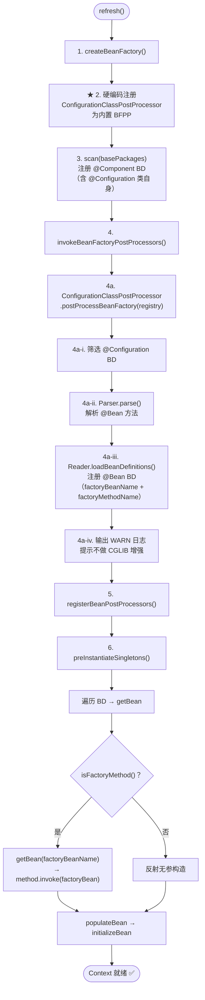

# JavaConfig Phase 1: 最小闭环（@Configuration + @Bean 解析与工厂方法创建）

> **mode**: PHASE  
> **phase_n**: 1  
> **sources**: AnnotationScan + JavaConfig（并存）  
> **conflict_policy**: FAIL_FAST（Phase 2 落地，Phase 1 不检测冲突）  
> **javaconfig_features**: CONFIGURATION_CLASS=ENABLED, BEAN_METHOD=ENABLED, IMPORT=DISABLED, PROXY_ENHANCEMENT=DISABLED  
> **package group**: `com.xujn`

---

## 1. 目标与范围

### 必须实现

| # | 能力                               | 完成标志                                                                                |
|---|------------------------------------|----------------------------------------------------------------------------------------|
| 1 | `@Configuration` 注解定义           | 注解类型定义，元标注 `@Component` 以便 AnnotationScan 自动注册                           |
| 2 | `@Bean` 注解定义                    | 注解类型定义，支持 `name`/`value` 属性指定 beanName                                      |
| 3 | `ConfigurationClassParser`         | 从 @Configuration BD 集合中解析出所有 @Bean 方法元数据                                    |
| 4 | `ConfigurationClassBeanDefinitionReader` | 将解析结果转换为 BeanDefinition 并注册到 Registry                                  |
| 5 | `ConfigurationClassPostProcessor`（BFPP） | 在 `invokeBFPP` 阶段驱动 Parser + Reader                                         |
| 6 | BeanDefinition 扩展                 | 增加 `factoryBeanName` / `factoryMethodName` 字段                                       |
| 7 | createBean 工厂方法分支             | 当 `bd.isFactoryMethod() == true` 时，走 getBean(factoryBeanName) → 反射调用工厂方法路径 |
| 8 | 无参 @Bean 方法可创建 Bean          | `@Bean DataSource dataSource() { return new HikariDataSource(); }` → getBean 返回实例    |
| 9 | @Configuration 类与 @Component 并存 | 两种配置源注册的 BD 共存于同一 Registry                                                   |

### 不做（Phase 1 边界）

| 排除项                             | 延后至              |
|------------------------------------|---------------------|
| @Bean 方法参数注入                  | JavaConfig Phase 2  |
| 重复 beanName FAIL_FAST 检测       | JavaConfig Phase 2  |
| @Bean(initMethod/destroyMethod)    | JavaConfig Phase 2  |
| @Scope 在 @Bean 上                 | JavaConfig Phase 2  |
| @Import                           | 不在计划内           |
| CGLIB @Configuration 增强          | 不在计划内           |
| @Qualifier / @Primary             | 不在计划内           |

---

## 2. 设计与关键决策

### 2.1 新增模块与包结构

```
com.xujn.minispring
├── beans
│   ├── factory
│   │   ├── config
│   │   │   ├── BeanDefinition.java                    # [MODIFY] +factoryBeanName, +factoryMethodName
│   │   │   ├── BeanFactoryPostProcessor.java          # 已有（Phase 2 IOC 可选）
│   │   │   └── ...
│   │   └── support
│   │       └── AutowireCapableBeanFactory.java         # [MODIFY] createBean 增加工厂方法分支
├── context
│   ├── annotation
│   │   ├── Configuration.java                          # [NEW] @Configuration 注解
│   │   ├── Bean.java                                   # [NEW] @Bean 注解
│   │   ├── ConfigurationClassParser.java               # [NEW] 解析 @Bean 方法元数据
│   │   ├── ConfigurationClassBeanDefinitionReader.java  # [NEW] 注册 @Bean BD
│   │   ├── ConfigurationClassPostProcessor.java        # [NEW] BFPP 驱动器
│   │   ├── ConfigurationClass.java                     # [NEW] 配置类元数据模型
│   │   ├── BeanMethod.java                             # [NEW] @Bean 方法元数据模型
│   │   └── ...（已有 Component.java / Autowired.java 等）
│   └── support
│       └── AnnotationConfigApplicationContext.java     # [MODIFY] refresh 中注册 ConfigurationClassPostProcessor
└── ...
```

### 2.2 数据结构与接口签名

#### @Configuration 注解

```text
@Target(ElementType.TYPE)
@Retention(RetentionPolicy.RUNTIME)
@Component                     // 元标注 @Component，扫描阶段自动注册
@interface Configuration
```

#### @Bean 注解

```text
@Target(ElementType.METHOD)
@Retention(RetentionPolicy.RUNTIME)
@interface Bean
    String[] name() default {}    // 显式 beanName；为空时使用方法名
    String[] value() default {}   // name 的别名
```

#### ConfigurationClass 元数据

| 字段          | 类型               | 说明                                |
|---------------|--------------------|-------------------------------------|
| `configClass` | `Class<?>`         | 配置类 Class                         |
| `beanName`    | `String`           | 配置类在容器中的 beanName             |
| `beanMethods` | `Set<BeanMethod>`  | 该类中所有 @Bean 方法的元数据集合     |

#### BeanMethod 元数据

| 字段           | 类型       | 说明                                        |
|----------------|------------|---------------------------------------------|
| `method`       | `Method`   | @Bean 方法反射对象                           |
| `beanName`     | `String`   | @Bean(name=...) 优先，缺省为方法名           |
| `returnType`   | `Class<?>` | 方法返回类型                                 |

#### BeanDefinition 新增字段

| 新增字段            | 类型     | 说明                                              |
|---------------------|----------|---------------------------------------------------|
| `factoryBeanName`   | `String` | 工厂 Bean 名称（@Configuration 类 beanName）       |
| `factoryMethodName` | `String` | 工厂方法名称（@Bean 方法名）                       |
| `source`            | `String` | BD 来源标记（`"AnnotationScan"` / `"JavaConfig:<className>"` ） |
| `isFactoryMethod()` | `boolean`| `factoryBeanName != null && factoryMethodName != null` |

#### ConfigurationClassParser

```text
class ConfigurationClassParser
    Set<ConfigurationClass> parse(Set<BeanDefinition> configCandidates)
    boolean isConfigurationClass(BeanDefinition bd)
```

#### ConfigurationClassBeanDefinitionReader

```text
class ConfigurationClassBeanDefinitionReader
    void loadBeanDefinitions(Set<ConfigurationClass> configClasses, BeanDefinitionRegistry registry)
```

#### ConfigurationClassPostProcessor

```text
class ConfigurationClassPostProcessor implements BeanFactoryPostProcessor
    void postProcessBeanFactory(BeanDefinitionRegistry registry)
```

### 2.3 与 refresh 的集成方式

Phase 1 中 `refresh()` 流程扩展：

```
1. createBeanFactory
2. scan(basePackages)
   → @Configuration 类本身标注了 @Component，在此阶段被注册为 BD
3. ★ invokeBeanFactoryPostProcessors()
   → 实例化 ConfigurationClassPostProcessor
   → 调用 postProcessBeanFactory(registry)
     → 从 registry 筛选 @Configuration BD
     → ConfigurationClassParser.parse() → 得到 ConfigurationClass 集合
     → ConfigurationClassBDReader.loadBeanDefinitions() → 注册 @Bean BD
4. registerBeanPostProcessors
5. preInstantiateSingletons
   → getBean 时，factoryMethod BD → 走工厂方法创建分支
```

**关键问题**：`ConfigurationClassPostProcessor` 本身如何注册到容器？

> [注释] ConfigurationClassPostProcessor 的注册策略
> - 背景：`ConfigurationClassPostProcessor` 是一个 BFPP，但它不能通过 @Component 扫描注册（否则鸡生蛋问题：BFPP 需要先于 JavaConfig 解析执行，但自身又需要被解析注册）
> - 影响：如果不做特殊处理，BFPP 将永远不被实例化
> - 取舍：在 `AnnotationConfigApplicationContext.refresh()` 中硬编码注册 `ConfigurationClassPostProcessor` 为内置 BFPP（与 Spring 一致：Spring 在 `AnnotationConfigUtils.registerAnnotationConfigProcessors` 中硬编码注册）
> - 可选增强：后续抽取为 `AnnotationConfigUtils` 工具类统一注册所有内置处理器

### 2.4 createBean 工厂方法分支

`AutowireCapableBeanFactory.createBean()` 在 `createBeanInstance` 步骤中增加分支：

```
createBeanInstance(beanName, bd):
  if bd.isFactoryMethod():
    factoryBean = getBean(bd.factoryBeanName)   // 获取 @Configuration 类实例
    method = factoryBean.getClass().getMethod(bd.factoryMethodName)
    method.setAccessible(true)
    return method.invoke(factoryBean)            // Phase 1 无参调用
  else:
    return bd.beanClass.getDeclaredConstructor().newInstance()  // 已有逻辑
```

> [注释] @Bean 方法间调用的 singleton 语义风险
> - 背景：Phase 1 不做 CGLIB 增强，@Bean 方法间直接调用将绕过容器创建新实例
> - 影响：`@Bean A a() { return new A(b()); }` 中调用 `b()` 将创建新实例而非容器中的 singleton
> - 取舍：Phase 1 在 `ConfigurationClassPostProcessor.postProcessBeanFactory()` 执行完毕后，输出 WARN 日志：`"@Configuration class [X] is not CGLIB-enhanced; use @Bean method parameters instead of inter-method calls to preserve singleton semantics"`。使用者应改写为 `@Bean A a(B b) { return new A(b); }`（参数注入在 Phase 2 支持）
> - 可选增强：Phase N 实现 CGLIB 增强

> [注释] 工厂方法创建的 Bean 的后续生命周期
> - 背景：通过 @Bean 方法创建的实例需要与反射创建的实例走相同的后续流程
> - 影响：跳过 BPP / InitializingBean / AOP 将导致工厂方法 Bean 行为不一致
> - 取舍：`createBeanInstance` 返回实例后，与反射路径合流到 `populateBean → initializeBean → registerSingleton` 统一流程
> - 可选增强：无（这是正确设计，不需要额外增强）

---

## 3. 流程与图

### 3.1 JavaConfig Phase 1 refresh 集成流程

> **标题**：refresh 流程 — AnnotationScan + JavaConfig BFPP 集成  
> **覆盖范围**：从 refresh 入口到 @Bean BD 注册完成，标注 ConfigurationClassPostProcessor 的执行位置



### 3.2 ConfigurationClassPostProcessor 解析详细流程

> **标题**：ConfigurationClassPostProcessor 内部解析流程  
> **覆盖范围**：从 BFPP 入口到所有 @Bean BD 注册完毕的详细步骤

```mermaid
flowchart TD
    ENTRY(["postProcessBeanFactory(registry)"])
    ENTRY --> GET_NAMES["获取 registry.getBeanDefinitionNames()"]
    GET_NAMES --> LOOP["遍历所有 BD"]
    LOOP --> IS_CONFIG{"BD.beanClass 标注\n@Configuration？"}
    IS_CONFIG -->|否| NEXT["下一个 BD"]
    IS_CONFIG -->|是| ADD["加入 configCandidates"]
    ADD --> NEXT
    NEXT --> LOOP
    LOOP -->|"遍历完成"| HAS{"configCandidates 非空？"}
    HAS -->|否| SKIP(["无配置类，跳过"])
    HAS -->|是| PARSE["ConfigurationClassParser.parse(configCandidates)"]
    PARSE --> FOR_CONFIG["对每个 configCandidate BD："]
    FOR_CONFIG --> LOAD_CLASS["Class.forName(bd.beanClass)\n加载配置类"]
    LOAD_CLASS --> GET_METHODS["反射获取 declaredMethods"]
    GET_METHODS --> FOR_METHOD["遍历方法"]
    FOR_METHOD --> HAS_BEAN{"方法标注 @Bean？"}
    HAS_BEAN -->|否| NEXT_M["下一个方法"]
    HAS_BEAN -->|是| EXTRACT["提取 BeanMethod 元数据\nbeanName = @Bean.name 非空 ? name[0] : method.getName()\nreturnType = method.getReturnType()"]
    EXTRACT --> ADD_M["加入 configClass.beanMethods"]
    ADD_M --> NEXT_M
    NEXT_M --> FOR_METHOD
    FOR_METHOD -->|"方法遍历完成"| FOR_CONFIG
    FOR_CONFIG -->|"配置类遍历完成"| READER_CALL["ConfigurationClassBDReader\n.loadBeanDefinitions(configClasses, registry)"]
    READER_CALL --> FOR_BM["对每个 BeanMethod："]
    FOR_BM --> BUILD_BD["构建 BeanDefinition\nbeanClass = returnType\nfactoryBeanName = configClass.beanName\nfactoryMethodName = method.getName()\nsource = \"JavaConfig:\" + configClass.name"]
    BUILD_BD --> REGISTER["registry.registerBeanDefinition(\nbeanName, bd)"]
    REGISTER --> FOR_BM
    FOR_BM -->|"全部注册完成"| LOG_WARN["输出 WARN 日志\n\"@Configuration not CGLIB-enhanced\""]
    LOG_WARN --> COMPLETE(["解析完成 ✅"])
```

### 3.3 createBean 工厂方法分支流程

> **标题**：createBean 工厂方法 vs 反射构造双分支  
> **覆盖范围**：createBeanInstance 阶段的分支判断与工厂方法调用细节

```mermaid
flowchart TD
    CB(["createBean(beanName, bd)"])
    CB --> CBI["createBeanInstance(beanName, bd)"]
    CBI --> IS_FM{"bd.isFactoryMethod()？\nfactoryBeanName != null\n&& factoryMethodName != null"}
    IS_FM -->|否| REFLECT["反射路径：\nbd.beanClass\n.getDeclaredConstructor()\n.newInstance()"]
    IS_FM -->|是| GET_FB["getBean(bd.factoryBeanName)\n获取 @Configuration 类实例"]
    GET_FB --> GET_M["factoryBean.getClass()\n.getDeclaredMethod(bd.factoryMethodName)"]
    GET_M --> SET_ACC["method.setAccessible(true)"]
    SET_ACC --> INVOKE["bean = method.invoke(factoryBean)\n（Phase 1 无参调用）"]
    INVOKE --> NULL_CHECK{"返回值 == null？"}
    NULL_CHECK -->|是| THROW_NULL["抛出 BeansException\n\"@Bean method returned null\n for bean '\" + beanName + \"'\""]
    NULL_CHECK -->|否| MERGE
    REFLECT --> MERGE
    MERGE["后续流程（统一）：\npopulateBean → initializeBean\n→ registerSingleton"]
    MERGE --> RET(["返回 Bean 实例"])
```

---

## 4. 验收标准（可量化）

| #  | 验收项                                           | 通过条件                                                                            |
|----|--------------------------------------------------|-------------------------------------------------------------------------------------|
| 1  | @Configuration 类被 AnnotationScan 注册           | `@Configuration class AppConfig` → `containsBeanDefinition("appConfig") == true`     |
| 2  | @Bean 方法注册为 BeanDefinition                   | `@Bean DataSource dataSource()` → `containsBeanDefinition("dataSource") == true`     |
| 3  | BD 的 factoryBeanName 正确                        | `getBeanDefinition("dataSource").getFactoryBeanName().equals("appConfig")`            |
| 4  | BD 的 factoryMethodName 正确                      | `getBeanDefinition("dataSource").getFactoryMethodName().equals("dataSource")`         |
| 5  | getBean 通过工厂方法创建实例                      | `getBean(DataSource.class)` 返回非 null 且类型正确                                    |
| 6  | singleton 一致性                                  | `getBean(DataSource.class) == getBean(DataSource.class)` → `assertSame`              |
| 7  | @Bean(name="customName") 自定义名称               | `getBean("customName")` 返回正确实例                                                  |
| 8  | @Bean 默认名称为方法名                            | 无 @Bean(name) 时 beanName 等于方法名                                                 |
| 9  | @Configuration + @Component 并存                  | 同一容器中同时包含 @Configuration 注册的 BD 和 @Component 注册的 BD                     |
| 10 | 工厂方法 Bean 走完整生命周期                       | 工厂方法创建的 Bean 经过 populateBean + initializeBean（含 BPP）                       |
| 11 | @Bean 方法返回 null → 异常                        | 抛出 `BeansException`，message 包含方法名                                              |
| 12 | WARN 日志输出                                     | 启动时输出 CGLIB 未增强的警告日志                                                      |

---

## 5. Git 交付计划

### 分支

```
branch: feature/javaconfig-phase-1-minimal
base:   main (IOC Phase 1+ 已合并)
```

### PR

```
PR title: feat(javaconfig): add @Configuration/@Bean parsing and factory-method bean creation
```

### Commits（12 条，Angular 格式）

```
1. feat(context): define @Configuration annotation with @Component meta-annotation
   -> src/main/java/com/xujn/minispring/context/annotation/Configuration.java

2. feat(context): define @Bean annotation with name/value attributes
   -> src/main/java/com/xujn/minispring/context/annotation/Bean.java

3. feat(javaconfig): define ConfigurationClass and BeanMethod metadata models
   -> src/main/java/com/xujn/minispring/context/annotation/ConfigurationClass.java
   -> src/main/java/com/xujn/minispring/context/annotation/BeanMethod.java

4. feat(javaconfig): implement ConfigurationClassParser to extract @Bean methods
   -> src/main/java/com/xujn/minispring/context/annotation/ConfigurationClassParser.java

5. feat(javaconfig): implement ConfigurationClassBeanDefinitionReader to register @Bean BDs
   -> src/main/java/com/xujn/minispring/context/annotation/ConfigurationClassBeanDefinitionReader.java

6. feat(javaconfig): implement ConfigurationClassPostProcessor as BeanFactoryPostProcessor
   -> src/main/java/com/xujn/minispring/context/annotation/ConfigurationClassPostProcessor.java

7. feat(beans): extend BeanDefinition with factoryBeanName, factoryMethodName, and source fields
   -> src/main/java/com/xujn/minispring/beans/factory/config/BeanDefinition.java

8. feat(beans): add factory-method branch in createBeanInstance
   -> src/main/java/com/xujn/minispring/beans/factory/support/AutowireCapableBeanFactory.java

9. feat(context): register ConfigurationClassPostProcessor as built-in BFPP in refresh
   -> src/main/java/com/xujn/minispring/context/support/AnnotationConfigApplicationContext.java

10. feat(beans): define BeanFactoryPostProcessor interface if not yet present
    -> src/main/java/com/xujn/minispring/beans/factory/config/BeanFactoryPostProcessor.java

11. test(javaconfig): add tests for @Configuration scanning and @Bean BD registration
    -> src/test/java/com/xujn/minispring/context/JavaConfigScanTest.java
    -> src/test/java/com/xujn/minispring/test/config/AppConfig.java

12. test(javaconfig): add tests for factory-method bean creation, singleton, and null return
    -> src/test/java/com/xujn/minispring/context/FactoryMethodBeanTest.java
    -> src/test/java/com/xujn/minispring/test/config/NullBeanConfig.java
    -> src/test/java/com/xujn/minispring/test/config/CustomNameConfig.java
```
