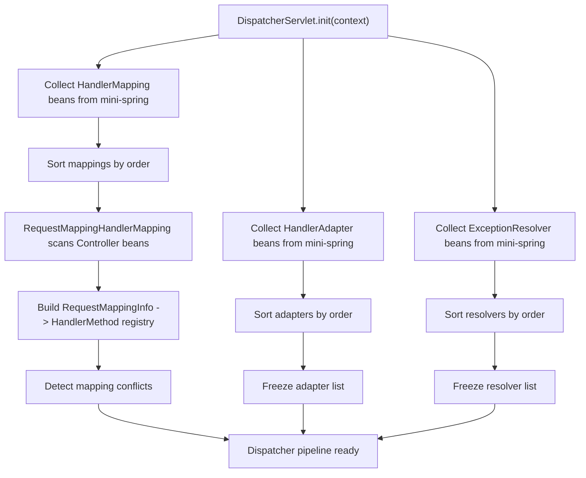
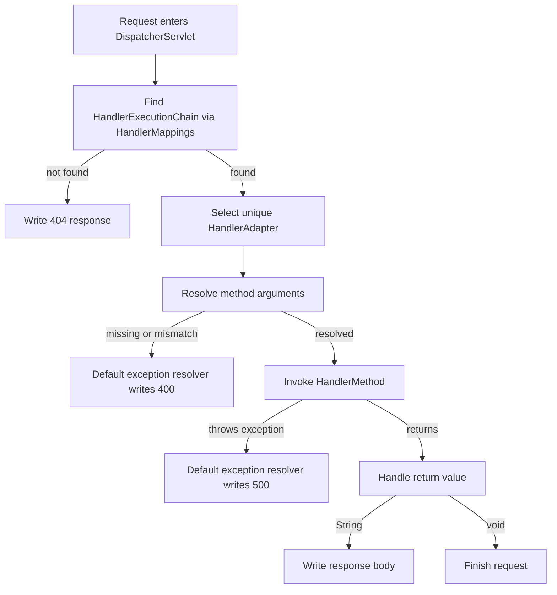
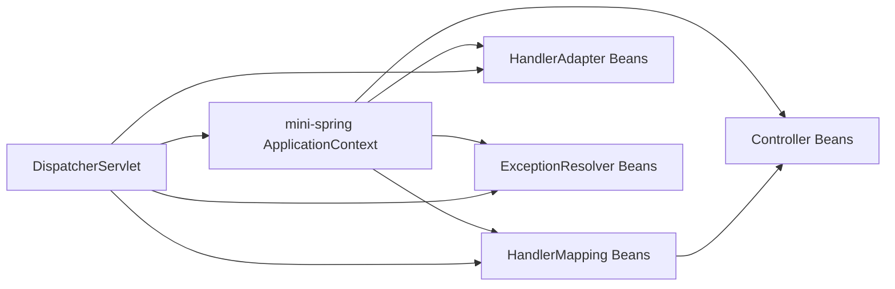

# MVC Phase 1: Dispatcher + Mapping + Adapter 最小闭环

## 1. 目标与范围（必须/不做）

### 1.1 必须

- 构建 `DispatcherServlet` 请求分发主流程
- 基于 `AnnotationMapping` 实现 `@Controller` + `@RequestMapping` 最小注解路由
- 使用 `HandlerMethod` 表示控制器处理器
- 实现 `HandlerMapping` 与 `HandlerAdapter` 最小闭环
- 支持 `mini-spring` 容器托管所有 MVC 组件
- 支持最小参数绑定：
  - `WebRequest`
  - `WebResponse`
  - `@RequestParam` 标注的简单类型：`String/int/long/boolean`
- 支持最小返回值处理：
  - `String`
  - `void`
- 支持最小异常出口：
  - 404：找不到 Handler
  - 400：参数缺失或类型转换失败
  - 500：未处理异常
- 支持 MVC 初始化装配流程：
  - 从 `mini-spring` 容器收集 MVC 组件
  - 排序
  - 构建 Dispatcher 运行时流水线

### 1.2 不做

- 不做 `ViewResolver`
- 不做 `ModelAndView` 视图渲染闭环
- 不做 `HandlerInterceptor`
- 不做 `ExceptionResolver` 责任链扩展，仅保留默认异常处理器
- 不做路径变量
- 不做 Ant 风格路径匹配
- 不做 JSON body 解析
- 不做复杂对象绑定
- 不做内容协商
- 不做异步请求处理
- 不做 Servlet 容器细节

### 1.3 本阶段固定输入

- `mapping_style=AnnotationMapping`
- `view=DISABLED`
- `integration=MINI_SPRING_AS_CONTAINER`

## 2. 设计与关键决策

### 2.1 模块职责（结合 com.xujn 包结构）

#### mini-springmvc 包结构

```text
com.xujn.minispringmvc
├── servlet
│   ├── DispatcherServlet
│   ├── HandlerExecutionChain
│   └── support
│       └── DefaultDispatcherPipeline
├── context
│   ├── MvcApplicationContext
│   └── support
│       └── DefaultMvcInfrastructureInitializer
├── annotation
│   ├── Controller
│   ├── RequestMapping
│   ├── RequestParam
│   └── ResponseBody
├── mapping
│   ├── HandlerMapping
│   ├── HandlerMethod
│   ├── RequestMappingInfo
│   ├── RequestMappingRegistry
│   └── RequestMappingHandlerMapping
├── adapter
│   ├── HandlerAdapter
│   ├── RequestMappingHandlerAdapter
│   └── support
│       ├── InvocableHandlerMethod
│       ├── SimpleTypeConverter
│       ├── RequestParamArgumentResolver
│       ├── WebRequestArgumentResolver
│       ├── WebResponseArgumentResolver
│       ├── StringReturnValueHandler
│       └── VoidReturnValueHandler
├── exception
│   ├── MvcException
│   ├── NoHandlerFoundException
│   ├── MappingConflictException
│   ├── MissingRequestParameterException
│   ├── MethodArgumentTypeMismatchException
│   └── DefaultHandlerExceptionResolver
└── support
    ├── Ordered
    ├── PriorityOrdered
    └── AnnotationIntrospector
```

#### mini-spring 提供的能力

- `com.xujn.minispring.context.*`：ApplicationContext、refresh 生命周期
- `com.xujn.minispring.beans.*`：BeanFactory、BeanDefinition、DI
- `com.xujn.minispring.aop.*`：可选代理能力；Controller 允许被代理
- `com.xujn.minispring.extension/BPP 思想`：MVC 初始化时复用“收集 -> 排序 -> 组装”的可插拔思想

#### 依赖方向

- `mini-springmvc -> mini-spring`
- MVC 组件全部由 `mini-spring` 管理
- MVC init 在 `mini-spring.refresh()` 完成之后执行

> [注释] MVC 组件必须全部作为 Bean 由 mini-spring 管理
> - 背景：Dispatcher、Mapping、Adapter 都存在可替换需求
> - 影响：如果 MVC 自己 new 组件，会破坏统一生命周期和扩展点模型
> - 取舍：Phase 1 固定通过 `ApplicationContext.getBean(...)` 按类型收集 MVC 组件
> - 可选增强：Phase 2 增加显式 MVC 配置类和基础设施 Bean 自动注册器

### 2.2 数据结构/接口草图（仅签名与字段）

#### `WebRequest`

字段列表：

- `String method`
- `String requestUri`
- `String contextPath`
- `Map<String, String[]> parameters`
- `Map<String, String> headers`
- `InputStream bodyStream`
- `Map<String, Object> attributes`

#### `WebResponse`

字段列表：

- `int status`
- `Map<String, String> headers`
- `Writer writer`
- `boolean committed`

#### `HandlerMethod`

字段列表：

- `String beanName`
- `Object bean`
- `Class<?> beanType`
- `Method method`
- `MethodParameter[] parameters`

#### `RequestMappingInfo`

字段列表：

- `String httpMethod`
- `String path`

#### `HandlerExecutionChain`

字段列表：

- `Object handler`

Phase 1 固定不带拦截器列表。

#### `HandlerMapping`

```java
public interface HandlerMapping {
    HandlerExecutionChain getHandler(WebRequest request);
    int getOrder();
}
```

#### `HandlerAdapter`

```java
public interface HandlerAdapter {
    boolean supports(Object handler);
    void handle(WebRequest request, WebResponse response, Object handler) throws Exception;
    int getOrder();
}
```

#### `RequestMappingHandlerAdapter`

职责：

- 只支持 `HandlerMethod`
- 执行参数解析
- 反射调用 Controller 方法
- 执行返回值处理

#### `RequestParamArgumentResolver`

```java
public interface HandlerMethodArgumentResolver {
    boolean supportsParameter(MethodParameter parameter);
    Object resolveArgument(MethodParameter parameter, WebRequest request, WebResponse response) throws Exception;
    int getOrder();
}
```

Phase 1 内部支持者固定为：

- `RequestParamArgumentResolver`
- `WebRequestArgumentResolver`
- `WebResponseArgumentResolver`

#### `HandlerMethodReturnValueHandler`

```java
public interface HandlerMethodReturnValueHandler {
    boolean supportsReturnType(MethodParameter returnType);
    void handleReturnValue(
            Object returnValue,
            MethodParameter returnType,
            WebRequest request,
            WebResponse response) throws Exception;
    int getOrder();
}
```

Phase 1 内部支持者固定为：

- `StringReturnValueHandler`
- `VoidReturnValueHandler`

#### `DefaultHandlerExceptionResolver`

```java
public interface ExceptionResolver {
    boolean supports(Exception ex, Object handler);
    boolean resolveException(
            WebRequest request,
            WebResponse response,
            Object handler,
            Exception ex) throws Exception;
    int getOrder();
}
```

Phase 1 固定只有默认实现。

### 2.3 扩展点与执行顺序

Phase 1 可插拔点：

- `HandlerMapping`
- `HandlerAdapter`
- 参数解析器
- 返回值处理器
- 默认异常处理器

固定顺序：

1. `DispatcherServlet.init()` 从容器收集 Bean
2. 按 `PriorityOrdered -> Ordered -> 默认最低优先级` 排序
3. Dispatcher 持有不可变列表
4. 请求进入时：
   - `HandlerMapping` 链按顺序查找第一个返回非空结果的组件
   - `HandlerAdapter` 链必须找到且只能找到一个支持者
   - 参数解析器链按顺序找第一个支持者
   - 返回值处理器链按顺序找第一个支持者
   - 默认异常处理器最后兜底

> [注释] HandlerMapping 的选择规则必须是“首个唯一命中”
> - 背景：多个 Mapping Bean 可以共存
> - 影响：如果没有统一顺序，请求会随着注册顺序漂移
> - 取舍：Phase 1 先统一按 `order` 排序，再按顺序调用 `getHandler`；第一个返回非空链的 Mapping 即短路
> - 可选增强：Phase 2 增加更细粒度的 mapping specificity 评分

> [注释] 参数解析与返回值处理都采用链式首个命中
> - 背景：这两个扩展点与 BeanPostProcessor 一样，都是链式扩展模型
> - 影响：没有短路规则就无法稳定扩展
> - 取舍：Phase 1 规定“按排序后的列表找到首个支持者即执行”，未找到直接报错
> - 可选增强：Phase 2 引入 composite 组件并暴露自定义扩展 SPI

> [注释] 多匹配冲突必须 fail-fast
> - 背景：路由冲突和多个 Adapter 同时支持同一个 Handler 都会导致运行结果不唯一
> - 影响：如果默认取第一个，行为不可预测
> - 取舍：Phase 1 在初始化映射表时检测 `RequestMappingInfo` 冲突；在调度阶段若 `HandlerAdapter` 支持者数量不等于 1 直接抛异常
> - 可选增强：Phase 2 把这些错误转为更细粒度的配置异常类型

### 2.4 与 mini-spring 的集成点

#### 容器提供什么

- IOC/DI：Controller、Mapping、Adapter、Resolver 都是 Bean
- 生命周期：MVC 组件与普通 Bean 一样由容器构造和注入
- AOP：Controller 可以被代理；MVC 注解解析看目标类元数据
- 扩展点思想：MVC 复用 `mini-spring.refresh()` 的“收集 -> 排序 -> 组装”编排方式

#### MVC 额外提供什么

- Dispatcher 请求分发流水线
- `HandlerMapping` 路由组件
- `HandlerAdapter` 调用组件
- 参数解析、返回值处理、默认异常处理

#### 装配方式

- `DispatcherServlet.init()` 接收 `ApplicationContext`
- 初始化时按类型从容器中收集：
  - `HandlerMapping`
  - `HandlerAdapter`
  - `ExceptionResolver`
- `RequestMappingHandlerMapping` 自己再从容器中收集 `@Controller` Bean，构建映射表
- `RequestMappingHandlerAdapter` 内部持有参数解析器和返回值处理器列表

> [注释] Controller 注解解析要基于目标类，不基于代理类
> - 背景：AOP 代理类可能不保留原始类上的 MVC 注解结构
> - 影响：直接扫描代理类会导致映射丢失
> - 取舍：Phase 1 固定“注解解析看目标类，方法调用使用容器中的 Bean 实例”
> - 可选增强：后续抽出统一 `AopTargetClassResolver` 供事务与 MVC 共享

## 3. 流程与图

### 3.1 流程图：MVC Phase 1 初始化流程

**标题：MVC Phase 1 init 流程**  
**说明：覆盖 Phase 1 从容器收集 MVC Bean 到构建 Dispatcher 运行流水线的过程。**



### 3.2 流程图：Dispatcher 主流程

**标题：MVC Phase 1 doDispatch 主流程**  
**说明：覆盖 Handler 查找、参数绑定、方法调用、返回值写出、错误兜底。**



### 3.3 架构图：mini-spring 与 mini-springmvc 的 Phase 1 集成

**标题：Phase 1 容器集成架构图**  
**说明：覆盖 MVC 组件与 mini-spring 容器之间的职责边界和依赖方向。**



> [注释] 路径匹配策略在 Phase 1 固定为精确匹配
> - 背景：路径匹配一旦引入模式语义，冲突判定就会迅速复杂
> - 影响：早期引入通配符会让 Mapping 选择规则失控
> - 取舍：Phase 1 只支持精确路径和 HTTP 方法精确匹配
> - 可选增强：Phase 2+ 再引入路径模式和 specificity 比较

> [注释] 异常处理在 Phase 1 只保留默认闭环
> - 背景：当前目标是先让 Dispatcher 主链路稳定
> - 影响：如果同时引入完整异常责任链，初始化与调度复杂度都会上升
> - 取舍：Phase 1 固定只有 `DefaultHandlerExceptionResolver`
> - 可选增强：Phase 3 再扩展为 `ExceptionResolver` 链

## 4. 验收标准（可量化）

### 4.1 初始化与装配

- 能从 `mini-spring` 容器中成功收集 `HandlerMapping`、`HandlerAdapter`、`ExceptionResolver`
- `RequestMappingHandlerMapping` 能扫描所有 `@Controller` Bean
- 遇到重复 `RequestMappingInfo(method + path)`，初始化直接失败并给出冲突上下文
- Dispatcher 初始化后持有排序完成且不可变的流水线列表

### 4.2 正常路径

- 给定一个 `@Controller` 方法和匹配请求，能找到唯一 `HandlerMethod`
- `HandlerAdapter` 能成功调用控制器方法
- `@RequestParam String/int/long/boolean` 能成功绑定
- 方法返回 `String` 时，响应体能正确写出
- 方法返回 `void` 时，分发流程正常结束

### 4.3 失败路径

- 找不到 Handler 时返回 404
- 请求方法不匹配时返回 404
- 缺少必填参数时返回 400，并包含参数名
- 参数类型转换失败时返回 400，并包含参数名与目标类型
- 控制器抛异常时返回 500
- 多个 `HandlerAdapter` 同时支持同一 Handler 时直接失败
- 没有任何 `HandlerAdapter` 支持某个 Handler 时直接失败

### 4.4 集成边界

- Controller 允许被 `mini-spring` AOP 代理，映射解析仍能成功
- MVC 不直接创建 Controller 实例，只使用容器 Bean
- `view=DISABLED` 时，`String` 不解释为视图名

## 5. Git 交付计划

- `branch: feature/mvc-phase-1-dispatcher`
- `PR title: feat(mvc): implement phase-1 dispatcher mapping and adapter pipeline`

commits：

- `docs(docs): add mvc phase-1 design and acceptance documents -> docs/mvc-phase-1.md, tests/acceptance-mvc-phase-1.md`
- `chore(mvc): initialize minispringmvc phase-1 package layout -> src/main/java/com/xujn/minispringmvc/servlet, src/main/java/com/xujn/minispringmvc/mapping, src/main/java/com/xujn/minispringmvc/adapter, src/main/java/com/xujn/minispringmvc/annotation, src/main/java/com/xujn/minispringmvc/exception`
- `feat(annotation): add controller request-mapping and request-param annotations -> src/main/java/com/xujn/minispringmvc/annotation/Controller.java, src/main/java/com/xujn/minispringmvc/annotation/RequestMapping.java, src/main/java/com/xujn/minispringmvc/annotation/RequestParam.java, src/main/java/com/xujn/minispringmvc/annotation/ResponseBody.java`
- `feat(mapping): add handler-method request-mapping-info and registry core -> src/main/java/com/xujn/minispringmvc/mapping/HandlerMethod.java, src/main/java/com/xujn/minispringmvc/mapping/RequestMappingInfo.java, src/main/java/com/xujn/minispringmvc/mapping/RequestMappingRegistry.java`
- `feat(mapping): implement request-mapping handler-mapping with conflict detection -> src/main/java/com/xujn/minispringmvc/mapping/HandlerMapping.java, src/main/java/com/xujn/minispringmvc/mapping/RequestMappingHandlerMapping.java, src/main/java/com/xujn/minispringmvc/exception/MappingConflictException.java`
- `feat(adapter): implement handler-adapter invocation and simple argument binding -> src/main/java/com/xujn/minispringmvc/adapter/HandlerAdapter.java, src/main/java/com/xujn/minispringmvc/adapter/RequestMappingHandlerAdapter.java, src/main/java/com/xujn/minispringmvc/adapter/support/InvocableHandlerMethod.java, src/main/java/com/xujn/minispringmvc/adapter/support/RequestParamArgumentResolver.java, src/main/java/com/xujn/minispringmvc/adapter/support/SimpleTypeConverter.java`
- `feat(dispatcher): implement dispatcher servlet and default dispatch pipeline -> src/main/java/com/xujn/minispringmvc/servlet/DispatcherServlet.java, src/main/java/com/xujn/minispringmvc/servlet/HandlerExecutionChain.java, src/main/java/com/xujn/minispringmvc/servlet/support/DefaultDispatcherPipeline.java`
- `feat(exception): add default mvc exception resolver for 404 400 and 500 responses -> src/main/java/com/xujn/minispringmvc/exception/MvcException.java, src/main/java/com/xujn/minispringmvc/exception/NoHandlerFoundException.java, src/main/java/com/xujn/minispringmvc/exception/MissingRequestParameterException.java, src/main/java/com/xujn/minispringmvc/exception/MethodArgumentTypeMismatchException.java, src/main/java/com/xujn/minispringmvc/exception/DefaultHandlerExceptionResolver.java`
- `feat(context): integrate mvc init pipeline with mini-spring application context -> src/main/java/com/xujn/minispringmvc/context/MvcApplicationContext.java, src/main/java/com/xujn/minispringmvc/context/support/DefaultMvcInfrastructureInitializer.java`
- `test(tests): add mvc phase-1 acceptance coverage for dispatch success and failure paths -> src/test/java/com/xujn/minispringmvc/Phase1AcceptanceTest.java, src/test/java/com/xujn/minispringmvc/test/phase1/**`
- `feat(examples): add runnable mvc phase-1 dispatcher example -> examples/src/main/java/com/xujn/minispringmvc/examples/phase1/Phase1DispatcherExample.java, examples/src/main/java/com/xujn/minispringmvc/examples/phase1/fixture/**`
