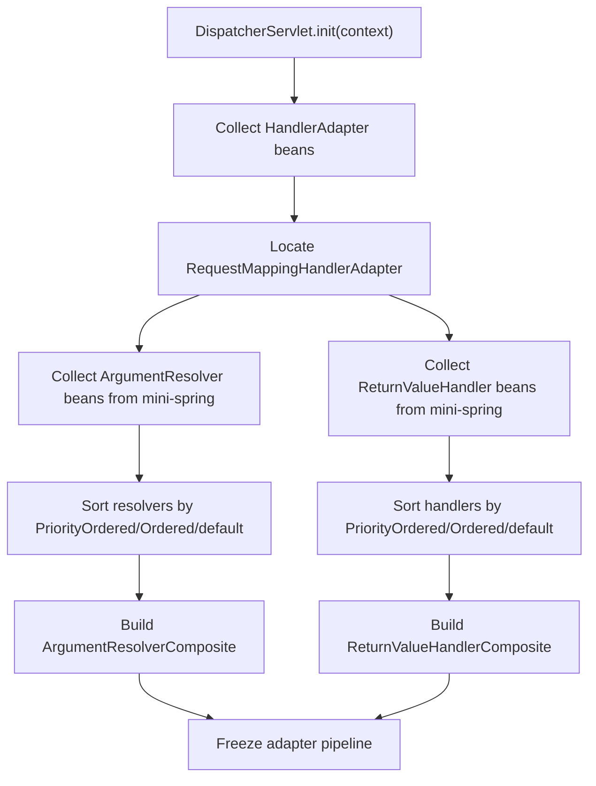
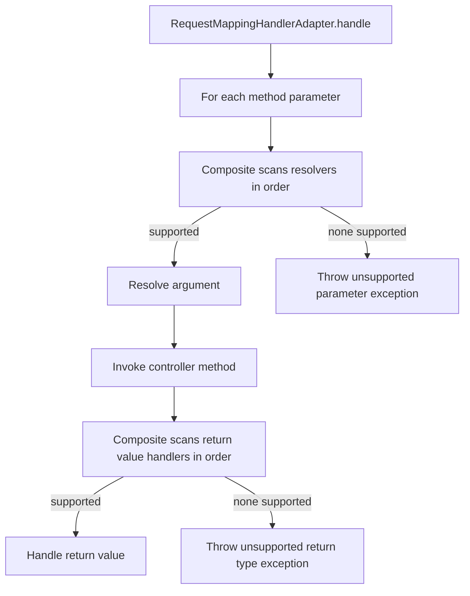
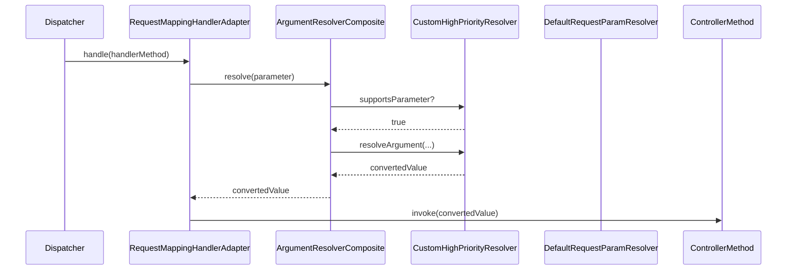

# MVC Phase 2: 参数解析与返回值处理扩展点

## 1. 目标与范围（必须/不做）

### 1.1 必须

- 在 Phase 1 `Dispatcher + Mapping + Adapter` 最小闭环之上，引入可插拔参数解析与返回值处理扩展点
- 抽象并实现：
  - `HandlerMethodArgumentResolver`
  - `HandlerMethodArgumentResolverComposite`
  - `HandlerMethodReturnValueHandler`
  - `HandlerMethodReturnValueHandlerComposite`
- 固化链式选择规则：
  - 参数解析：首个支持者执行
  - 返回值处理：首个支持者执行
- 支持最小默认解析器：
  - `@RequestParam` 简单类型解析器
  - `WebRequest` 解析器
  - `WebResponse` 解析器
- 支持最小默认返回值处理器：
  - `String` 响应体处理
  - `void` 结束处理
- 支持容器内自定义 Resolver / Handler 作为 Bean 参与排序和装配
- 支持不支持参数类型 / 返回值类型的 fail-fast
- 保持 `view=DISABLED`

### 1.2 不做

- 不做 `ViewResolver`
- 不做 `ModelAndView` 视图渲染
- 不做 `HandlerInterceptor`
- 不做 `ExceptionResolver` 责任链扩展
- 不做 JSON body 解析
- 不做复杂对象绑定
- 不做集合参数绑定
- 不做路径变量
- 不做内容协商
- 不做校验框架
- 不做文件上传

### 1.3 与 Phase 1 的边界

Phase 2 只增强“参数绑定与返回值处理”的可插拔能力，不改变以下稳定主流程：

1. `DispatcherServlet` 仍负责总控
2. `HandlerMapping` 仍负责找到唯一 `HandlerMethod`
3. `HandlerAdapter` 仍负责调用 Handler
4. 默认异常闭环仍存在

## 2. 设计与关键决策

### 2.1 模块职责（结合 com.xujn 包结构）

#### 新增/增强的 mini-springmvc 包结构

```text
com.xujn.minispringmvc
├── adapter
│   ├── HandlerAdapter
│   ├── HandlerMethodArgumentResolver
│   ├── HandlerMethodReturnValueHandler
│   ├── RequestMappingHandlerAdapter
│   └── support
│       ├── InvocableHandlerMethod
│       ├── HandlerMethodArgumentResolverComposite
│       ├── HandlerMethodReturnValueHandlerComposite
│       ├── RequestParamArgumentResolver
│       ├── WebRequestArgumentResolver
│       ├── WebResponseArgumentResolver
│       ├── StringReturnValueHandler
│       ├── VoidReturnValueHandler
│       └── SimpleTypeConverter
├── bind
│   ├── TypeConverter
│   └── support
│       └── SimpleTypeConverter
└── support
    ├── Ordered
    └── PriorityOrdered
```

#### 职责划分

- `RequestMappingHandlerAdapter`
  - 持有参数解析器组合器
  - 持有返回值处理器组合器
  - 驱动 `InvocableHandlerMethod`
- `HandlerMethodArgumentResolverComposite`
  - 负责排序后的链式参数解析分发
- `HandlerMethodReturnValueHandlerComposite`
  - 负责排序后的链式返回值处理分发
- `SimpleTypeConverter`
  - 负责 `String -> int/long/boolean` 等最小类型转换
- `InvocableHandlerMethod`
  - 统一执行“解析参数 -> 反射调用 -> 交给返回值处理器”

#### mini-spring 复用点

- 所有 Resolver / Handler 作为 Bean 注册到 `mini-spring`
- Phase 2 init 期间从容器中收集这些 Bean，按顺序装配 Composite
- 可选复用 `mini-spring` AOP 代理能力；自定义解析器或返回值处理器可以被代理

### 2.2 数据结构/接口草图（仅签名与字段）

#### `HandlerMethodArgumentResolver`

```java
public interface HandlerMethodArgumentResolver {
    boolean supportsParameter(MethodParameter parameter);
    Object resolveArgument(
            MethodParameter parameter,
            WebRequest request,
            WebResponse response) throws Exception;
    int getOrder();
}
```

#### `HandlerMethodArgumentResolverComposite`

字段列表：

- `List<HandlerMethodArgumentResolver> resolvers`

方法签名：

```java
public final class HandlerMethodArgumentResolverComposite {
    void addResolvers(List<HandlerMethodArgumentResolver> resolvers);
    boolean supportsParameter(MethodParameter parameter);
    Object resolveArgument(
            MethodParameter parameter,
            WebRequest request,
            WebResponse response) throws Exception;
}
```

#### `HandlerMethodReturnValueHandler`

```java
public interface HandlerMethodReturnValueHandler {
    boolean supportsReturnType(MethodParameter returnType);
    void handleReturnValue(
            Object returnValue,
            MethodParameter returnType,
            WebRequest request,
            WebResponse response) throws Exception;
    int getOrder();
}
```

#### `HandlerMethodReturnValueHandlerComposite`

字段列表：

- `List<HandlerMethodReturnValueHandler> handlers`

方法签名：

```java
public final class HandlerMethodReturnValueHandlerComposite {
    void addHandlers(List<HandlerMethodReturnValueHandler> handlers);
    boolean supportsReturnType(MethodParameter returnType);
    void handleReturnValue(
            Object returnValue,
            MethodParameter returnType,
            WebRequest request,
            WebResponse response) throws Exception;
}
```

#### `TypeConverter`

```java
public interface TypeConverter {
    boolean supports(Class<?> targetType);
    Object convert(String rawValue, Class<?> targetType) throws Exception;
}
```

#### `SimpleTypeConverter`

支持字段范围：

- `String`
- `int` / `Integer`
- `long` / `Long`
- `boolean` / `Boolean`

#### `RequestMappingHandlerAdapter`

字段列表：

- `HandlerMethodArgumentResolverComposite argumentResolvers`
- `HandlerMethodReturnValueHandlerComposite returnValueHandlers`

方法签名：

```java
public final class RequestMappingHandlerAdapter implements HandlerAdapter {
    boolean supports(Object handler);
    void handle(WebRequest request, WebResponse response, Object handler) throws Exception;
    int getOrder();
}
```

### 2.3 扩展点与执行顺序

Phase 2 排序与执行规则：

1. 初始化阶段从 `mini-spring` 容器中收集所有 `HandlerMethodArgumentResolver` Bean
2. 按 `PriorityOrdered -> Ordered -> 默认最低优先级` 排序
3. 初始化阶段从容器中收集所有 `HandlerMethodReturnValueHandler` Bean
4. 按相同规则排序
5. `RequestMappingHandlerAdapter` 使用排序后的不可变列表构建 Composite
6. 请求执行时：
   - 对每个方法参数，Composite 依次调用 `supportsParameter`
   - 命中首个支持者后执行 `resolveArgument`
   - 对返回值，Composite 依次调用 `supportsReturnType`
   - 命中首个支持者后执行 `handleReturnValue`

> [注释] 参数解析器顺序决定扩展生效结果
> - 背景：多个解析器可能都声称支持相同参数
> - 影响：如果顺序不固定，自定义扩展无法稳定覆盖默认行为
> - 取舍：Phase 2 统一按 `PriorityOrdered -> Ordered -> 默认` 排序，自定义 Bean 可以通过更高优先级覆盖默认解析器
> - 可选增强：后续增加 init 阶段冲突检测，标记“多个高优先级解析器覆盖同一参数类型”的配置风险

> [注释] 返回值处理器必须采用首个命中短路
> - 背景：一个返回类型可能同时被多个处理器支持
> - 影响：如果多个处理器都执行，响应会被重复写入
> - 取舍：Phase 2 固定首个支持者执行，后续处理器不再参与
> - 可选增强：后续对“已提交响应”增加更严格保护和调试日志

> [注释] 不支持的参数与返回值必须显式失败
> - 背景：参数绑定和返回值处理是 MVC 可扩展链的核心环节
> - 影响：静默忽略会把配置错误变成运行时脏数据
> - 取舍：Phase 2 规定 Composite 找不到支持者时直接抛明确异常，包含方法、参数索引、参数类型或返回值类型
> - 可选增强：后续增加错误码和更细粒度异常分类

### 2.4 与 mini-spring 的集成点

#### 哪些组件是 Bean

必须作为 Bean 交给 `mini-spring` 管理：

- `RequestMappingHandlerAdapter`
- 默认参数解析器
- 默认返回值处理器
- `SimpleTypeConverter`
- 自定义 `HandlerMethodArgumentResolver`
- 自定义 `HandlerMethodReturnValueHandler`

#### 如何装配流水线

- `DispatcherServlet.init()` 从容器中收集 `HandlerAdapter`
- `RequestMappingHandlerAdapter` 在初始化阶段从容器中收集：
  - `HandlerMethodArgumentResolver`
  - `HandlerMethodReturnValueHandler`
- 排序后构建两个 Composite
- 请求执行时仅使用已组装好的 Composite，不在请求中二次查容器

> [注释] Phase 2 的 Composite 仍然遵循 mini-spring 的“初始化期编排”
> - 背景：这与 `BeanPostProcessor` 的“先收集、后排序、再执行”思想一致
> - 影响：如果在请求中动态查找 Resolver，会导致顺序漂移和额外性能损耗
> - 取舍：Phase 2 固定在 init 期冻结解析器和处理器列表
> - 可选增强：后续支持显式 rebuild 机制，用于容器刷新后的流水线重建

## 3. 流程与图

### 3.1 流程图：Phase 2 初始化装配流程

**标题：MVC Phase 2 初始化扩展点装配流程**  
**说明：覆盖参数解析器与返回值处理器如何从 mini-spring 容器收集、排序、构建 Composite。**



### 3.2 流程图：参数解析与返回值处理主流程

**标题：MVC Phase 2 HandlerMethod 执行流程**  
**说明：覆盖方法参数如何解析、控制器如何调用、返回值如何写回响应。**



### 3.3 时序图：自定义 Resolver 覆盖默认 Resolver

**标题：自定义参数解析器覆盖默认解析器时序**  
**说明：覆盖同类参数被多个解析器支持时，排序和首个命中规则如何生效。**



> [注释] 参数绑定错误不能被吞掉
> - 背景：类型转换和必填参数校验是最常见失败点
> - 影响：如果错误被内部吞掉，控制器会拿到不完整参数，问题难以定位
> - 取舍：Phase 2 规定解析器抛出的绑定异常由 Dispatcher 统一交给默认异常处理器，最终返回 400
> - 可选增强：后续增加字段级错误集合和统一错误响应结构

> [注释] response 已提交后，返回值处理器不能再次写响应
> - 背景：某些处理器或控制器可能已经直接写出了响应
> - 影响：重复写入会造成内容污染或容器层异常
> - 取舍：Phase 2 规定 `response.committed=true` 时，后续返回值处理直接跳过并记录处理完成
> - 可选增强：后续增加专门的“响应已提交”诊断日志和保护异常

## 4. 验收标准（可量化）

### 4.1 初始化与装配

- `RequestMappingHandlerAdapter` 能从 `mini-spring` 容器收集所有参数解析器与返回值处理器
- 排序规则稳定，初始化后列表冻结
- 自定义 Resolver / Handler Bean 能参与排序并生效

### 4.2 正常路径

- `@RequestParam String/int/long/boolean` 仍能正确解析
- `WebRequest` 和 `WebResponse` 参数仍能正确注入
- `String` 返回值仍能直接写响应体
- `void` 返回值仍能正常结束请求
- 高优先级自定义参数解析器能覆盖默认解析器
- 高优先级自定义返回值处理器能覆盖默认处理器

### 4.3 失败路径

- 找不到支持的参数解析器时直接失败，异常包含：
  - 控制器类
  - 方法名
  - 参数索引
  - 参数类型
- 参数转换失败时返回 400，错误信息包含参数名与目标类型
- 找不到支持的返回值处理器时直接失败，异常包含：
  - 控制器类
  - 方法名
  - 返回值类型
- 同一返回值被多个处理器支持时，只执行排序后的首个处理器
- `response.committed=true` 时不会重复写出响应体

### 4.4 集成边界

- 所有 Resolver / Handler 都由 `mini-spring` 管理
- MVC 请求处理中不重新扫描容器
- `view=DISABLED` 保持不变，`String` 仍然不是视图名
- 不出现跨阶段能力：
  - 无 `ViewResolver`
  - 无拦截器链
  - 无异常责任链
  - 无 JSON body

## 5. Git 交付计划

- `branch: feature/mvc-phase-2-binding`
- `PR title: feat(mvc): implement phase-2 argument resolver and return value pipeline`

commits：

- `docs(docs): add mvc phase-2 design and acceptance documents -> docs/mvc-phase-2.md, tests/acceptance-mvc-phase-2.md`
- `refactor(adapter): extract argument resolver and return value handler spi contracts -> src/main/java/com/xujn/minispringmvc/adapter/HandlerMethodArgumentResolver.java, src/main/java/com/xujn/minispringmvc/adapter/HandlerMethodReturnValueHandler.java`
- `feat(adapter): add argument resolver composite and resolver ordering support -> src/main/java/com/xujn/minispringmvc/adapter/support/HandlerMethodArgumentResolverComposite.java, src/main/java/com/xujn/minispringmvc/support/Ordered.java, src/main/java/com/xujn/minispringmvc/support/PriorityOrdered.java`
- `feat(adapter): add return value handler composite and short-circuit selection -> src/main/java/com/xujn/minispringmvc/adapter/support/HandlerMethodReturnValueHandlerComposite.java, src/main/java/com/xujn/minispringmvc/adapter/support/StringReturnValueHandler.java, src/main/java/com/xujn/minispringmvc/adapter/support/VoidReturnValueHandler.java`
- `feat(bind): add simple type converter for request parameter binding -> src/main/java/com/xujn/minispringmvc/bind/TypeConverter.java, src/main/java/com/xujn/minispringmvc/bind/support/SimpleTypeConverter.java`
- `feat(adapter): add request-param and native request argument resolvers -> src/main/java/com/xujn/minispringmvc/adapter/support/RequestParamArgumentResolver.java, src/main/java/com/xujn/minispringmvc/adapter/support/WebRequestArgumentResolver.java, src/main/java/com/xujn/minispringmvc/adapter/support/WebResponseArgumentResolver.java`
- `feat(adapter): integrate resolver composites into request-mapping handler adapter -> src/main/java/com/xujn/minispringmvc/adapter/RequestMappingHandlerAdapter.java, src/main/java/com/xujn/minispringmvc/adapter/support/InvocableHandlerMethod.java`
- `feat(context): initialize resolver and return-handler beans from mini-spring container -> src/main/java/com/xujn/minispringmvc/context/support/DefaultMvcInfrastructureInitializer.java, src/main/java/com/xujn/minispringmvc/servlet/DispatcherServlet.java`
- `test(tests): add mvc phase-2 acceptance coverage for resolver ordering and unsupported types -> src/test/java/com/xujn/minispringmvc/Phase2AcceptanceTest.java, src/test/java/com/xujn/minispringmvc/test/phase2/**`
- `feat(examples): add runnable mvc phase-2 binding example -> examples/src/main/java/com/xujn/minispringmvc/examples/phase2/Phase2BindingExample.java, examples/src/main/java/com/xujn/minispringmvc/examples/phase2/fixture/**`
