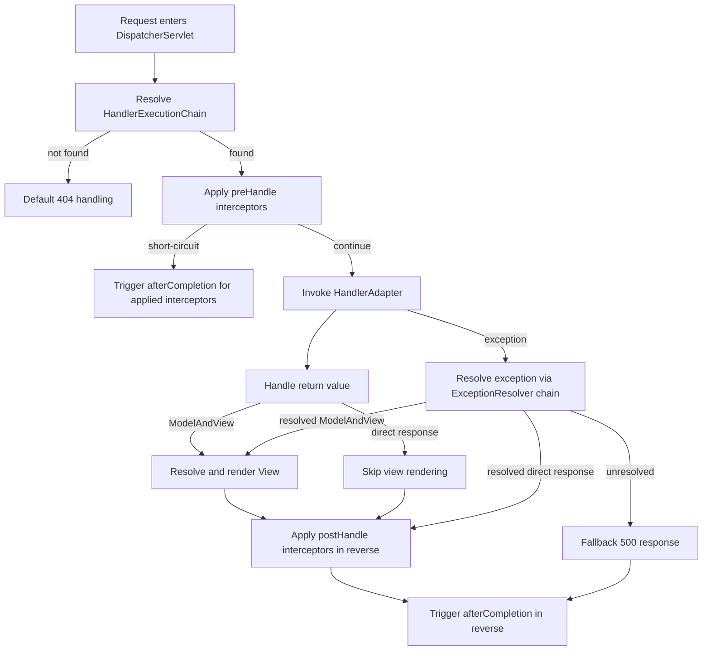
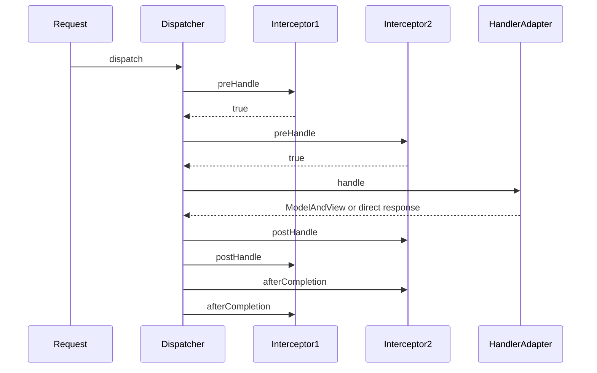
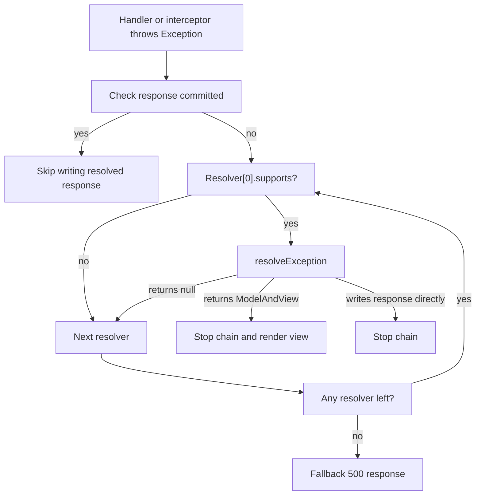

# MVC Phase 3: 拦截器链 + 异常处理链 + 可选视图解析

## 1. 目标与范围（必须/不做）

### 1.1 必须

- 在 Phase 1、Phase 2 的稳定主流程之上，引入 `HandlerInterceptor` 拦截器链
- 支持拦截器执行时序：
  - `preHandle`
  - `postHandle`
  - `afterCompletion`
- 固化拦截器短路规则：
  - 任一 `preHandle` 返回 `false` 立即停止后续 Handler 调用
  - 仅对已成功通过 `preHandle` 的拦截器执行 `afterCompletion`
- 将异常出口从单一默认异常处理器扩展为 `ExceptionResolver` 责任链
- 支持异常解析顺序与短路规则：
  - 按 `PriorityOrdered -> Ordered -> 默认最低优先级`
  - 首个成功解析异常的 Resolver 立即终止链路
- 保留默认异常解析器作为兜底实现
- 在 `view=SIMPLE_VIEW_RESOLVER` 开启时，引入最小视图解析能力：
  - `ModelAndView`
  - `View`
  - `ViewResolver`
- 支持 `String` 返回值在两种模式下的明确语义：
  - `view=DISABLED`：作为响应体
  - `view=SIMPLE_VIEW_RESOLVER`：作为逻辑视图名，除非由返回值处理器明确按响应体处理
- 支持 `ModelAndView` 作为返回值进入视图解析与渲染链

### 1.2 不做

- 不做路径变量
- 不做 Ant 风格路径匹配
- 不做 JSON body
- 不做复杂对象绑定
- 不做 `@ExceptionHandler`
- 不做内容协商
- 不做异步请求处理
- 不做文件上传
- 不做模板引擎实现细节
- 不做容器层响应缓冲与二次提交控制细节

### 1.3 本阶段固定输入

- `mapping_style=AnnotationMapping`
- `integration=MINI_SPRING_AS_CONTAINER`
- `view` 支持两种运行开关：
  - `DISABLED`
  - `SIMPLE_VIEW_RESOLVER`

## 2. 设计与关键决策

### 2.1 模块职责（结合 com.xujn 包结构）

#### 新增/增强的 mini-springmvc 包结构

```text
com.xujn.minispringmvc
├── servlet
│   ├── DispatcherServlet
│   ├── HandlerExecutionChain
│   └── ModelAndView
├── interceptor
│   ├── HandlerInterceptor
│   ├── MappedInterceptor
│   └── support
│       └── InterceptorRegistry
├── exception
│   ├── ExceptionResolver
│   ├── HandlerExceptionResolverComposite
│   └── support
│       └── DefaultHandlerExceptionResolver
├── view
│   ├── View
│   ├── ViewResolver
│   └── support
│       ├── SimpleView
│       └── SimpleViewResolver
└── adapter
    └── support
        ├── ModelAndViewReturnValueHandler
        ├── ViewNameReturnValueHandler
        └── ResponseBodyStringReturnValueHandler
```

#### 模块职责

- `HandlerExecutionChain`
  - 持有 `handler`
  - 持有排序后的拦截器列表
  - 记录已成功执行 `preHandle` 的拦截器下标
- `HandlerInterceptor`
  - 提供前置、后置、完成回调
- `HandlerExceptionResolverComposite`
  - 统一驱动异常解析责任链
- `ModelAndView`
  - 承载视图名与模型
- `ViewResolver`
  - 将逻辑视图名解析为 `View`
- `View`
  - 根据模型向响应写入内容
- `ModelAndViewReturnValueHandler`
  - 处理 `ModelAndView`
- `ViewNameReturnValueHandler`
  - 在视图模式开启时处理 `String` 视图名
- `ResponseBodyStringReturnValueHandler`
  - 在无视图模式或明确响应体语义时处理 `String`

#### mini-spring 复用点

- 拦截器、异常处理器、视图解析器全部作为 `mini-spring` Bean 管理
- 初始化阶段从容器收集组件并排序
- AOP 可用于拦截器或异常处理器自身

### 2.2 数据结构/接口草图（仅签名与字段）

#### `HandlerInterceptor`

```java
public interface HandlerInterceptor {
    boolean preHandle(WebRequest request, WebResponse response, Object handler) throws Exception;
    void postHandle(WebRequest request, WebResponse response, Object handler, ModelAndView modelAndView) throws Exception;
    void afterCompletion(WebRequest request, WebResponse response, Object handler, Exception ex) throws Exception;
    int getOrder();
}
```

#### `HandlerExecutionChain`

字段列表：

- `Object handler`
- `List<HandlerInterceptor> interceptors`
- `int interceptorIndex`

方法签名：

```java
public class HandlerExecutionChain {
    Object getHandler();
    List<HandlerInterceptor> getInterceptors();
    boolean applyPreHandle(WebRequest request, WebResponse response) throws Exception;
    void applyPostHandle(WebRequest request, WebResponse response, ModelAndView modelAndView) throws Exception;
    void triggerAfterCompletion(WebRequest request, WebResponse response, Exception ex) throws Exception;
}
```

#### `ModelAndView`

字段列表：

- `String viewName`
- `Map<String, Object> model`

#### `ExceptionResolver`

```java
public interface ExceptionResolver {
    boolean supports(Exception ex, Object handler);
    ModelAndView resolveException(
            WebRequest request,
            WebResponse response,
            Object handler,
            Exception ex) throws Exception;
    int getOrder();
}
```

#### `HandlerExceptionResolverComposite`

字段列表：

- `List<ExceptionResolver> resolvers`

方法签名：

```java
public final class HandlerExceptionResolverComposite {
    void addResolvers(List<ExceptionResolver> resolvers);
    ModelAndView resolveException(
            WebRequest request,
            WebResponse response,
            Object handler,
            Exception ex) throws Exception;
}
```

#### `View`

```java
public interface View {
    void render(Map<String, Object> model, WebRequest request, WebResponse response) throws Exception;
}
```

#### `ViewResolver`

```java
public interface ViewResolver {
    boolean supports(String viewName);
    View resolveViewName(String viewName) throws Exception;
    int getOrder();
}
```

### 2.3 扩展点与执行顺序

Dispatcher Phase 3 执行顺序：

1. 通过 `HandlerMapping` 获取 `HandlerExecutionChain`
2. 执行拦截器 `preHandle`
3. 调用 `HandlerAdapter`
4. 处理返回值，得到：
   - 直接响应已写出
   - 或 `ModelAndView`
5. 倒序执行 `postHandle`
6. 若有 `ModelAndView`，执行视图解析与渲染
7. 倒序执行 `afterCompletion`
8. 发生异常时：
   - 先交给 `ExceptionResolver` 链
   - 若解析出 `ModelAndView`，继续走渲染
   - 若响应已提交，则不再尝试写错误结果
   - 始终调用 `afterCompletion`

> [注释] 拦截器链的回调顺序必须严格固定
> - 背景：拦截器本质是围绕 Handler 的责任链
> - 影响：若 `postHandle` 和 `afterCompletion` 顺序错误，资源释放和状态回滚会反向错乱
> - 取舍：Phase 3 固定 `preHandle` 正序、`postHandle` 反序、`afterCompletion` 反序
> - 可选增强：后续扩展异步回调时，再单独定义异步链规则

> [注释] preHandle 短路后只能回调已执行过的拦截器
> - 背景：后续拦截器尚未进入链
> - 影响：若错误地回调未执行拦截器，会引入空状态清理或错误副作用
> - 取舍：Phase 3 用 `interceptorIndex` 记录已成功通过的最大下标，`afterCompletion` 只回调该范围
> - 可选增强：后续增加链路调试日志输出每个拦截器阶段

> [注释] 异常处理链必须在 afterCompletion 之前完成
> - 背景：部分拦截器需要在 `afterCompletion` 中看到最终异常结果或最终渲染结果
> - 影响：若先 afterCompletion 再解析异常，拦截器拿到的是不完整状态
> - 取舍：Phase 3 固定“先异常解析，再渲染，再 afterCompletion”
> - 可选增强：后续增加统一 `DispatchResult` 模型，将异常/视图/响应状态一起传递

> [注释] String 返回值在视图开启后不能再保持模糊语义
> - 背景：同一个 `String` 可能既是响应体，也可能是逻辑视图名
> - 影响：没有明确规则会让相同控制器在不同配置下出现不可预测行为
> - 取舍：Phase 3 明确由返回值处理器链控制：视图模式下默认 `String` 走视图名处理器；若显式响应体语义存在，则优先响应体处理器
> - 可选增强：后续引入 `@ResponseBody`、内容协商和消息转换器

### 2.4 与 mini-spring 的集成点

#### 哪些组件是 Bean

必须由 `mini-spring` 管理：

- `HandlerInterceptor`
- `ExceptionResolver`
- `ViewResolver`
- `View`
- 返回值处理器中的视图相关处理器

#### 如何装配流水线

- `DispatcherServlet.init()` 从容器中收集：
  - `HandlerMapping`
  - `HandlerAdapter`
  - `HandlerInterceptor`
  - `ExceptionResolver`
  - `ViewResolver`
- `RequestMappingHandlerMapping` 在构建 `HandlerExecutionChain` 时，将拦截器列表组装进链
- `RequestMappingHandlerAdapter` 在视图开启时收集并排序视图相关返回值处理器
- `HandlerExceptionResolverComposite` 在 init 阶段排序完成并冻结

> [注释] MVC 组件装配必须继续遵守 mvc -> spring 的单向依赖
> - 背景：拦截器链、异常链、视图链都是 MVC 语义
> - 影响：如果反向把这些逻辑塞回 mini-spring，会污染 IOC/AOP 核心边界
> - 取舍：Phase 3 继续通过容器“按类型取 Bean”，但所有执行语义都停留在 `mini-springmvc`
> - 可选增强：后续抽出独立 MVC 自动注册器，但不改变依赖方向

## 3. 流程与图

### 3.1 流程图：Dispatcher Phase 3 主流程

**标题：MVC Phase 3 Dispatcher 主流程**  
**说明：覆盖拦截器、Handler 调用、返回值处理、视图渲染和异常解析。**



### 3.2 时序图：拦截器链回调顺序

**标题：HandlerInterceptor 执行时序**  
**说明：覆盖 `preHandle`、`postHandle`、`afterCompletion` 的顺序和短路行为。**



### 3.3 流程图：ExceptionResolver 责任链

**标题：Phase 3 异常处理责任链**  
**说明：覆盖多个异常解析器按顺序短路，以及已提交响应的边界。**



## 4. 验收标准（可量化）

### 4.1 拦截器链

- 支持多个拦截器按顺序执行 `preHandle`
- `postHandle` 与 `afterCompletion` 按逆序执行
- `preHandle=false` 时不再调用 Handler
- `preHandle=false` 时只回调已执行过的拦截器 `afterCompletion`

### 4.2 异常处理链

- 多个 `ExceptionResolver` 按顺序执行
- 首个成功解析异常的 Resolver 会终止后续链路
- 未解析异常时默认返回 500
- `response.committed=true` 时不再尝试写新的错误结果

### 4.3 视图解析

- `view=SIMPLE_VIEW_RESOLVER` 时：
  - `String` 视图名可成功解析并渲染
  - `ModelAndView` 可成功渲染
- `view=DISABLED` 时：
  - `String` 仍然作为响应体
  - 不触发 `ViewResolver`

### 4.4 集成边界

- 拦截器、异常处理器、视图解析器都来自 `mini-spring` 容器
- 自定义组件可通过 `Ordered`/`PriorityOrdered` 覆盖默认顺序
- Controller 被 AOP 代理时，拦截器链和异常链仍能正常工作

## 5. Git 交付计划

- `branch: feature/mvc-phase-3-interceptor-exception-view`
- `PR title: feat(mvc): implement phase-3 interceptor exception and view pipeline`

commits：

- `docs(docs): add mvc phase-3 design and acceptance documents -> docs/mvc-phase-3.md, tests/acceptance-mvc-phase-3.md`
- `feat(interceptor): add handler interceptor contract and execution chain callbacks -> src/main/java/com/xujn/minispringmvc/interceptor/HandlerInterceptor.java, src/main/java/com/xujn/minispringmvc/servlet/HandlerExecutionChain.java`
- `feat(dispatcher): integrate interceptor pre-post-after lifecycle into dispatcher -> src/main/java/com/xujn/minispringmvc/servlet/DispatcherServlet.java`
- `feat(exception): add exception resolver composite and ordered resolver chain -> src/main/java/com/xujn/minispringmvc/exception/HandlerExceptionResolverComposite.java, src/main/java/com/xujn/minispringmvc/exception/ExceptionResolver.java`
- `feat(exception): add mvc phase-3 default resolver behaviors for committed response and fallback handling -> src/main/java/com/xujn/minispringmvc/exception/support/DefaultHandlerExceptionResolver.java`
- `feat(view): add model-and-view contracts and simple view resolver support -> src/main/java/com/xujn/minispringmvc/servlet/ModelAndView.java, src/main/java/com/xujn/minispringmvc/view/View.java, src/main/java/com/xujn/minispringmvc/view/ViewResolver.java`
- `feat(adapter): add phase-3 return value handlers for model-and-view and view names -> src/main/java/com/xujn/minispringmvc/adapter/support/ModelAndViewReturnValueHandler.java, src/main/java/com/xujn/minispringmvc/adapter/support/ViewNameReturnValueHandler.java`
- `feat(context): initialize interceptor exception and view components from mini-spring container -> src/main/java/com/xujn/minispringmvc/context/support/DefaultMvcInfrastructureInitializer.java, src/main/java/com/xujn/minispringmvc/servlet/DispatcherServlet.java`
- `test(tests): add mvc phase-3 acceptance coverage for interceptor short-circuit and resolver chain -> src/test/java/com/xujn/minispringmvc/Phase3AcceptanceTest.java, src/test/java/com/xujn/minispringmvc/test/phase3/**`
- `feat(examples): add runnable mvc phase-3 interceptor and view example -> examples/src/main/java/com/xujn/minispringmvc/examples/phase3/Phase3MvcExample.java, examples/src/main/java/com/xujn/minispringmvc/examples/phase3/fixture/**`
