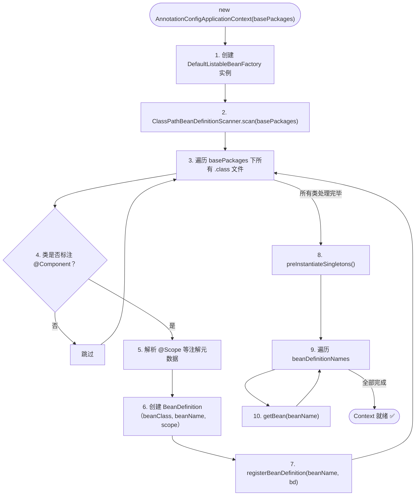
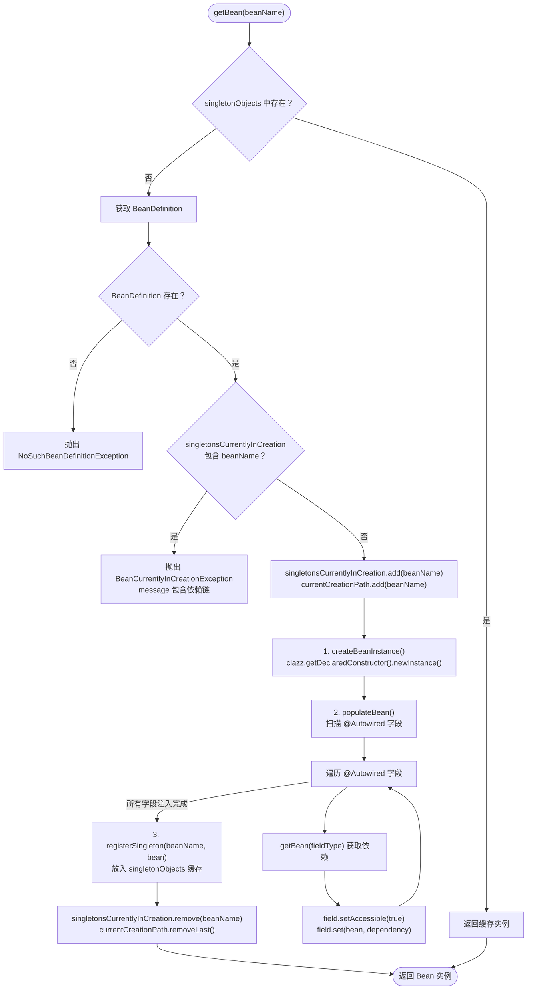
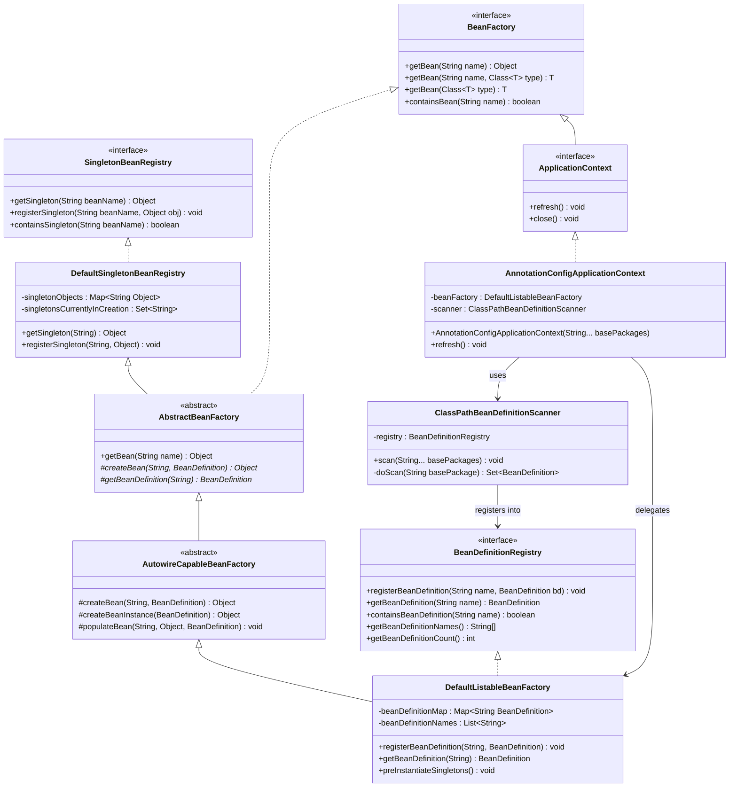

# Phase 1: IOC 容器 + DI 注入

> **mode**: PHASE  
> **phase_n**: 1  
> **config_source**: AnnotationScan  
> **circular_dependency**: DISALLOW  
> **package group**: `com.xujn`

---

## 1. 目标与范围

### 必须实现

| # | 能力                         | 完成标志                                                                |
|---|------------------------------|-------------------------------------------------------------------------|
| 1 | `@Component` 注解扫描         | 指定包路径下所有 `@Component` 类被解析为 BeanDefinition 并注册到容器       |
| 2 | `@ComponentScan` 包路径配置   | 通过注解指定扫描根包，扫描器递归该包下所有类                              |
| 3 | BeanDefinition 注册与存储     | `BeanDefinitionRegistry` 接口完成，`BeanDefinitionMap` 可查询             |
| 4 | 反射实例化（无参构造器）       | `createBeanInstance()` 通过 `clazz.getDeclaredConstructor().newInstance()` 创建对象 |
| 5 | `@Autowired` 字段注入         | 扫描 Bean 中 `@Autowired` 字段 → 递归 `getBean` 获取依赖 → 反射 `field.set()` |
| 6 | Singleton 单例缓存            | `singletonObjects` Map 缓存已创建的 singleton Bean；重复 `getBean` 返回同一实例 |
| 7 | 循环依赖检测 + 快速失败       | `singletonsCurrentlyInCreation` Set 检测循环；抛出 `BeanCurrentlyInCreationException`，message 包含依赖链 |
| 8 | `getBean` 按名称 / 按类型获取 | 支持 `getBean(String)`、`getBean(Class<T>)`、`getBean(String, Class<T>)` |
| 9 | 异常体系                      | `BeansException`（基类）、`NoSuchBeanDefinitionException`、`BeanCurrentlyInCreationException` |

### 不做（Phase 1 边界）

| 排除项                               | 延后至         |
|---------------------------------------|---------------|
| `InitializingBean` / `DisposableBean` | Phase 2       |
| `BeanPostProcessor` / `BFPP`         | Phase 2       |
| AOP 代理                              | Phase 2       |
| `prototype` 作用域                    | Phase 2       |
| 构造器注入 / setter 注入              | Phase 2+      |
| XML / Java Config 配置源              | 不在计划内     |
| 三级缓存循环依赖解决                  | Phase 3       |
| `@Lazy` / `@DependsOn`               | 不在计划内     |

---

## 2. 设计与关键决策

### 2.1 模块职责（Phase 1 涉及的包）

```
com.xujn.minispring
├── beans
│   ├── factory
│   │   ├── config
│   │   │   ├── BeanDefinition.java          # Bean 元数据
│   │   │   ├── SingletonBeanRegistry.java   # 单例注册表接口
│   │   │   └── BeanDefinitionRegistry.java  # BD 注册表接口
│   │   ├── support
│   │   │   ├── DefaultSingletonBeanRegistry.java   # 单例缓存实现
│   │   │   ├── AbstractBeanFactory.java             # getBean 模板方法
│   │   │   ├── AutowireCapableBeanFactory.java      # createBean + DI
│   │   │   └── DefaultListableBeanFactory.java      # 完整 BeanFactory 实现
│   │   └── BeanFactory.java                # 顶层工厂接口
│   └── PropertyValue.java                  # 属性值封装（预留）
├── context
│   ├── ApplicationContext.java             # 高级容器接口
│   ├── annotation
│   │   ├── Component.java                  # @Component 注解
│   │   ├── ComponentScan.java              # @ComponentScan 注解
│   │   ├── Autowired.java                  # @Autowired 注解
│   │   ├── Scope.java                      # @Scope 注解
│   │   └── ClassPathBeanDefinitionScanner.java  # 扫描器
│   └── support
│       └── AnnotationConfigApplicationContext.java  # 入口 Context
├── core
│   ├── ReflectionUtils.java               # 反射工具
│   └── AnnotationUtils.java               # 注解工具
└── exception
    ├── BeansException.java                 # 基础异常
    ├── NoSuchBeanDefinitionException.java  # Bean 不存在
    └── BeanCurrentlyInCreationException.java  # 循环依赖
```

### 2.2 数据结构 / 接口草图

#### BeanDefinition 字段

| 字段             | 类型                  | Phase 1 使用 | 说明                                     |
|------------------|-----------------------|-------------|------------------------------------------|
| `beanClass`      | `Class<?>`            | ✅          | Bean 的 Class 对象                        |
| `beanName`       | `String`              | ✅          | Bean 名称（类名首字母小写）                |
| `scope`          | `String`              | ✅          | 固定为 `"singleton"`                      |
| `propertyValues` | `List<PropertyValue>` | ❌（预留）  | Phase 3 setter 注入 / 三级缓存场景使用    |
| `lazyInit`       | `boolean`             | ❌（预留）  | 延迟加载                                  |

#### 核心接口签名

```text
interface BeanFactory
    Object getBean(String name)
    <T> T getBean(String name, Class<T> requiredType)
    <T> T getBean(Class<T> requiredType)
    boolean containsBean(String name)

interface BeanDefinitionRegistry
    void registerBeanDefinition(String beanName, BeanDefinition bd)
    BeanDefinition getBeanDefinition(String beanName)
    boolean containsBeanDefinition(String beanName)
    String[] getBeanDefinitionNames()
    int getBeanDefinitionCount()

interface SingletonBeanRegistry
    Object getSingleton(String beanName)
    void registerSingleton(String beanName, Object singletonObject)
    boolean containsSingleton(String beanName)

interface ApplicationContext extends BeanFactory
    void refresh()
    void close()
```

#### 类继承结构

```text
SingletonBeanRegistry (I)
  └─ DefaultSingletonBeanRegistry (C)
       └─ AbstractBeanFactory (AC) implements BeanFactory
            └─ AutowireCapableBeanFactory (AC)
                 └─ DefaultListableBeanFactory (C) implements BeanDefinitionRegistry
```

### 2.3 关键流程与决策

#### 2.3.1 注解扫描流程

1. `AnnotationConfigApplicationContext` 构造函数接收 `basePackages` 或 `@ComponentScan` 标注的配置类
2. `ClassPathBeanDefinitionScanner.scan(basePackages)` 递归扫描指定包
3. 对每个类检查是否标注 `@Component`
4. 命中的类 → 创建 `BeanDefinition`（beanName = 类名首字母小写，scope 从 `@Scope` 读取，默认 `"singleton"`）
5. 调用 `BeanDefinitionRegistry.registerBeanDefinition(beanName, bd)` 注册

> [注释] 扫描器职责边界
> - 背景：`ClassPathBeanDefinitionScanner` 同时承担"发现类"和"解析注解"两个职责
> - 影响：职责耦合导致后续扩展新注解（如 `@Service`、`@Repository`）时修改扫描器核心逻辑
> - 取舍：Phase 1 扫描器仅识别 `@Component`；通过将"注解 → BeanDefinition"的映射逻辑集中在一个方法内，后续扩展时仅需在该方法增加判断分支
> - 可选增强：Phase N 抽取 `BeanDefinitionReader` 接口，分离发现与解析

#### 2.3.2 依赖注入流程

1. `populateBean()` 获取 Bean 实例的所有声明字段
2. 过滤出标注 `@Autowired` 的字段
3. 对每个 `@Autowired` 字段：根据字段类型调用 `getBean(fieldType)` 获取依赖实例
4. `field.setAccessible(true)` → `field.set(bean, dependency)`
5. 若 `getBean(fieldType)` 触发循环依赖，由 `singletonsCurrentlyInCreation` 检测并抛出异常

> [注释] 按类型注入的歧义问题
> - 背景：`@Autowired` 按类型注入时，如果同一类型存在多个 Bean，需要消歧
> - 影响：Phase 1 不处理消歧，注入时仅按类型匹配第一个命中的 BeanDefinition
> - 取舍：Phase 1 遇到同一类型多个 Bean 时抛出 `BeansException("expected single bean but found N")`，快速失败
> - 可选增强：后续支持 `@Qualifier` 按名称消歧、`@Primary` 标记优先 Bean

#### 2.3.3 循环依赖检测

```
A 的 createBean 入口 → singletonsCurrentlyInCreation.add("A")
  → populateBean(A) 发现 @Autowired B
    → getBean("B") → createBean("B") → singletonsCurrentlyInCreation.add("B")
      → populateBean(B) 发现 @Autowired A
        → getBean("A") → singletonsCurrentlyInCreation.contains("A") == true
        → 抛出 BeanCurrentlyInCreationException("A -> B -> A")
```

> [注释] 依赖链信息构建
> - 背景：循环依赖错误信息必须包含完整依赖链路，便于定位
> - 影响：仅抛出 `"circular dependency"` 不足以帮助使用者定位问题
> - 取舍：在 `AbstractBeanFactory` 维护 `List<String> currentCreationPath` 线程局部变量，记录当前创建链路。检测到循环时，将路径拼接为 `"A -> B -> A"` 写入异常 message
> - 可选增强：Phase 3 引入三级缓存后，该检测逻辑对 singleton 字段注入场景移除，仅保留构造器注入场景的快速失败

---

## 3. 流程与图

### 3.1 AnnotationConfigApplicationContext 启动流程

> **标题**：Phase 1 容器启动全流程  
> **覆盖范围**：从 `new AnnotationConfigApplicationContext(basePackages)` 到所有 singleton Bean 就绪的完整过程



### 3.2 getBean → createBean 完整流程

> **标题**：Phase 1 getBean 流程（含循环依赖检测与字段注入）  
> **覆盖范围**：从 `getBean` 调用到返回可用 Bean 实例的全流程；Phase 1 不包含生命周期回调和 BPP



### 3.3 核心类协作架构图

> **标题**：Phase 1 核心类继承与协作关系  
> **覆盖范围**：容器启动涉及的全部接口与实现类的继承 / 实现 / 依赖关系



---

## 4. 验收标准（可量化）

| # | 验收项                                   | 通过条件                                                                      |
|---|------------------------------------------|-------------------------------------------------------------------------------|
| 1 | 注解扫描注册                              | 指定包下 N 个 `@Component` 类 → `getBeanDefinitionCount() == N`                |
| 2 | getBean 按类型获取                        | `getBean(UserService.class)` 返回非 null 且 `instanceof UserService`           |
| 3 | getBean 按名称获取                        | `getBean("userService")` 返回非 null 且 `instanceof UserService`               |
| 4 | singleton 一致性                          | `getBean(X.class) == getBean(X.class)` → `assertSame` 通过                    |
| 5 | @Autowired 字段注入                       | `userService.getUserRepository() != null` 且类型为 `UserRepository`             |
| 6 | 多层依赖注入                              | A → B → C 三层依赖全部正确注入                                                 |
| 7 | 循环依赖快速失败                          | A ↔ B 循环 → 抛出 `BeanCurrentlyInCreationException`，message 包含 `"A -> B -> A"` 或 `"B -> A -> B"` |
| 8 | Bean 不存在异常                           | `getBean("nonExistent")` → 抛出 `NoSuchBeanDefinitionException`                |
| 9 | 同类型多 Bean 异常                        | 同类型注册 2 个 Bean → `getBean(Type.class)` 抛出 `BeansException`              |
| 10| BeanDefinition 字段正确                  | 注册后查询 BD：`beanClass`、`beanName`、`scope` 三个字段与注解定义一致           |

---

## 5. Git 交付计划

### 分支

```
branch: feature/phase-1-ioc
base:   main
```

### PR

```
PR title: feat(phase-1): implement IOC container with annotation scan and field injection
```

### Commits（15 条，Angular 格式）

```
1. chore(build): initialize maven project with groupId com.xujn and JDK 17
   -> pom.xml
   -> src/main/java/com/xujn/minispring/.gitkeep

2. feat(exception): define BeansException base exception and subclasses
   -> src/main/java/com/xujn/minispring/exception/BeansException.java
   -> src/main/java/com/xujn/minispring/exception/NoSuchBeanDefinitionException.java
   -> src/main/java/com/xujn/minispring/exception/BeanCurrentlyInCreationException.java

3. feat(beans): define BeanDefinition with core fields and scope support
   -> src/main/java/com/xujn/minispring/beans/factory/config/BeanDefinition.java
   -> src/main/java/com/xujn/minispring/beans/PropertyValue.java

4. feat(beans): define BeanFactory interface with getBean overloads
   -> src/main/java/com/xujn/minispring/beans/factory/BeanFactory.java

5. feat(beans): define SingletonBeanRegistry interface
   -> src/main/java/com/xujn/minispring/beans/factory/config/SingletonBeanRegistry.java

6. feat(beans): implement DefaultSingletonBeanRegistry with singletonObjects cache
   -> src/main/java/com/xujn/minispring/beans/factory/support/DefaultSingletonBeanRegistry.java

7. feat(beans): define BeanDefinitionRegistry interface
   -> src/main/java/com/xujn/minispring/beans/factory/config/BeanDefinitionRegistry.java

8. feat(beans): implement AbstractBeanFactory with getBean template method and circular detection
   -> src/main/java/com/xujn/minispring/beans/factory/support/AbstractBeanFactory.java

9. feat(beans): implement AutowireCapableBeanFactory with createBean and populateBean
   -> src/main/java/com/xujn/minispring/beans/factory/support/AutowireCapableBeanFactory.java

10. feat(beans): implement DefaultListableBeanFactory with BeanDefinitionRegistry
    -> src/main/java/com/xujn/minispring/beans/factory/support/DefaultListableBeanFactory.java

11. feat(context): define annotation types Component, Autowired, ComponentScan, Scope
    -> src/main/java/com/xujn/minispring/context/annotation/Component.java
    -> src/main/java/com/xujn/minispring/context/annotation/Autowired.java
    -> src/main/java/com/xujn/minispring/context/annotation/ComponentScan.java
    -> src/main/java/com/xujn/minispring/context/annotation/Scope.java

12. feat(context): implement ClassPathBeanDefinitionScanner with recursive package scan
    -> src/main/java/com/xujn/minispring/context/annotation/ClassPathBeanDefinitionScanner.java
    -> src/main/java/com/xujn/minispring/core/ReflectionUtils.java
    -> src/main/java/com/xujn/minispring/core/AnnotationUtils.java

13. feat(context): implement AnnotationConfigApplicationContext with refresh lifecycle
    -> src/main/java/com/xujn/minispring/context/ApplicationContext.java
    -> src/main/java/com/xujn/minispring/context/support/AnnotationConfigApplicationContext.java

14. test(ioc): add unit tests for BeanDefinition registration and getBean
    -> src/test/java/com/xujn/minispring/beans/factory/DefaultListableBeanFactoryTest.java
    -> src/test/java/com/xujn/minispring/test/bean/SimpleComponent.java

15. test(ioc): add integration tests for annotation scan, DI, singleton, and circular dependency
    -> src/test/java/com/xujn/minispring/context/AnnotationConfigApplicationContextTest.java
    -> src/test/java/com/xujn/minispring/test/bean/UserService.java
    -> src/test/java/com/xujn/minispring/test/bean/UserRepository.java
    -> src/test/java/com/xujn/minispring/test/bean/CircularA.java
    -> src/test/java/com/xujn/minispring/test/bean/CircularB.java
```
