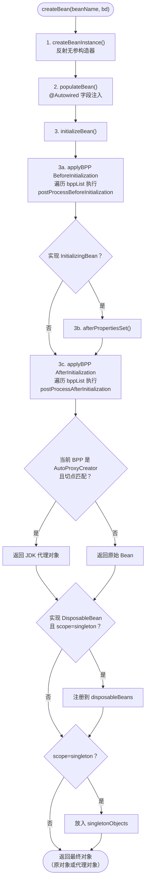
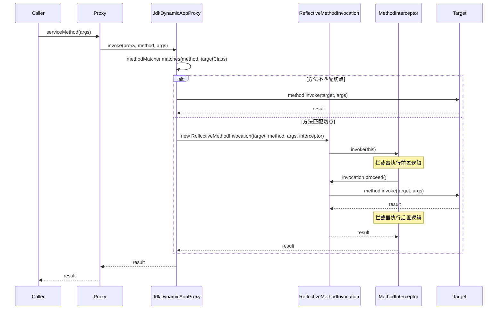
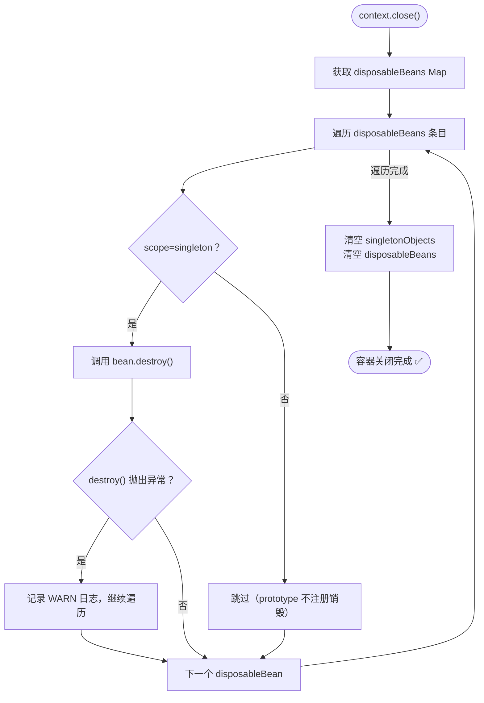

# Phase 2: 生命周期 + BeanPostProcessor + AOP

> **mode**: PHASE  
> **phase_n**: 2  
> **config_source**: AnnotationScan  
> **circular_dependency**: DISALLOW  
> **package group**: `com.xujn`

---

## 1. 目标与范围

### 必须实现

| # | 能力                          | 完成标志                                                                                  |
|---|-------------------------------|-------------------------------------------------------------------------------------------|
| 1 | `InitializingBean` 接口       | Bean 属性注入后、BPP After 前，容器自动调用 `afterPropertiesSet()`                          |
| 2 | `DisposableBean` 接口          | `context.close()` 时，容器自动调用所有 singleton Bean 的 `destroy()`                        |
| 3 | `BeanPostProcessor` 接口      | 注册到容器的 BPP 在每个 Bean 初始化前后被依次调用                                           |
| 4 | BPP 提前实例化                 | BPP 类型的 Bean 在 `refresh()` 阶段 6 提前实例化，保证所有业务 Bean 创建时 BPP 已就绪         |
| 5 | `Pointcut` 切点                | 支持 `execution()` 表达式子集：匹配包名前缀 + 方法名通配符                                   |
| 6 | `MethodInterceptor` / Advice   | 定义 Around 语义拦截器接口，支持链式调用                                                    |
| 7 | `ProxyFactory`                 | 基于 JDK 动态代理创建代理对象，代理对象实现目标 Bean 的接口                                  |
| 8 | `AutoProxyCreator`（BPP 实现） | 作为 BPP 在 `postProcessAfterInitialization` 阶段为匹配切点的 Bean 创建并返回代理            |
| 9 | `Prototype` 作用域             | `@Scope("prototype")` 的 Bean 每次 `getBean` 返回新实例，不缓存，不注册销毁回调              |

### 不做（Phase 2 边界）

| 排除项                            | 原因                                        |
|-----------------------------------|---------------------------------------------|
| 三级缓存 / 循环依赖解决           | Phase 3 实现                                 |
| CGLIB 字节码代理                  | 仅支持 JDK 代理；无接口的 Bean 不创建代理     |
| `@PostConstruct` / `@PreDestroy`  | JSR-250 注解，非 Spring 核心接口              |
| `@Order` / `Ordered` 排序        | BPP / Advice 按注册顺序执行                   |
| `BeanFactoryPostProcessor`       | 可选增强，不在 Phase 2 必做范围               |
| `@Aspect` 注解解析               | 采用编程式 Advice 注册替代                    |
| `@Value` 属性注入                 | 依赖 BFPP，Phase 2 不实现                     |

---

## 2. 设计与关键决策

### 2.1 模块职责（Phase 2 新增 / 修改的包）

```
com.xujn.minispring
├── beans
│   ├── factory
│   │   ├── config
│   │   │   ├── BeanPostProcessor.java              # [NEW] BPP 接口
│   │   │   └── BeanDefinition.java                  # [MODIFY] 无新增字段
│   │   ├── support
│   │   │   ├── AutowireCapableBeanFactory.java      # [MODIFY] 集成 BPP + 生命周期
│   │   │   └── DefaultListableBeanFactory.java      # [MODIFY] BPP 注册列表 + prototype
│   │   ├── InitializingBean.java                    # [NEW] 初始化回调接口
│   │   └── DisposableBean.java                      # [NEW] 销毁回调接口
│   └── ...
├── context
│   └── support
│       └── AnnotationConfigApplicationContext.java   # [MODIFY] refresh 增加 BPP 注册 + close 增加销毁
├── aop                                               # [NEW] 整个包
│   ├── Pointcut.java                                 # 切点接口
│   ├── ClassFilter.java                              # 类匹配器接口
│   ├── MethodMatcher.java                            # 方法匹配器接口
│   ├── MethodInterceptor.java                        # 方法拦截器接口
│   ├── MethodInvocation.java                         # 方法调用封装接口
│   ├── AdvisedSupport.java                           # 代理配置（目标+拦截器+切点）
│   ├── aspectj
│   │   └── AspectJExpressionPointcut.java            # execution() 子集实现
│   └── framework
│       ├── JdkDynamicAopProxy.java                   # JDK 动态代理实现
│       ├── ProxyFactory.java                         # 代理创建工厂
│       ├── ReflectiveMethodInvocation.java           # MethodInvocation 实现
│       └── autoproxy
│           └── AutoProxyCreator.java                 # BPP 实现：自动代理创建
└── ...
```

### 2.2 数据结构 / 接口草图

#### BeanPostProcessor 接口

```text
interface BeanPostProcessor
    Object postProcessBeforeInitialization(Object bean, String beanName)
    Object postProcessAfterInitialization(Object bean, String beanName)
```

#### 生命周期回调接口

```text
interface InitializingBean
    void afterPropertiesSet()

interface DisposableBean
    void destroy()
```

#### AOP 核心接口

```text
interface Pointcut
    ClassFilter getClassFilter()
    MethodMatcher getMethodMatcher()

interface ClassFilter
    boolean matches(Class<?> clazz)

interface MethodMatcher
    boolean matches(Method method, Class<?> targetClass)

interface MethodInterceptor
    Object invoke(MethodInvocation invocation)

interface MethodInvocation
    Method getMethod()
    Object[] getArguments()
    Object getThis()
    Object proceed()
```

#### AdvisedSupport（代理配置聚合对象）

| 字段                 | 类型                       | 说明                          |
|----------------------|----------------------------|-------------------------------|
| `targetSource`       | `TargetSource`             | 封装目标对象及其接口列表       |
| `methodInterceptor`  | `MethodInterceptor`        | 方法拦截器（Phase 2 单拦截器） |
| `methodMatcher`      | `MethodMatcher`            | 方法匹配器                    |

#### TargetSource

| 字段              | 类型          | 说明                            |
|-------------------|---------------|---------------------------------|
| `target`          | `Object`      | 被代理的原始对象                 |
| `targetInterfaces`| `Class<?>[]`  | 目标对象实现的接口列表           |

#### AutoProxyCreator 职责

```text
class AutoProxyCreator implements BeanPostProcessor
    // 持有切面配置列表（Pointcut + MethodInterceptor 对）
    List<AdvisedSupport> advisors

    postProcessBeforeInitialization(bean, beanName):
        return bean  // 不做处理

    postProcessAfterInitialization(bean, beanName):
        for each advisor in advisors:
            if advisor.getClassFilter().matches(bean.getClass()):
                创建 JDK 代理并返回
        return bean  // 无匹配则返回原对象
```

### 2.3 关键流程与决策

#### 2.3.1 createBean 生命周期阶段（Phase 2 完整版）

```
createBeanInstance()          → 反射实例化
  ↓
populateBean()                → @Autowired 字段注入（Phase 1 已实现）
  ↓
applyBPP BeforeInitialization → 遍历 BPP 列表执行 postProcessBeforeInitialization
  ↓
invokeInitMethods()           → 若实现 InitializingBean → 调用 afterPropertiesSet()
  ↓
applyBPP AfterInitialization  → 遍历 BPP 列表执行 postProcessAfterInitialization
                                （AutoProxyCreator 在此返回代理对象）
  ↓
registerDisposableBean()      → 若实现 DisposableBean 且 scope=singleton → 注册销毁回调
  ↓
registerSingleton()           → singleton 放入缓存（缓存的是 BPP 返回的对象，即代理）
```

> [注释] BPP 返回值替换机制
> - 背景：每个 BPP 的 `postProcessBeforeInitialization` / `postProcessAfterInitialization` 返回值将替换当前 Bean 引用
> - 影响：如果 BPP 返回 null，后续流程将以 null 作为 Bean 引用导致 NPE
> - 取舍：Phase 2 在 `applyBeanPostProcessors*` 方法中，如果 BPP 返回 null 则保留前一个非 null 结果（与 Spring 行为一致）
> - 可选增强：增加日志警告，提示 BPP 返回 null 的情况

> [注释] 生命周期钩子执行顺序
> - 背景：Bean 生命周期中存在多个扩展点，执行顺序严格固定
> - 影响：顺序错误将导致 AOP 代理在初始化回调之前创建（初始化逻辑未被代理拦截）或 BPP Before 在注入前执行（Bean 状态不完整）
> - 取舍：Phase 2 严格遵循 Spring 顺序：实例化 → DI → BPP Before → InitializingBean → BPP After；该顺序在 `AutowireCapableBeanFactory.createBean()` 中硬编码，不可配置
> - 可选增强：后续支持 `@PostConstruct`（需在 BPP Before 阶段通过 `CommonAnnotationBeanPostProcessor` 实现）

#### 2.3.2 Prototype 与 Singleton 的分支

```
scope == "singleton":
  → 走单例缓存 → createBean → 注册到 singletonObjects → 注册 DisposableBean
scope == "prototype":
  → 每次 createBean → 不缓存 → 不注册 DisposableBean
```

> [注释] Prototype Bean 不注册销毁回调
> - 背景：Prototype 每次 `getBean` 创建新实例，容器不持有引用
> - 影响：如果注册销毁回调，容器无法追踪所有 prototype 实例
> - 取舍：与 Spring 行为一致，prototype 的 `destroy()` 不由容器调用；使用者自行管理生命周期
> - 可选增强：在文档中提醒使用者 prototype 的销毁限制

#### 2.3.3 AOP 切点匹配策略

`AspectJExpressionPointcut` 实现 `execution()` 表达式的子集：

| 支持的表达式模式                              | 示例                                               | 说明                       |
|-----------------------------------------------|-----------------------------------------------------|----------------------------|
| `execution(* com.xujn.app.service.*.*(..))`   | 匹配 `com.xujn.app.service` 包下所有类的所有方法     | 包名精确 + 全通配           |
| `execution(* com.xujn.app.service..*.*(..))`  | 匹配 `com.xujn.app.service` 及子包下所有方法         | 包名递归通配                |
| `execution(* *.doSomething(..))`              | 匹配任意类的 `doSomething` 方法                      | 方法名精确匹配              |

**不支持的表达式**：

| 不支持                  | 原因                                |
|------------------------|-------------------------------------|
| `@annotation()` 匹配   | 注解匹配增加解析复杂度，延后实现      |
| 返回类型精确匹配        | Phase 2 返回类型固定为 `*` 通配       |
| 参数类型精确匹配        | Phase 2 参数固定为 `(..)` 通配         |

> [注释] JDK 动态代理的限制
> - 背景：JDK 动态代理要求目标对象实现至少一个接口
> - 影响：未实现接口的 `@Component` 类无法创建 AOP 代理
> - 取舍：Phase 2 中 `AutoProxyCreator` 在切点匹配命中但目标类未实现接口时，跳过代理创建并输出 WARN 日志（不抛异常，不阻断启动）
> - 可选增强：Phase N 引入 CGLIB 代理，对无接口类自动降级为 CGLIB

#### 2.3.4 refresh() 流程变更（相对 Phase 1）

Phase 2 在 Phase 1 的 `refresh()` 中插入两个阶段：

| Step | Phase 1                       | Phase 2 变更                                  |
|------|-------------------------------|-----------------------------------------------|
| 1-4  | 扫描 → 注册 BD                | 无变化                                         |
| 5    | （无）                        | `invokeBeanFactoryPostProcessors()`（如有 BFPP）|
| 6    | （无）                        | **`registerBeanPostProcessors()`**：识别 BPP 类型 BD → 提前 getBean 实例化 → 注册到 BPP 列表 |
| 7    | preInstantiateSingletons      | 无变化（此时 BPP 已就绪）                       |
| 8    | （无）                        | **`close()` 注册 shutdown hook**：遍历 disposableBeans 调用 destroy() |

---

## 3. 流程与图

### 3.1 Phase 2 createBean 完整生命周期流程

> **标题**：Phase 2 createBean 生命周期流程（含 BPP + 初始化回调 + AOP 代理）  
> **覆盖范围**：从 `createBean` 入口到返回最终对象的全流程，包含全部生命周期钩子



### 3.2 AOP 代理创建与方法调用时序

> **标题**：Phase 2 AOP 方法调用时序（JDK 动态代理 + MethodInterceptor）  
> **覆盖范围**：调用方通过代理对象调用目标方法时，InvocationHandler 判断切点匹配 → 分发到 MethodInterceptor 链或直接调用目标



### 3.3 容器关闭与销毁流程

> **标题**：Phase 2 容器关闭流程（DisposableBean 销毁回调）  
> **覆盖范围**：从 `context.close()` 到所有 singleton DisposableBean 执行 `destroy()` 的流程



> [注释] 销毁异常不中断整体流程
> - 背景：多个 Bean 的 `destroy()` 各自独立执行，每个都有抛出异常的风险
> - 影响：如果一个 Bean 的 `destroy()` 异常中断整个流程，其余 Bean 的资源不会释放
> - 取舍：Phase 2 对每个 `destroy()` 调用做 try-catch，捕获异常后记录 WARN 日志并继续遍历下一个 Bean
> - 可选增强：收集所有异常为 `CompositeException`，在遍历完毕后统一抛出

---

## 4. 验收标准（可量化）

| #  | 验收项                                      | 通过条件                                                                              |
|----|---------------------------------------------|--------------------------------------------------------------------------------------|
| 1  | InitializingBean 回调                        | 实现 `InitializingBean` 的 Bean，`afterPropertiesSet()` 在 `populateBean` 之后被调用    |
| 2  | InitializingBean 调用顺序                    | `afterPropertiesSet()` 在 BPP Before 之后、BPP After 之前执行                           |
| 3  | DisposableBean 销毁回调                      | `context.close()` 后，所有 singleton `DisposableBean` 的 `destroy()` 被调用              |
| 4  | DisposableBean 销毁异常隔离                  | 一个 Bean 的 `destroy()` 抛出异常，不影响其余 Bean 的销毁                                |
| 5  | BPP Before 执行                              | 注册的 BPP 的 `postProcessBeforeInitialization` 在每个 Bean 初始化前被调用                |
| 6  | BPP After 执行                               | 注册的 BPP 的 `postProcessAfterInitialization` 在每个 Bean 初始化后被调用                 |
| 7  | BPP 执行顺序                                 | 多个 BPP 按注册顺序执行（第一个注册的先执行）                                            |
| 8  | BPP 返回值替换                               | BPP 返回新对象后，后续流程使用新对象（非原对象）                                          |
| 9  | AOP 切点匹配 — 命中                          | `execution(* com.xujn.test.service.*.*(..))` 匹配该包下 Bean 的方法                     |
| 10 | AOP 切点匹配 — 未命中                        | 不在切点范围内的 Bean 方法不经过 MethodInterceptor                                       |
| 11 | AOP 代理类型                                 | `getBean(ServiceInterface.class) instanceof Proxy == true`                              |
| 12 | AOP 拦截器调用                               | 代理方法调用时 `MethodInterceptor.invoke()` 被调用，可记录调用日志验证                    |
| 13 | AOP 目标方法执行                              | `invocation.proceed()` 后目标方法正常执行并返回结果                                       |
| 14 | 无接口 Bean 不代理                           | 切点匹配但 Bean 未实现接口 → 不创建代理，返回原对象                                       |
| 15 | Prototype 每次新实例                         | `@Scope("prototype")` Bean：`getBean()` 两次返回不同实例（`assertNotSame`）               |
| 16 | Prototype 不缓存                             | Prototype Bean 不存在于 `singletonObjects` 中                                            |
| 17 | Prototype 不注册销毁                         | `context.close()` 后 prototype Bean 的 `destroy()` 不被调用                               |
| 18 | Phase 1 能力回归                             | Phase 1 全部验收用例在 Phase 2 代码上通过                                                 |

---

## 5. Git 交付计划

### 分支

```
branch: feature/phase-2-lifecycle-aop
base:   main (Phase 1 已合并)
```

### PR

```
PR title: feat(phase-2): add bean lifecycle, BeanPostProcessor, and AOP proxy support
```

### Commits（18 条，Angular 格式）

```
1. feat(lifecycle): define InitializingBean interface
   -> src/main/java/com/xujn/minispring/beans/factory/InitializingBean.java

2. feat(lifecycle): define DisposableBean interface
   -> src/main/java/com/xujn/minispring/beans/factory/DisposableBean.java

3. feat(extension): define BeanPostProcessor interface
   -> src/main/java/com/xujn/minispring/beans/factory/config/BeanPostProcessor.java

4. feat(beans): add beanPostProcessors list and registration to DefaultListableBeanFactory
   -> src/main/java/com/xujn/minispring/beans/factory/support/DefaultListableBeanFactory.java

5. feat(beans): integrate BPP before/after and InitializingBean into createBean lifecycle
   -> src/main/java/com/xujn/minispring/beans/factory/support/AutowireCapableBeanFactory.java

6. feat(beans): register DisposableBean and implement destroySingletons
   -> src/main/java/com/xujn/minispring/beans/factory/support/DefaultSingletonBeanRegistry.java
   -> src/main/java/com/xujn/minispring/beans/factory/support/DefaultListableBeanFactory.java

7. feat(context): add registerBeanPostProcessors and close with destroySingletons to refresh lifecycle
   -> src/main/java/com/xujn/minispring/context/support/AnnotationConfigApplicationContext.java

8. feat(beans): add prototype scope support in getBean and createBean
   -> src/main/java/com/xujn/minispring/beans/factory/support/AbstractBeanFactory.java
   -> src/main/java/com/xujn/minispring/beans/factory/support/AutowireCapableBeanFactory.java

9. feat(aop): define Pointcut, ClassFilter, and MethodMatcher interfaces
   -> src/main/java/com/xujn/minispring/aop/Pointcut.java
   -> src/main/java/com/xujn/minispring/aop/ClassFilter.java
   -> src/main/java/com/xujn/minispring/aop/MethodMatcher.java

10. feat(aop): define MethodInterceptor and MethodInvocation interfaces
    -> src/main/java/com/xujn/minispring/aop/MethodInterceptor.java
    -> src/main/java/com/xujn/minispring/aop/MethodInvocation.java

11. feat(aop): implement AspectJExpressionPointcut with execution() subset parsing
    -> src/main/java/com/xujn/minispring/aop/aspectj/AspectJExpressionPointcut.java

12. feat(aop): implement AdvisedSupport and TargetSource configuration objects
    -> src/main/java/com/xujn/minispring/aop/AdvisedSupport.java
    -> src/main/java/com/xujn/minispring/aop/TargetSource.java

13. feat(aop): implement ReflectiveMethodInvocation with proceed chain
    -> src/main/java/com/xujn/minispring/aop/framework/ReflectiveMethodInvocation.java

14. feat(aop): implement JdkDynamicAopProxy with InvocationHandler
    -> src/main/java/com/xujn/minispring/aop/framework/JdkDynamicAopProxy.java

15. feat(aop): implement ProxyFactory for proxy creation
    -> src/main/java/com/xujn/minispring/aop/framework/ProxyFactory.java

16. feat(aop): implement AutoProxyCreator as BeanPostProcessor
    -> src/main/java/com/xujn/minispring/aop/framework/autoproxy/AutoProxyCreator.java

17. test(lifecycle): add tests for InitializingBean, DisposableBean callback order and BPP execution
    -> src/test/java/com/xujn/minispring/beans/factory/LifecycleTest.java
    -> src/test/java/com/xujn/minispring/beans/factory/BeanPostProcessorTest.java
    -> src/test/java/com/xujn/minispring/test/bean/LifecycleBean.java

18. test(aop): add tests for pointcut matching, JDK proxy creation, interceptor invocation, and prototype
    -> src/test/java/com/xujn/minispring/aop/AspectJExpressionPointcutTest.java
    -> src/test/java/com/xujn/minispring/aop/JdkDynamicAopProxyTest.java
    -> src/test/java/com/xujn/minispring/context/PrototypeScopeTest.java
    -> src/test/java/com/xujn/minispring/test/service/TestService.java
    -> src/test/java/com/xujn/minispring/test/service/TestServiceImpl.java
    -> src/test/java/com/xujn/minispring/test/interceptor/LoggingInterceptor.java
```
