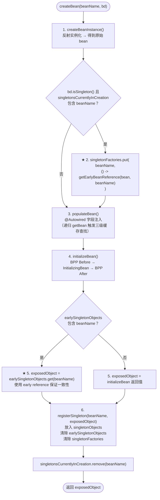
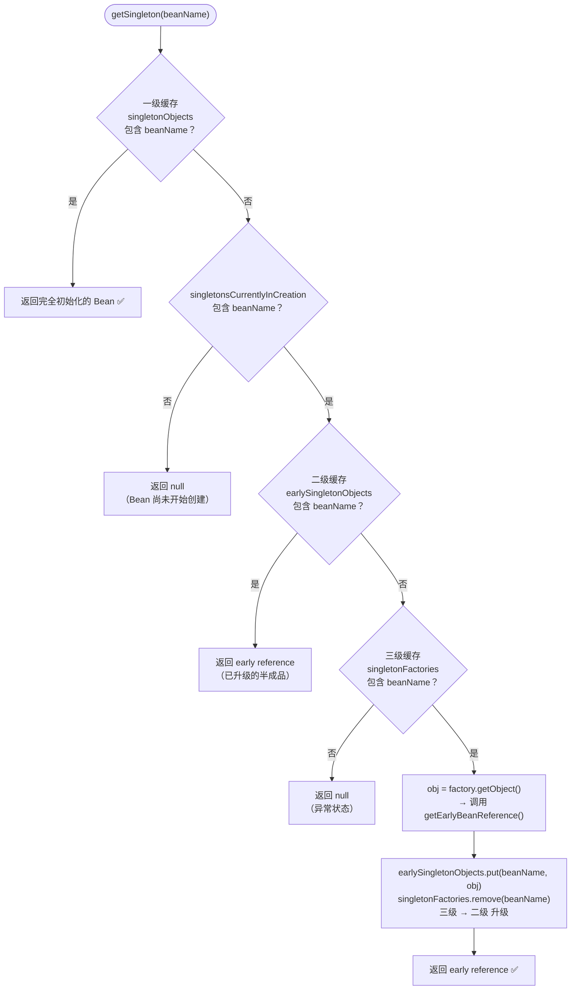
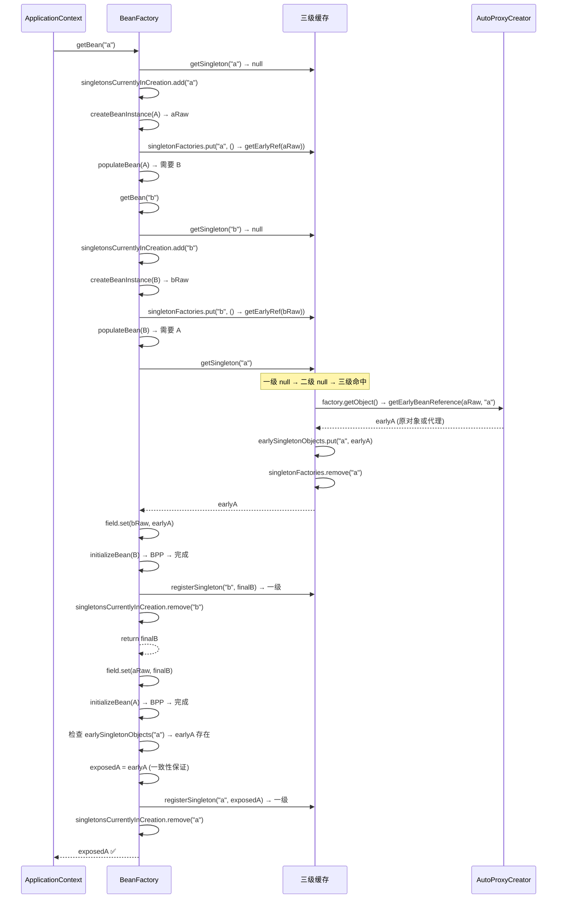

# Phase 3: 三级缓存循环依赖

> **mode**: PHASE  
> **phase_n**: 3  
> **config_source**: AnnotationScan  
> **circular_dependency**: THREE_LEVEL_CACHE_REQUIRED  
> **package group**: `com.xujn`

---

## 1. 目标与范围

### 必须实现

| # | 能力                                    | 完成标志                                                                                       |
|---|-----------------------------------------|-----------------------------------------------------------------------------------------------|
| 1 | 三级缓存数据结构                         | `DefaultSingletonBeanRegistry` 增加 `earlySingletonObjects` 和 `singletonFactories` 两个 Map   |
| 2 | `getSingleton` 三级缓存查找              | 按 `singletonObjects → earlySingletonObjects → singletonFactories` 顺序查找                    |
| 3 | `singletonFactory` 注册                  | `createBean` 中实例化后、`populateBean` 前，将 `ObjectFactory` 注册到 `singletonFactories`       |
| 4 | `SmartInstantiationAwareBeanPostProcessor` | 定义 `getEarlyBeanReference(bean, beanName)` 方法，`AutoProxyCreator` 实现此接口                |
| 5 | AOP + 循环依赖一致性                     | 循环依赖场景下，通过 `getEarlyBeanReference` 确保返回的 early reference 是代理对象（如需代理）   |
| 6 | 缓存升级逻辑                             | 从 `singletonFactories` 获取后升级到 `earlySingletonObjects`，从一级缓存获取时清理二三级         |
| 7 | singleton 字段注入循环依赖可解决          | A ↔ B 双向 `@Autowired` 字段注入，容器正常启动                                                  |
| 8 | 移除 singleton 字段注入的快速失败检测      | Phase 1/2 的 `singletonsCurrentlyInCreation` 检测改为仅标记状态，不直接抛异常                    |

### 不做（Phase 3 边界）

| 排除项                              | 原因                                                        |
|--------------------------------------|-------------------------------------------------------------|
| 构造器注入循环依赖                    | 实例化阶段即需要依赖，三级缓存无法解决；Spring 也不支持       |
| prototype 参与的循环依赖              | prototype 不缓存，无法放入三级缓存                            |
| `@Lazy` 延迟代理                     | 属于替代方案，不在核心三级缓存范围                            |
| CGLIB 代理                           | Phase 2 已明确仅 JDK 代理                                    |
| `@DependsOn` 显式依赖排序            | 非三级缓存核心                                               |

---

## 2. 设计与关键决策

### 2.1 模块职责（Phase 3 修改的包）

```
com.xujn.minispring
├── beans
│   ├── factory
│   │   ├── config
│   │   │   ├── SingletonBeanRegistry.java                       # [MODIFY] 无接口变更
│   │   │   └── SmartInstantiationAwareBeanPostProcessor.java    # [NEW]
│   │   └── support
│   │       ├── DefaultSingletonBeanRegistry.java                # [MODIFY] 三级缓存核心
│   │       ├── AbstractBeanFactory.java                         # [MODIFY] getSingleton 调整
│   │       └── AutowireCapableBeanFactory.java                  # [MODIFY] createBean 注册 singletonFactory
│   └── ...
├── aop
│   └── framework
│       └── autoproxy
│           └── AutoProxyCreator.java                            # [MODIFY] 实现 SmartInstantiationAwareBPP
└── ...
```

### 2.2 数据结构 / 接口草图

#### DefaultSingletonBeanRegistry 三级缓存字段

| 字段                           | 类型                                  | 说明                                           |
|--------------------------------|---------------------------------------|------------------------------------------------|
| `singletonObjects`            | `Map<String, Object>`                 | 一级缓存：完全初始化的 Bean                     |
| `earlySingletonObjects`       | `Map<String, Object>`                 | 二级缓存：提前暴露的半成品 Bean（原对象或代理）   |
| `singletonFactories`          | `Map<String, ObjectFactory<?>>`       | 三级缓存：延迟生成 early reference 的工厂        |
| `singletonsCurrentlyInCreation` | `Set<String>`                        | 正在创建中的 Bean 标记（仅标记，不直接抛异常）    |

#### ObjectFactory 接口

```text
@FunctionalInterface
interface ObjectFactory<T>
    T getObject()
```

#### SmartInstantiationAwareBeanPostProcessor 接口

```text
interface SmartInstantiationAwareBeanPostProcessor extends BeanPostProcessor
    Object getEarlyBeanReference(Object bean, String beanName)
```

### 2.3 关键流程与决策

#### 2.3.1 三级缓存 getSingleton 查找逻辑

```
getSingleton(beanName, allowEarlyReference=true):
  1. obj = singletonObjects.get(beanName)         // 一级缓存
     if obj != null → return obj

  2. if singletonsCurrentlyInCreation.contains(beanName):
       obj = earlySingletonObjects.get(beanName)   // 二级缓存
       if obj != null → return obj

       if allowEarlyReference:
         factory = singletonFactories.get(beanName)  // 三级缓存
         if factory != null:
           obj = factory.getObject()                  // 调用 ObjectFactory → 触发 getEarlyBeanReference
           earlySingletonObjects.put(beanName, obj)   // 升级到二级
           singletonFactories.remove(beanName)        // 移除三级
           return obj

  3. return null  // 未找到
```

> [注释] 三级缓存为何不能省略为二级
> - 背景：如果只使用 `singletonObjects` + `earlySingletonObjects`，需要在实例化后立即决定放入二级缓存的是原对象还是代理对象
> - 影响：在没有循环依赖的场景下，所有 Bean 都会被 AOP 处理两次（一次 early、一次 BPP After），造成不必要的代理创建和性能浪费
> - 取舍：三级缓存使用 `ObjectFactory` 延迟执行 `getEarlyBeanReference()`，仅在实际发生循环依赖时（即有人从三级缓存取值时）才触发代理创建
> - 可选增强：无（三级缓存是 Spring 的最终方案，无需进一步简化）

> [注释] 缓存升级时机与一致性
> - 背景：从三级获取后升级到二级，确保后续对同一 Bean 的 `getSingleton` 调用直接命中二级缓存，不重复调用 `ObjectFactory`
> - 影响：如果不升级，同一 Bean 在多处循环引用时会被 `getEarlyBeanReference` 多次调用，产生多个代理对象，破坏 singleton 语义
> - 取舍：严格执行"三级获取 → 升级二级 → 移除三级"的原子操作
> - 可选增强：在多线程场景下增加 `synchronized` 保护查找逻辑（mini-spring Phase 3 为单线程启动，不强制要求）

#### 2.3.2 createBean 流程变更（对比 Phase 2）

Phase 3 在 `createBeanInstance()` 之后、`populateBean()` 之前，插入 singletonFactory 注册：

```
createBean(beanName, bd):
  1. createBeanInstance()                  // 反射实例化（同 Phase 2）
  2. ★ 注册 singletonFactory（仅 singleton）
     if (bd.isSingleton() && singletonsCurrentlyInCreation.contains(beanName)):
       singletonFactories.put(beanName, () -> getEarlyBeanReference(bean, beanName))
  3. populateBean()                        // @Autowired 字段注入（递归 getBean 时触发三级缓存查找）
  4. initializeBean()                      // BPP Before → InitializingBean → BPP After
  5. ★ 检查 early reference 一致性
     if earlySingletonObjects.containsKey(beanName):
       exposedObject = earlySingletonObjects.get(beanName)  // 使用 early reference（代理）
     // 否则使用 initializeBean 返回的对象
  6. registerSingleton → 放入一级缓存 → 清除二级 + 三级
```

> [注释] 步骤 5 early reference 一致性检查
> - 背景：如果 Bean 在循环依赖中被提前暴露了 early reference（代理对象），那么最终放入一级缓存的必须是同一个代理对象，而非 BPP After 阶段再次创建的新代理
> - 影响：如果忽略此检查，A 持有的 B 代理 和 容器中缓存的 B 代理 将是两个不同对象，破坏 singleton 一致性
> - 取舍：Phase 3 在 `createBean` 末尾检查 `earlySingletonObjects` 中是否已存在该 Bean 的 early reference；如果存在，最终对象使用 early reference。同时在 `AutoProxyCreator.postProcessAfterInitialization` 中，如果该 Bean 已通过 `getEarlyBeanReference` 创建过代理，则跳过重复代理创建
> - 可选增强：使用 `Set<String> earlyProxyReferences` 在 `AutoProxyCreator` 中记录已创建 early 代理的 beanName，避免重复

#### 2.3.3 getEarlyBeanReference 流程

```
AutoProxyCreator.getEarlyBeanReference(bean, beanName):
  1. earlyProxyReferences.add(beanName)         // 标记已提前创建代理
  2. if 任意切点匹配 bean.getClass():
       return createProxy(bean)                  // 返回代理对象
  3. return bean                                  // 不需要代理，返回原对象

AutoProxyCreator.postProcessAfterInitialization(bean, beanName):
  1. if earlyProxyReferences.contains(beanName):
       earlyProxyReferences.remove(beanName)
       return bean                                // 已提前代理，跳过
  2. // 正常走代理创建逻辑（同 Phase 2）
```

> [注释] earlyProxyReferences 防止重复代理
> - 背景：一个 Bean 如果在循环依赖中通过 `getEarlyBeanReference` 创建了代理，后续 `postProcessAfterInitialization` 不应再次创建
> - 影响：重复创建代理将导致 early reference 与最终对象不一致（两个不同的代理实例）
> - 取舍：`AutoProxyCreator` 维护 `Set<String> earlyProxyReferences` 记录已提前代理的 beanName；`postProcessAfterInitialization` 检查该集合决定是否跳过
> - 可选增强：无（该机制与 Spring 实现一致）

#### 2.3.4 循环依赖完整流程示例（A ↔ B）

```
getBean("a"):
  1. getSingleton("a") → null
  2. singletonsCurrentlyInCreation.add("a")
  3. createBeanInstance(A) → a 实例
  4. singletonFactories.put("a", () -> getEarlyBeanReference(a, "a"))
  5. populateBean(A):
     → 发现 @Autowired B → getBean("b"):
       5.1 getSingleton("b") → null
       5.2 singletonsCurrentlyInCreation.add("b")
       5.3 createBeanInstance(B) → b 实例
       5.4 singletonFactories.put("b", () -> getEarlyBeanReference(b, "b"))
       5.5 populateBean(B):
           → 发现 @Autowired A → getBean("a"):
             5.5.1 getSingleton("a"):
               singletonObjects → null
               singletonsCurrentlyInCreation.contains("a") == true
               earlySingletonObjects → null
               singletonFactories.get("a") → factory 存在
               earlyA = factory.getObject()  // → getEarlyBeanReference(a, "a")
               earlySingletonObjects.put("a", earlyA)
               singletonFactories.remove("a")
               return earlyA                 // B 拿到 A 的 early reference
           → field.set(b, earlyA)
       5.6 initializeBean(B) → BPP Before → InitializingBean → BPP After
       5.7 registerSingleton("b", finalB) → 一级缓存
       5.8 singletonsCurrentlyInCreation.remove("b")
       → return finalB
     → field.set(a, finalB)
  6. initializeBean(A) → BPP Before → InitializingBean → BPP After
  7. 检查 earlySingletonObjects.containsKey("a"):
     → 是 → exposedObject = earlyA（保证与 B 持有的引用一致）
  8. registerSingleton("a", earlyA) → 一级缓存
  9. singletonsCurrentlyInCreation.remove("a")
  → 完成 ✅
```

#### 2.3.5 不可解决的循环依赖场景

| 场景                          | 原因                                                    | 行为                                           |
|-------------------------------|--------------------------------------------------------|------------------------------------------------|
| 构造器注入循环                 | 实例化阶段即需要完整依赖，无法先创建半成品               | 抛出 `BeanCurrentlyInCreationException`         |
| prototype + 循环              | prototype 不参与缓存机制                                | 抛出 `BeanCurrentlyInCreationException`         |
| singleton 构造器 + 字段混合循环 | 只要循环链中有一环是构造器注入，即无法解决               | 抛出 `BeanCurrentlyInCreationException`         |

> [注释] 构造器注入循环依赖无法解决
> - 背景：构造器注入在 `createBeanInstance` 阶段即需要依赖实例，此时 singletonFactory 尚未注册（注册发生在实例化之后）
> - 影响：构造器注入的循环依赖在 Spring 中也是不支持的（Spring 5.3+ 默认禁止循环依赖，需显式开启）
> - 取舍：Phase 3 仅解决 singleton 字段注入的循环依赖；构造器注入循环仍然快速失败并在异常 message 中标注 `"constructor injection circular dependency is not supported"`
> - 可选增强：提示使用者通过 `@Lazy` 延迟注入打破构造器循环（需 `@Lazy` 支持后）

---

## 3. 流程与图

### 3.1 三级缓存 createBean 流程图

> **标题**：Phase 3 createBean 完整流程（含三级缓存注册与 early reference 一致性检查）  
> **覆盖范围**：从 createBean 入口到放入一级缓存的全流程，标注三级缓存关键步骤



### 3.2 三级缓存 getSingleton 查找流程

> **标题**：Phase 3 getSingleton 三级缓存查找流程  
> **覆盖范围**：从 getSingleton 入口到返回 Bean 实例（或 null）的三级查找逻辑



### 3.3 A ↔ B 循环依赖解决时序图

> **标题**：Phase 3 三级缓存解决 A ↔ B 循环依赖完整时序  
> **覆盖范围**：从 getBean("a") 到 A 和 B 均成功创建的全过程，体现三级缓存的注册、查找、升级



---

## 4. 验收标准（可量化）

| #  | 验收项                                          | 通过条件                                                                                          |
|----|------------------------------------------------|--------------------------------------------------------------------------------------------------|
| 1  | 基础循环依赖解决（A ↔ B）                        | A、B 均 singleton + 字段注入 → 容器启动成功 → A.b == getBean(B) && B.a == getBean(A)               |
| 2  | 三层循环依赖（A → B → C → A）                   | 三个 singleton + 字段注入 → 容器启动成功 → 所有引用一致                                             |
| 3  | AOP + 循环依赖一致性                             | A ↔ B，B 需要 AOP 代理 → B 的 early reference 是代理 → A.b instanceof Proxy == true                |
| 4  | AOP + 循环依赖 — getBean 返回代理                | `getBean(B.class) instanceof Proxy == true` 且 `getBean(B.class) == A.b`                         |
| 5  | 双向 AOP + 循环依赖                              | A、B 均需 AOP 代理 + 循环依赖 → 两者均为代理 → A.b 和 B.a 均为代理对象                              |
| 6  | 无循环依赖 Bean 不受影响                          | 无循环依赖的 Bean 不经过 `getEarlyBeanReference`，`singletonFactories` 中注册后未被调用直接清除      |
| 7  | 构造器注入循环 → 快速失败                        | 构造器注入场景循环 → 抛出 `BeanCurrentlyInCreationException`，message 包含依赖链                    |
| 8  | prototype 参与循环 → 快速失败                    | A(singleton) ↔ B(prototype) 循环 → 抛出 `BeanCurrentlyInCreationException`                        |
| 9  | 自依赖解决                                       | `SelfRef` 有 `@Autowired SelfRef self` → 容器启动成功 → self == getBean(SelfRef.class)             |
| 10 | 三级 → 二级升级                                  | 循环依赖场景中，`singletonFactories` 调用后 entry 移入 `earlySingletonObjects`，三级 entry 删除      |
| 11 | 一级缓存最终状态正确                              | 容器启动完成后，所有 singleton Bean 仅存在于 `singletonObjects`，`earlySingletonObjects` 和 `singletonFactories` 为空 |
| 12 | Phase 1 + Phase 2 能力回归                       | Phase 1 和 Phase 2 全部验收用例在 Phase 3 代码基线上通过                                            |

---

## 5. Git 交付计划

### 分支

```
branch: feature/phase-3-circular-dependency
base:   main (Phase 2 已合并)
```

### PR

```
PR title: feat(phase-3): implement three-level cache to resolve singleton circular dependencies
```

### Commits（14 条，Angular 格式）

```
1. feat(beans): define ObjectFactory functional interface
   -> src/main/java/com/xujn/minispring/beans/factory/ObjectFactory.java

2. refactor(beans): extend DefaultSingletonBeanRegistry with earlySingletonObjects and singletonFactories maps
   -> src/main/java/com/xujn/minispring/beans/factory/support/DefaultSingletonBeanRegistry.java

3. feat(beans): implement three-level cache lookup in getSingleton
   -> src/main/java/com/xujn/minispring/beans/factory/support/DefaultSingletonBeanRegistry.java

4. feat(beans): implement addSingletonFactory and cache upgrade logic
   -> src/main/java/com/xujn/minispring/beans/factory/support/DefaultSingletonBeanRegistry.java

5. feat(beans): update registerSingleton to clear second and third level caches
   -> src/main/java/com/xujn/minispring/beans/factory/support/DefaultSingletonBeanRegistry.java

6. feat(extension): define SmartInstantiationAwareBeanPostProcessor with getEarlyBeanReference
   -> src/main/java/com/xujn/minispring/beans/factory/config/SmartInstantiationAwareBeanPostProcessor.java

7. feat(aop): implement getEarlyBeanReference in AutoProxyCreator with earlyProxyReferences tracking
   -> src/main/java/com/xujn/minispring/aop/framework/autoproxy/AutoProxyCreator.java

8. feat(aop): skip duplicate proxy creation in postProcessAfterInitialization for early-proxied beans
   -> src/main/java/com/xujn/minispring/aop/framework/autoproxy/AutoProxyCreator.java

9. feat(beans): register singletonFactory in createBean before populateBean
   -> src/main/java/com/xujn/minispring/beans/factory/support/AutowireCapableBeanFactory.java

10. feat(beans): add early reference consistency check at end of createBean
    -> src/main/java/com/xujn/minispring/beans/factory/support/AutowireCapableBeanFactory.java

11. refactor(beans): change circular dependency detection to allow singleton field injection resolution
    -> src/main/java/com/xujn/minispring/beans/factory/support/AbstractBeanFactory.java

12. feat(beans): add constructor-injection circular dependency fast-fail with descriptive error
    -> src/main/java/com/xujn/minispring/beans/factory/support/AutowireCapableBeanFactory.java
    -> src/main/java/com/xujn/minispring/exception/BeanCurrentlyInCreationException.java

13. test(circular): add tests for A-B, A-B-C circular dependency resolution and self-reference
    -> src/test/java/com/xujn/minispring/beans/factory/CircularDependencyTest.java
    -> src/test/java/com/xujn/minispring/test/bean/CircularA.java
    -> src/test/java/com/xujn/minispring/test/bean/CircularB.java
    -> src/test/java/com/xujn/minispring/test/bean/CircularC.java
    -> src/test/java/com/xujn/minispring/test/bean/SelfRefBean.java

14. test(circular): add tests for AOP + circular dependency consistency and unsupported scenarios
    -> src/test/java/com/xujn/minispring/aop/AopCircularDependencyTest.java
    -> src/test/java/com/xujn/minispring/test/bean/ProxiedCircularA.java
    -> src/test/java/com/xujn/minispring/test/bean/ProxiedCircularB.java
    -> src/test/java/com/xujn/minispring/test/bean/ConstructorCircularA.java
    -> src/test/java/com/xujn/minispring/test/bean/ConstructorCircularB.java
```
