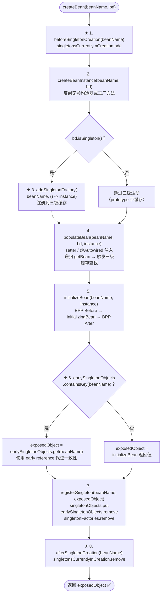
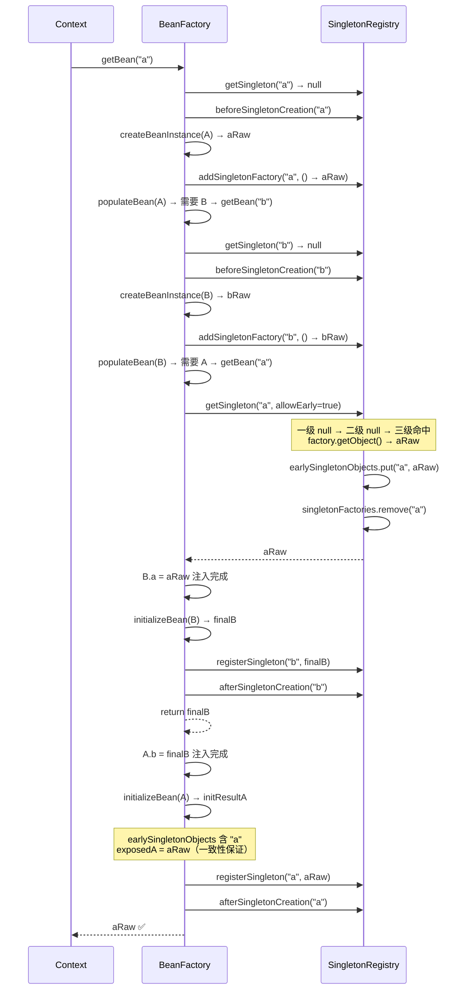

# Three-Level Cache Phase 1: 三级缓存最小闭环（setter 循环依赖 + 构造器 FAIL_FAST）

> **mode**: PHASE  
> **phase_n**: 1  
> **injection_style**: SETTER_REQUIRED  
> **circular_dependency**: THREE_LEVEL_CACHE  
> **aop_early_reference**: DISABLED  
> **scope_support**: SINGLETON_ONLY  
> **package group**: `com.xujn`

---

## 1. 目标与范围

### 必须实现

| # | 能力                                   | 完成标志                                                                                  |
|---|----------------------------------------|------------------------------------------------------------------------------------------|
| 1 | `ObjectFactory<T>` 函数式接口           | `T getObject()` 方法定义完成                                                              |
| 2 | `earlySingletonObjects` 二级缓存        | `DefaultSingletonBeanRegistry` 新增 `Map<String, Object>`                                |
| 3 | `singletonFactories` 三级缓存           | `DefaultSingletonBeanRegistry` 新增 `Map<String, ObjectFactory<?>>`                      |
| 4 | `getSingleton` 三级查找                 | 按一级 → 二级 → 三级顺序查找，三级命中时升级到二级                                         |
| 5 | `addSingletonFactory` 方法              | createBeanInstance 之后注册三级工厂                                                       |
| 6 | `registerSingleton` 清理二三级          | 放入一级时清除二级和三级对应条目                                                           |
| 7 | `beforeSingletonCreation` / `afterSingletonCreation` | 标记和移除创建中状态                                                            |
| 8 | createBean 改造                         | 实例化后、populateBean 前注册三级工厂（Phase 1 工厂直接返回原始 bean）                     |
| 9 | early reference 一致性检查              | createBean 末尾检查 earlySingletonObjects，若已暴露则使用 early reference 作为最终对象     |
| 10| A ↔ B setter 循环依赖                  | 容器正常启动，引用一致                                                                    |
| 11| 构造器循环依赖 FAIL_FAST                | 抛出 `BeanCurrentlyInCreationException`，message 包含依赖链                               |

### 不做（Phase 1 边界）

| 排除项                                         | 延后至        |
|------------------------------------------------|---------------|
| `SmartInstantiationAwareBeanPostProcessor`     | Phase 2       |
| `getEarlyBeanReference` AOP 代理               | Phase 2       |
| `earlyProxyReferences` 防重复代理               | Phase 2       |
| 依赖链追踪增强（`creationPath`）                | Phase 3       |
| prototype 循环依赖检测                          | Phase 3       |
| 并发安全                                        | 不做          |

---

## 2. 设计与关键决策

### 2.1 包结构与改造点

```
com.xujn.minispring
├── beans
│   ├── factory
│   │   ├── ObjectFactory.java                        # [NEW] 函数式接口
│   │   └── support
│   │       ├── DefaultSingletonBeanRegistry.java      # [MODIFY] +二级缓存 +三级缓存 +getSingleton 三级查找
│   │       │                                          #          +addSingletonFactory +registerSingleton 清理
│   │       │                                          #          +beforeSingletonCreation / afterSingletonCreation
│   │       ├── AbstractBeanFactory.java               # [MODIFY] getBean 调整为使用新 getSingleton
│   │       └── AutowireCapableBeanFactory.java         # [MODIFY] createBean 增加三级工厂注册 + 一致性检查
├── exception
│   └── BeanCurrentlyInCreationException.java          # [MODIFY] 构造器循环依赖消息增强
└── ...
```

### 2.2 缓存结构与访问规则

#### DefaultSingletonBeanRegistry 字段

| 字段                            | 类型                              | 初始化           |
|---------------------------------|-----------------------------------|------------------|
| `singletonObjects`              | `Map<String, Object>`             | `new HashMap<>()` |
| `earlySingletonObjects`         | `Map<String, Object>`             | `new HashMap<>()` |
| `singletonFactories`            | `Map<String, ObjectFactory<?>>`   | `new HashMap<>()` |
| `singletonsCurrentlyInCreation`  | `Set<String>`                     | `new HashSet<>()` |

#### 访问规则

| 操作                    | 规则                                                                         |
|------------------------|-----------------------------------------------------------------------------|
| 读（getSingleton）      | 一级 → 二级 → 三级；三级命中后升级到二级并移除三级                             |
| 写三级                  | `addSingletonFactory`：仅在 `singletonObjects` 不包含该 beanName 时写入        |
| 写一级                  | `registerSingleton`：写入一级同时移除二级和三级                                |
| 创建标记                | `beforeSingletonCreation`：加入 set；`afterSingletonCreation`：移除 set        |

#### ObjectFactory 接口

```text
@FunctionalInterface
interface ObjectFactory<T>
    T getObject()
```

### 2.3 createBean 改造点与执行顺序

Phase 1 改造后的 `createBean` 完整步骤：

```
createBean(beanName, bd):
  1. beforeSingletonCreation(beanName)
  2. instance = createBeanInstance(beanName, bd)
  3. ★ if (bd.isSingleton()):
       addSingletonFactory(beanName, () -> instance)   // Phase 1：直接返回原始对象
  4. populateBean(beanName, bd, instance)                // setter/@Autowired 注入 → 递归 getBean
  5. exposedObject = initializeBean(beanName, instance)  // BPP Before → InitializingBean → BPP After
  6. ★ if (earlySingletonObjects.containsKey(beanName)):
       exposedObject = earlySingletonObjects.get(beanName)  // 一致性保证
  7. registerSingleton(beanName, exposedObject)           // 一级缓存
  8. afterSingletonCreation(beanName)
  return exposedObject
```

> [注释] Phase 1 三级工厂直接返回原始对象
> - 背景：Phase 1 不涉及 AOP，三级工厂的 `getObject()` 直接返回原始 bean 实例
> - 影响：所有 early reference 都是原始对象，步骤 6 的一致性检查确保 initializeBean 的返回值不会替换为非 early reference（Phase 1 中 initializeBean 通常返回原始对象本身，因此步骤 6 实际上是 no-op）
> - 取舍：虽然 Phase 1 步骤 6 是 no-op，但保留该检查以确保 Phase 2 引入 AOP 后逻辑自然衔接
> - 可选增强：Phase 2 将 `() -> instance` 替换为 `() -> getEarlyBeanReference(instance, beanName)`

> [注释] 构造器循环依赖的检测点
> - 背景：构造器注入发生在 `createBeanInstance` 内部（步骤 2），此时三级工厂尚未注册（步骤 3 在步骤 2 之后）
> - 影响：构造器注入递归 getBean 时，`getSingleton` 在三级缓存中找不到该 Bean，但 `singletonsCurrentlyInCreation` 已包含该 beanName（步骤 1 已标记）
> - 取舍：在 `AbstractBeanFactory.getBean` 中，若 `getSingleton` 返回 null 且 `isSingletonCurrentlyInCreation(beanName) == true`，则判定为构造器循环依赖，抛出 `BeanCurrentlyInCreationException`
> - 可选增强：Phase 3 在异常 message 中附加完整依赖链

### 2.4 getSingleton 三级查找逻辑

```
getSingleton(beanName, allowEarlyReference):
  1. obj = singletonObjects.get(beanName)
     if obj != null → return obj

  2. if isSingletonCurrentlyInCreation(beanName):
       obj = earlySingletonObjects.get(beanName)
       if obj != null → return obj

       if allowEarlyReference:
         factory = singletonFactories.get(beanName)
         if factory != null:
           obj = factory.getObject()
           earlySingletonObjects.put(beanName, obj)
           singletonFactories.remove(beanName)
           return obj

  3. return null
```

### 2.5 缓存升级与清理规则

| 事件                         | 动作                                                          |
|------------------------------|---------------------------------------------------------------|
| getSingleton 三级命中         | `earlySingletonObjects.put` + `singletonFactories.remove`     |
| registerSingleton            | `singletonObjects.put` + `earlySingletonObjects.remove` + `singletonFactories.remove` |
| afterSingletonCreation       | `singletonsCurrentlyInCreation.remove`                        |
| createBean 异常（finally）   | `afterSingletonCreation` + `singletonFactories.remove` + `earlySingletonObjects.remove` |

---

## 3. 流程与图

### 3.1 Phase 1 createBean 完整流程（含三级缓存注册与一致性检查）

> **标题**：Phase 1 createBean 三级缓存改造后完整流程  
> **覆盖范围**：从 createBean 入口到返回最终对象，标注三级缓存的注册、一致性检查、清理步骤



### 3.2 A ↔ B setter 循环依赖闭环时序图

> **标题**：Phase 1 三级缓存解决 A ↔ B setter 循环依赖时序  
> **覆盖范围**：从 getBean("a") 到 A、B 均注册到一级缓存的全过程，标注缓存读写操作



### 3.3 构造器循环依赖 FAIL_FAST 流程

> **标题**：构造器循环依赖检测与 FAIL_FAST  
> **覆盖范围**：构造器注入场景下递归 getBean 检测到循环并抛出异常

```mermaid
flowchart TD
    GB_A(["getBean(\"ctorA\")"])
    GB_A --> GS_A["getSingleton(\"ctorA\") → null"]
    GS_A --> MARK_A["beforeSingletonCreation(\"ctorA\")"]
    MARK_A --> CBI_A["createBeanInstance(CtorA)\n构造器需要 CtorB →\ngetBean(\"ctorB\")"]
    CBI_A --> GS_B["getSingleton(\"ctorB\") → null"]
    GS_B --> MARK_B["beforeSingletonCreation(\"ctorB\")"]
    MARK_B --> CBI_B["createBeanInstance(CtorB)\n构造器需要 CtorA →\ngetBean(\"ctorA\")"]
    CBI_B --> GS_A2["getSingleton(\"ctorA\") → null\n（三级缓存为空：\naddSingletonFactory 尚未执行）"]
    GS_A2 --> CHECK{"isSingletonCurrently\nInCreation(\"ctorA\")？"}
    CHECK -->|是| THROW["❌ 抛出\nBeanCurrentlyInCreationException\n\"Circular dependency:\nctorA → ctorB → ctorA\""]
```

---

## 4. 验收标准（可量化）

| #  | 验收项                                       | 通过条件                                                                               |
|----|----------------------------------------------|----------------------------------------------------------------------------------------|
| 1  | A ↔ B setter 循环依赖                        | 启动成功 → `A.b == getBean(B)` 且 `B.a == getBean(A)`                                  |
| 2  | A → B → C → A 三层循环                       | 启动成功 → 所有引用一致                                                                 |
| 3  | 自依赖（A → A）                               | 启动成功 → `A.self == getBean(A)`                                                       |
| 4  | 构造器循环依赖                                | 抛出 `BeanCurrentlyInCreationException`                                                  |
| 5  | 非循环 Bean 不受影响                          | 正常创建、注入、getBean                                                                  |
| 6  | singleton 一致性                              | 循环依赖 Bean 多次 getBean 返回同一实例                                                  |
| 7  | 启动后二级缓存为空                            | `earlySingletonObjects.size() == 0`                                                     |
| 8  | 启动后三级缓存为空                            | `singletonFactories.size() == 0`                                                        |
| 9  | 启动后创建中标记为空                          | `singletonsCurrentlyInCreation.size() == 0`                                              |
| 10 | 工厂方法 Bean 参与循环依赖                    | @Bean 创建的 Bean 与 @Component 创建的 Bean 循环依赖 → 启动成功                           |
| 11 | 异常后缓存清理                                | createBean 异常时二三级缓存和创建标记被清理                                               |

---

## 5. Git 交付计划

### 分支

```
branch: feature/three-level-cache-phase-1-minimal
base:   main (IOC + 生命周期已合并)
```

### PR

```
PR title: feat(cache): implement three-level cache for singleton setter circular dependency resolution
```

### Commits（12 条，Angular 格式）

```
1. feat(beans): define ObjectFactory functional interface
   -> src/main/java/com/xujn/minispring/beans/factory/ObjectFactory.java

2. feat(registry): add earlySingletonObjects map to DefaultSingletonBeanRegistry
   -> src/main/java/com/xujn/minispring/beans/factory/support/DefaultSingletonBeanRegistry.java

3. feat(registry): add singletonFactories map to DefaultSingletonBeanRegistry
   -> src/main/java/com/xujn/minispring/beans/factory/support/DefaultSingletonBeanRegistry.java

4. feat(registry): implement three-level cache lookup in getSingleton with cache upgrade
   -> src/main/java/com/xujn/minispring/beans/factory/support/DefaultSingletonBeanRegistry.java

5. feat(registry): implement addSingletonFactory with singletonObjects guard check
   -> src/main/java/com/xujn/minispring/beans/factory/support/DefaultSingletonBeanRegistry.java

6. refactor(registry): update registerSingleton to clear second and third level caches
   -> src/main/java/com/xujn/minispring/beans/factory/support/DefaultSingletonBeanRegistry.java

7. feat(registry): implement beforeSingletonCreation and afterSingletonCreation lifecycle markers
   -> src/main/java/com/xujn/minispring/beans/factory/support/DefaultSingletonBeanRegistry.java

8. feat(beans): add singletonFactory registration in createBean after createBeanInstance
   -> src/main/java/com/xujn/minispring/beans/factory/support/AutowireCapableBeanFactory.java

9. feat(beans): add early reference consistency check at end of createBean
   -> src/main/java/com/xujn/minispring/beans/factory/support/AutowireCapableBeanFactory.java

10. feat(beans): add constructor circular dependency detection in getBean with fail-fast
    -> src/main/java/com/xujn/minispring/beans/factory/support/AbstractBeanFactory.java
    -> src/main/java/com/xujn/minispring/exception/BeanCurrentlyInCreationException.java

11. feat(beans): add try-finally cleanup for cache and creation markers on createBean exception
    -> src/main/java/com/xujn/minispring/beans/factory/support/AutowireCapableBeanFactory.java

12. test(circular): add tests for setter circular dependency, constructor fail-fast, self-ref, and cache cleanup
    -> src/test/java/com/xujn/minispring/beans/factory/ThreeLevelCacheTest.java
    -> src/test/java/com/xujn/minispring/test/bean/SetterCircularA.java
    -> src/test/java/com/xujn/minispring/test/bean/SetterCircularB.java
    -> src/test/java/com/xujn/minispring/test/bean/CtorCircularA.java
    -> src/test/java/com/xujn/minispring/test/bean/CtorCircularB.java
    -> src/test/java/com/xujn/minispring/test/bean/SelfRefBean.java
```
